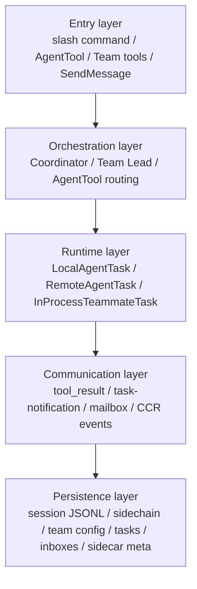
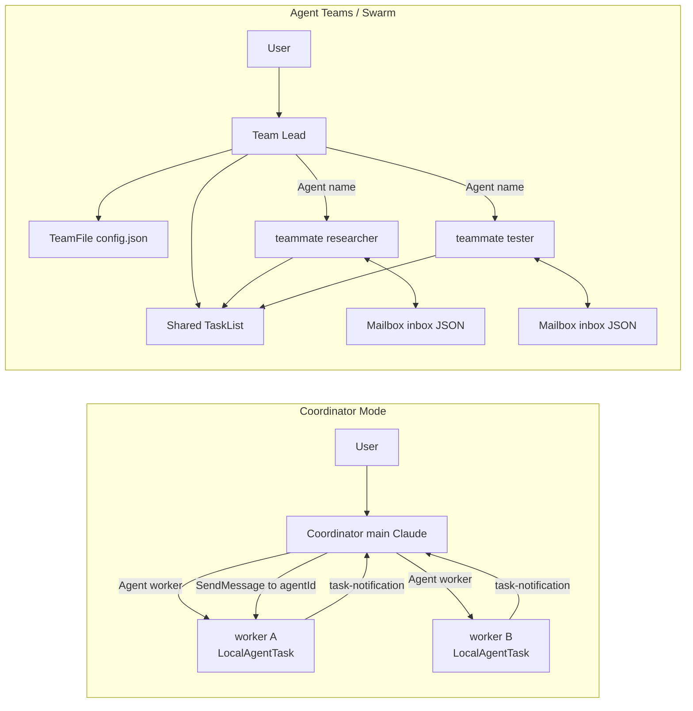
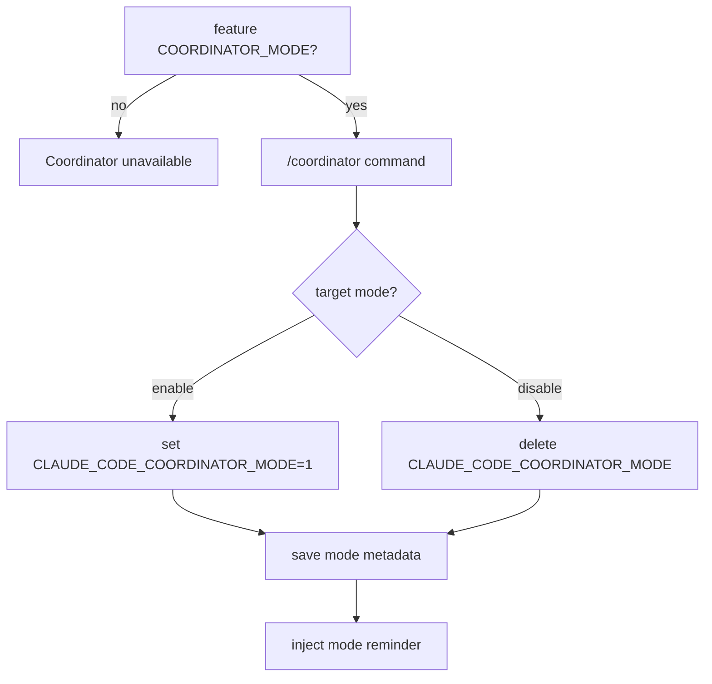
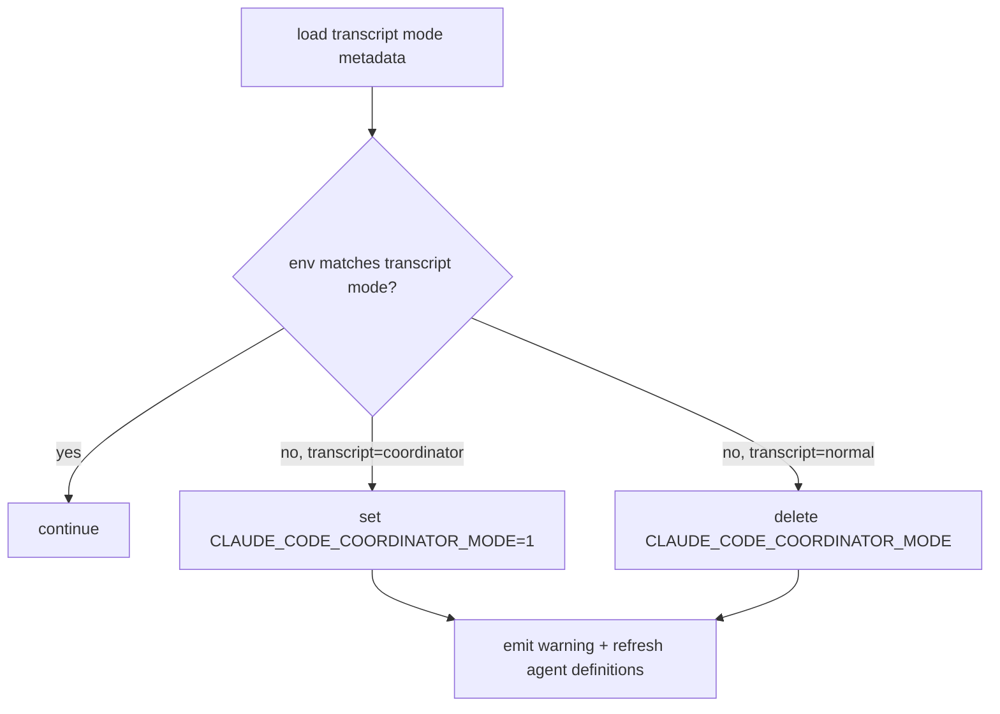
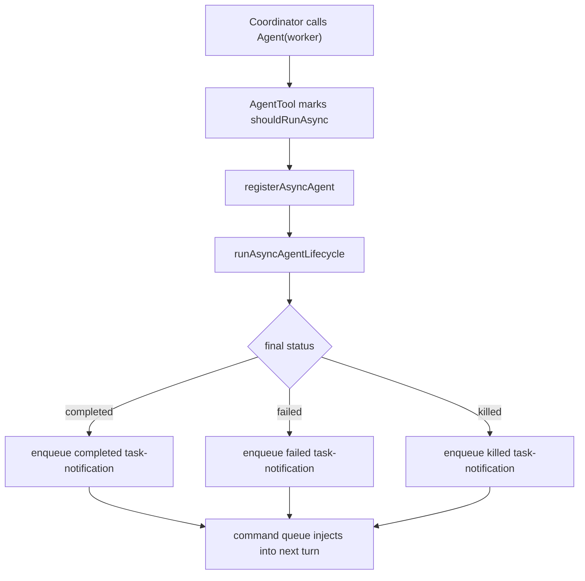
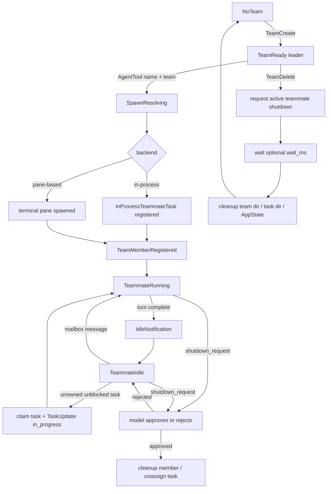
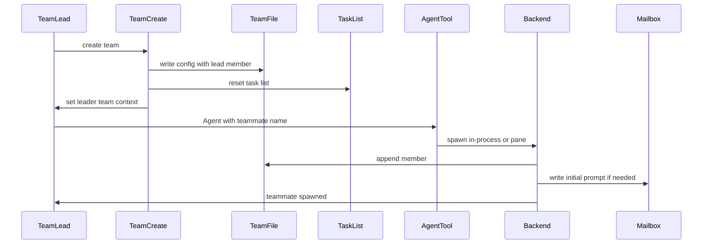
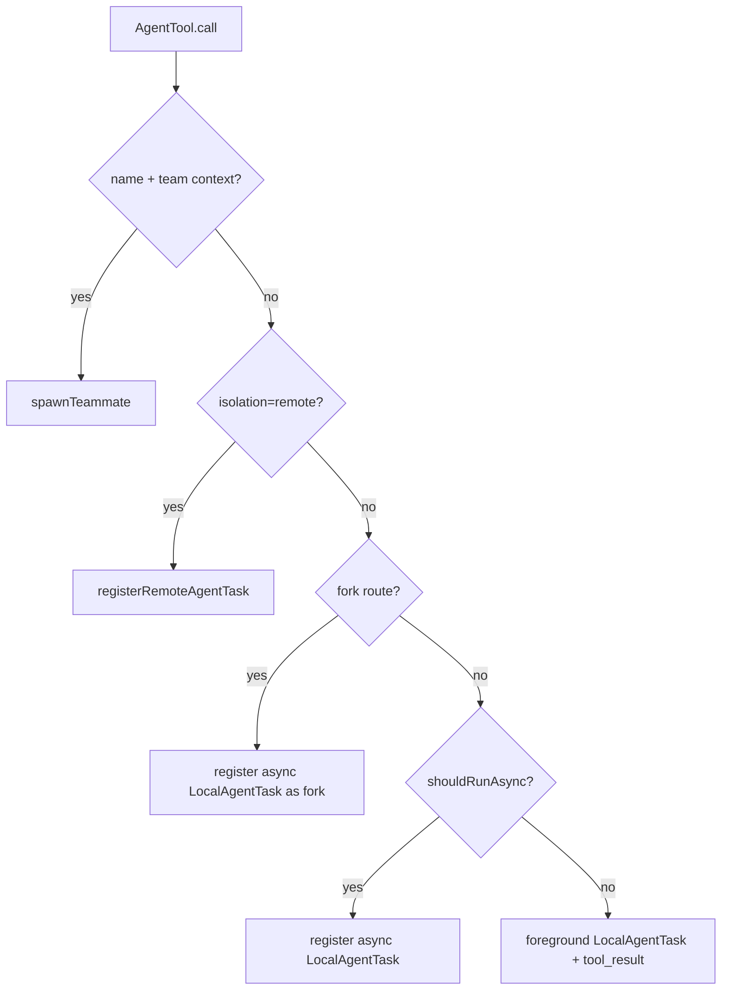
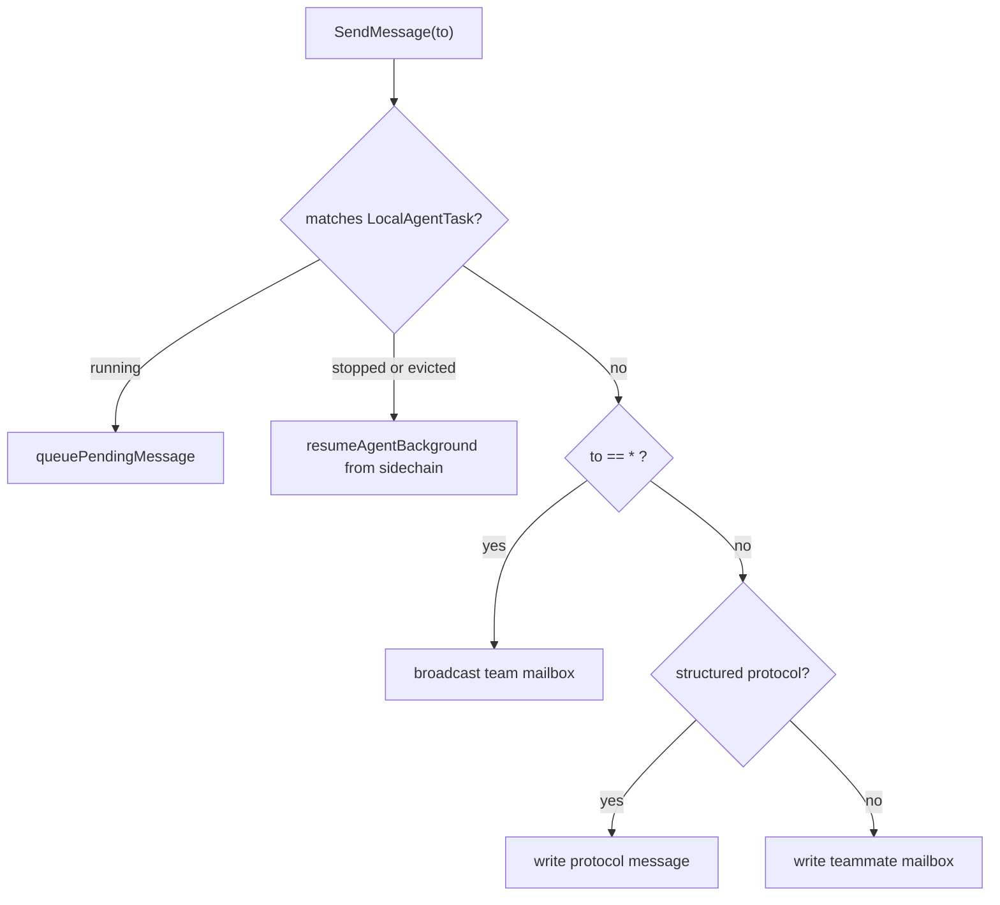
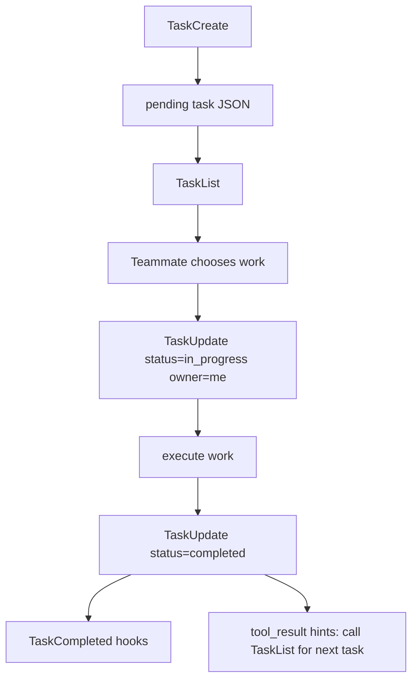

<!-- lang-switcher -->
**English** · [中文](/docs/zh/agent/coordinator-and-swarm) · [日本語](/docs/ja/agent/coordinator-and-swarm)

Claude Code has many mechanisms that appear to mean "multi-agent": the `Agent` tool, fork agents, Coordinator Mode, Agent Teams / Swarm, remote agents, background runtime tasks, and the `TaskCreate` task board. They share some underlying infrastructure, but they are not one abstraction.

This document addresses understanding across those mechanisms. When a task is "dispatched," a teammate becomes idle, a `<task-notification>` returns to the main thread, or a team directory remains while its teammate no longer runs, you should be able to identify the responsible mechanism, where it stores state, which communication path it uses, and what can be recovered.

## Global mental model

The shortest useful mental model is:

```text
Agent dispatches someone to do work.
TaskCreate puts a task card on the board.
Runtime Task is the person currently working, or the local shadow of a remote worker.
Coordinator is a hub-and-spoke orchestrator.
Swarm is a team with members, mailboxes, and a shared task board.
```

First, normalize the terminology:

| Concept | Essence | Entry point | State location | Result path |
|---|---|---|---|---|
| Normal sync subagent | One-shot foreground `Agent` tool call | `Agent({ subagent_type })` | Foreground `LocalAgentTask` | Current turn's `tool_result` |
| Normal async subagent | One-shot background agent | `Agent({ subagent_type, async: true })` or automatic backgrounding | `AppState.tasks` + sidechain | `async_launched` + `<task-notification>` |
| Fork agent | Background branch that inherits parent context and exact tools | Omit `subagent_type` while the fork gate is satisfied | `LocalAgentTask` + `.meta.json` | `<task-notification>` |
| Coordinator worker | Asynchronous `worker` subagent dispatched by Coordinator | Coordinator calls `Agent({ subagent_type: "worker" })` | `LocalAgentTask` | `<task-notification>` + `SendMessage(to: agentId)` |
| Swarm teammate | Long-lived team member | `Agent({ name, team_name?, prompt })` | `InProcessTeammateTask` or pane member | Mailbox by name; can continue after becoming idle |
| Remote agent | Local mirror of a remote executor | `Agent(..., isolation: "remote")` | `RemoteAgentTask` + remote sidecar | CCR events / polling |
| Work item task | Entry on the shared task board | `TaskCreate/Update/List/Get` | `~/.occ/tasks/<taskListId>/*.json` | Claimed and updated by a teammate / lead |
| Runtime task | Background executor that is or was running | Agent, shell, workflow, remote, and other entry points | `AppState.tasks` | UI, spinner, resume, kill |

## System layers

The multi-agent system can be understood as five layers, each answering one question:

| Layer | Question | Typical objects |
|---|---|---|
| Entry layer | Through which tool does the user or model start an action? | `/coordinator`, `AgentTool`, `TeamCreate`, `SendMessage`, `TaskUpdate` |
| Orchestration layer | Who decomposes, dispatches, controls, and synthesizes? | Coordinator, Team Lead, AgentTool routing |
| Runtime layer | Who executes work or represents its execution state? | `LocalAgentTask`, `InProcessTeammateTask`, `RemoteAgentTask` |
| Communication layer | How do results and control signals return? | `tool_result`, `<task-notification>`, mailbox, CCR events |
| Persistence layer | What remains visible after a process restart? | Session JSONL, sidechain, team config, task files, inbox, sidecar meta |



These five layers do not map one-to-one. At the runtime layer, a Coordinator worker is a `LocalAgentTask`; at the communication layer, it uses `<task-notification>` and `SendMessage(to: agentId)`. A Swarm teammate may be an `InProcessTeammateTask` at the runtime layer and use a mailbox at the communication layer. A remote agent is a local `RemoteAgentTask` mirror at the runtime layer, while its actual execution state comes from CCR.

## Choosing the right mechanism

| Scenario | Recommended mechanism | Why |
|---|---|---|
| One central reasoner must decompose, dispatch, synthesize, and correct work | Coordinator Mode | Restricts the main thread to orchestration, reducing the chance that it starts making uncoordinated changes directly. |
| Several relatively independent tasks need long-lived teammates that continue claiming work | Agent Teams / Swarm | Provides team config, mailboxes, and a shared task list. |
| One specialist should investigate or modify something | Normal subagent | Lower overhead, shorter model path, and a result that returns directly in the current turn or through a background notification. |
| Parallel exploration should copy the current context | Fork agent | Inherits parent context and exact tools, making it suitable for branch exploration. |
| Work should run in a remote environment | Remote agent | Keeps only a `RemoteAgentTask` mirror locally while execution occurs in CCR. |

Two common misclassifications:

| Misclassification | Better choice |
|---|---|
| "I need parallelism, so I must use Swarm." | For one-shot investigation or verification, an async subagent or Coordinator worker is lighter. |
| "I need a team, so Coordinator is enough." | If members must keep claiming shared work, message one another, and retain team state, use Swarm. |

## Two multi-agent topologies

Coordinator and Swarm both use multiple agents, but their control and state models are entirely different.



| Dimension | Coordinator Mode | Agent Teams / Swarm |
|---|---|---|
| Topology | Hub-and-spoke: Coordinator at the center, workers around it | Team: Team Lead + named teammates + mailbox + task list |
| Main Claude's role | Orchestrates only; does not execute directly | May execute directly or manage the team as team lead |
| Executors | Built-in `worker` async subagents | Teammates, which may be in-process or pane-based |
| Communication | `<task-notification>` and, when needed, `SendMessage(to: agentId)` | Mailbox by name, supporting P2P, broadcast, and structured protocols |
| Task collaboration | Does not center on `TeamCreate/TaskList` | `TeamFile` + shared task list + mailbox |
| Recovery model | Mode lives in the main transcript; workers use local-agent sidechains | Team/task/inbox files can remain; in-process runners cannot be restored completely |

Coordinator Mode is not a special Swarm Team Lead. It shares facilities such as `AgentTool`, `LocalAgentTask`, and `SendMessage`, but does not use `TeamCreate/TeamDelete/TaskList/TaskUpdate` as its core collaboration mechanism.

## The five-stage Coordinator Mode state machine

Coordinator Mode's central design demotes the main Claude to an orchestrator. Instead of using `Read/Edit/Bash` directly, the main thread decomposes work, dispatches workers, synthesizes results, and stops or continues workers when necessary.

### 1. Enablement state machine



Both conditions must be satisfied to enter Coordinator:

| Condition | Purpose |
|---|---|
| `feature("COORDINATOR_MODE")` | Build/runtime feature gate. |
| `CLAUDE_CODE_COORDINATOR_MODE=1` | Actually places the current process in coordinator mode. |

### 2. Recovery state machine

Coordinator mode is a session property stored as a `mode` entry in the main session JSONL:

```jsonl
{"type":"mode","sessionId":"...","mode":"coordinator"}
```

On resume, the current environment is reconciled with the mode in the transcript:



This prevents a user from resuming a coordinator session in a normal environment or, conversely, running an ordinary session as coordinator.

### 3. Prompt state machine

The coordinator prompt does not depend on the environment alone. In the interactive REPL, the approximate priority order is:

| Priority | Source | Explanation |
|---|---|---|
| 1 | Override system prompt | Highest priority. |
| 2 | Coordinator prompt | Used when `isCoordinatorMode()` is true and there is no `mainThreadAgentDefinition`. |
| 3 | Main-thread agent prompt | `--agent` / settings agent. |
| 4 | Custom/default prompt | Normal main-thread prompt. |
| 5 | Append prompt | Additional appended content. |

Combining `--agent` and Coordinator is a hazard: the tool pool may already be filtered for coordinator mode while the system prompt is not the coordinator prompt.

Headless execution must be considered separately. The current headless path explicitly applies coordinator tool filtering and injects coordinator user context, but its system-prompt assembly path is not identical to the interactive REPL. Treat this as a boundary that requires verification rather than assuming parity with the interactive path.

### 4. Tool-filtering state machine

The Coordinator main thread and its workers receive different tool pools:

| Role | Tool pool | Design purpose |
|---|---|---|
| Coordinator main thread | `Agent`, `SendMessage`, `TaskStop`, `SyntheticOutput`, and PR-activity subscription MCP tools | Orchestrate without executing directly. |
| Worker | `ASYNC_AGENT_ALLOWED_TOOLS`, excluding `TeamCreate`, `TeamDelete`, `SendMessage`, and `SyntheticOutput` | Execute work without nesting more orchestration. |
| Simple-mode worker | `Bash`, `Read`, `Edit` | Reduce the tool surface for simple execution paths. |
| MCP tools | Injected into worker context from connected servers | Give workers external capabilities while tool-pool rules preserve boundaries. |
| Scratchpad | Provides a scratchpad directory when its gate is enabled | Allow workers to share temporary knowledge. |

The interactive path primarily uses `mergeAndFilterTools()`. The headless path applies coordinator tool filtering directly at the main entry point. `AgentTool` independently assembles the worker tool pool; it does not inherit the main thread's filtered tool pool.

### 5. Worker lifecycle

Under Coordinator, `Agent(worker)` is forced to run asynchronously:



A `<task-notification>` is a user-role message, but it is not user input. The Coordinator prompt must interpret it as a worker-result signal:

```xml
<task-notification>
  <task-id>agent-a1b</task-id>
  <status>completed|failed|killed</status>
  <summary>Agent "Investigate auth bug" completed</summary>
  <result>Found null pointer in src/auth/validate.ts:42...</result>
  <usage>
    <total_tokens>N</total_tokens>
    <tool_uses>N</tool_uses>
    <duration_ms>N</duration_ms>
  </usage>
</task-notification>
```

Coordinator's key constraint is to synthesize rather than forward. A worker cannot see the full conversation between the user and Coordinator, so its prompt must be self-contained:

```text
Fix the null pointer in src/auth/validate.ts:42.
Session.user can be undefined when the session expires but the token remains cached.
Add a null check before user.id access; if null, return 401 with "Session expired".
Run validate.test.ts and report the commit hash.
```

An anti-pattern is:

```text
Based on your findings, fix it.
```

### Coordinator boundaries and troubleshooting

| Symptom | Possible cause | Resolution |
|---|---|---|
| The Coordinator main thread cannot read files or run commands | Its tool pool is filtered; this is expected | Dispatch a `worker` and include the files, errors, and acceptance criteria in the worker prompt. |
| Coordinator behavior is inconsistent after `--agent` | Agent-prompt priority overrides the coordinator prompt, while tools may remain filtered | Avoid combining them, or confirm the source of the current system prompt. |
| A worker is still running but heading in the wrong direction | Its runtime task remains `running` | Stop it with `TaskStop`; this produces a `killed` notification. |
| A worker completed but its conclusion is insufficient | It was a completed one-shot async agent | Prefer a fresh worker; use `SendMessage` to continue only when preserving the sidechain matters. |
| `SendMessage` fails | Agent not found, sidechain transcript missing, or message lacks `summary` | Check agentId/name and sidechain `.jsonl/.meta.json`; include `summary` with plain-text messages. |
| No `worker` is available under coordinator | Built-in agents are disabled in non-interactive mode | Check `CLAUDE_AGENT_SDK_DISABLE_BUILTIN_AGENTS`. |

## Complete Swarm state machine

Swarm centers on a team rather than a single `Agent` invocation. `TeamCreate` creates the team, `Agent({ name })` adds a teammate, `TaskCreate/Update/List/Get` supplies the task board, and `SendMessage` with mailboxes provides communication and control.

The current implementation enables Agent Teams by default. Set `CLAUDE_CODE_EXPERIMENTAL_AGENT_TEAMS_DISABLED` to disable them.

### Team lifecycle



Key invariants:

| Invariant | Meaning |
|---|---|
| Flat roster | A teammate cannot spawn another teammate, preventing nested teams. |
| Mailbox addressed by name | The inbox path uses `teamName + agentName`, not agentId. |
| Task list is a shared board | `TaskCreate` writes only a pending task; it does not start an executor. |
| Shutdown is not a force kill | A shutdown request is handled by the model, and graceful shutdown occurs only after approval. |
| TeamFile is the cross-process source of truth | `AppState.teamContext` is the leader UI's projection. |

### Storage topology

Swarm's core state lives under `~/.occ/teams` and `~/.occ/tasks`:

```text
~/.occ/
  teams/
    <team-name>/
      config.json
      inboxes/
        <agent-name>.json
  tasks/
    <team-name>/
      .highwatermark
      1.json
      2.json
      ...
```

| File or structure | Contents |
|---|---|
| `TeamFile` | `name`, `leadAgentId`, `leadSessionId`, `hiddenPaneIds`, `teamAllowedPaths`, `members[]`. |
| `TeamFile.members[]` | `agentId`, `name`, `agentType`, `model`, `color`, `backendType`, `isActive`, `mode`, `worktreePath`, `sessionId`. |
| Task JSON | `id`, `subject`, `description`, `activeForm`, `owner`, `status`, `blocks`, `blockedBy`, `metadata`. |
| Mailbox JSON | Plain messages, protocol messages, read state, colors, summaries, and related data. |

### From TeamCreate to teammate



`TeamCreate` does more than write `config.json`. It also registers session cleanup, resets the team's task list, sets `leaderTeamName`, and projects the leader into `AppState.teamContext`.

When `AgentTool` sees `team_name/current teamContext + name`, it takes the teammate-spawn branch instead of normal `runAgent()`. `spawnTeammate()` resolves the team, makes the name unique, chooses a backend, updates `AppState.teamContext.teammates`, and appends to `TeamFile.members`.

### In-process versus pane-based teammates

| Dimension | In-process teammate | Pane-based teammate |
|---|---|---|
| Runtime location | Same process as the leader | Separate terminal pane / CLI process |
| Startup | Register `InProcessTeammateTask` and start `runInProcessTeammate()` | Create a tmux / iTerm2 / Windows Terminal pane |
| Message consumption | Runner polls the mailbox about every 500ms | Leader / teammate side uses `useInboxPoller()` about every 1s |
| Input path | Teammate-view input enters `pendingUserMessages` | Normal mailbox prompt enters the teammate process |
| Handling priority | Shutdown > team-lead message > peer message > unowned task claim | Poller routes by message type and starts a turn while idle |
| UI | Spinner tree, footer pills, detail dialog, teammate transcript view | Footer TeamStatus, TeamsDialog, pane state |
| Recovery | Runner, AbortController, and pending queue live in memory; a process restart cannot recover them completely | Pane process may still run; the leader-side backend map is not persisted, so recovery is best-effort |
| Deletion | Requires the current AppState task / AbortController | Backend writes a shutdown request and waits for teammate approval / cleanup |

## AgentTool routing decision tree

`AgentTool.call()` is the most complex branch point in the multi-agent entry layer. The same `Agent` tool selects different runtimes based on parameters and context:



| Route | Trigger | Result |
|---|---|---|
| Teammate | Has `name` and either `team_name` or the current `teamContext` exists | Calls `spawnTeammate()` and returns `teammate_spawned`. |
| Remote | `isolation: "remote"` | Registers `RemoteAgentTask` and stores a remote sidecar locally. |
| Fork | Omits `subagent_type` and the fork gate/context allows it | Forces a background local agent that inherits parent context and exact tools. |
| Async local | Explicit async, Coordinator worker, or another automatic-background condition | Returns `async_launched` and injects `<task-notification>` on completion. |
| Sync local | Default one-shot foreground subagent | Returns `tool_result` from the current tool call. |

Documentation therefore cannot describe "Agent" as one concept: this single tool entry point has at least five runtime paths.

## Communication-path comparison

A multi-agent communication path determines whether the result enters the current turn, whether it is persisted, and whether it can resume.

| Communication path | Sender | Recipient | Purpose | Persistence/recovery |
|---|---|---|---|---|
| `tool_result` | Sync subagent | Current assistant turn | One-shot foreground result | Written to the main transcript. |
| `<task-notification>` | Async local agent / coordinator worker | Next main-thread turn | Background completed/failed/killed notification | Comes from the `LocalAgentTask` lifecycle and sidechain. |
| `SendMessage(to: agentId)` | Coordinator or user | Local agent task | Continue a running/stopped worker | Queued while running; attempts sidechain resume while stopped. |
| `SendMessage(to: teammateName)` | Lead / teammate | Teammate mailbox | Normal Swarm communication | Written to inbox JSON and addressed by name. |
| `SendMessage(to: "*")` | Lead / teammate | Team members | Swarm broadcast | Written to multiple inboxes; structured messages cannot be broadcast. |
| Structured mailbox protocol | Lead / teammate / runtime | Specific teammate or lead | Permission, plan, shutdown, mode, task assignment | Remains unread for poller routing and must not be consumed by ordinary attachments. |
| CCR events / polling | Remote runtime | `RemoteAgentTask` | Remote-agent state and results | Local sidecar + remote session state. |

### SendMessage routing



Plain-text `SendMessage` requires `summary`. A structured message cannot be broadcast. A teammate name is a bare name; `validateInput` rejects a `to` value containing `@` because a session has only one team and does not support cross-session addressing.

## Mailbox protocol table

The Mailbox path is:

```text
~/.occ/teams/<team-name>/inboxes/<agent-name>.json
```

It uses locking, atomic rename, size limits, and compaction:

| Limit | Value |
|---|---|
| Single text message | 64KB |
| Mailbox file | 4MB |
| Retained bytes | 2MB |
| Retained normal messages | Up to 1000 |
| Retained read messages | Up to 200 |
| Retained unread protocol messages | Up to 2000 |

Protocol messages are more than chat:

| Message type | Typical sender | Typical recipient | Consumer | Should enter normal LLM context |
|---|---|---|---|---|
| Plain text | Lead / teammate | Teammate / lead | Mailbox attachment or prompt handler | Yes |
| Broadcast | Lead / teammate | Team members | Mailbox attachment or prompt handler | Yes |
| `task_assignment` | `TaskUpdate` | New owner | Teammate poller / runner | Usually acts as a task trigger and should not be treated as ordinary chat |
| `permission_request/response` | Teammate / lead | Lead / teammate | `useInboxPoller` + permission UI queue | No |
| `sandbox_permission_request/response` | Teammate / sandbox host | Lead / teammate | Permission synchronization | No |
| `plan_approval_request/response` | Teammate / lead | Lead / teammate | Plan-approval path | No |
| `shutdown_request/approved/rejected` | Lead / teammate | Teammate / lead | Backend / runner / poller | No |
| `mode_set_request` | Lead | Teammate | Permission-mode synchronization | No |
| `team_permission_update` | Lead | Team members | Permission synchronization | No |
| Idle notification | Teammate runner | Lead | UI / lead poller | Usually no |

One boundary is critical: a mailbox attachment consumes only unstructured messages. Structured protocol messages must remain unread for `useInboxPoller` or the in-process runner to route. Otherwise, permission, plan, and shutdown messages may be swallowed as ordinary context.

## A Task is not a Runtime Task

A task created by `TaskCreate` and a task represented by `LocalAgentTask` belong to two different models.

| Name | Source type | Storage | States | Consumer |
|---|---|---|---|---|
| Work item task | `Task` in `src/utils/tasks.ts` | `~/.occ/tasks/<taskListId>/<id>.json` | `pending/in_progress/completed` | Task tools, TaskList UI, teammate claims |
| Runtime task | `TaskStateBase` subtype | `AppState.tasks`, with sidecar/output for some types | `running/completed/failed/killed` and others | UI, spinner, background selector, kill/resume |

Shared-task lifecycle:



Under Swarm, `TaskUpdate` has additional behavior:

| Behavior | Explanation |
|---|---|
| Teammate marks `in_progress` while owner is empty | Automatically sets owner to the current teammate name. |
| Owner changes | Writes `task_assignment` to the new owner's mailbox. |
| Status -> `completed` | Runs TaskCompleted hooks. |
| Teammate completes a task | Appends a tool-result reminder to call `TaskList` immediately for the next item. |
| Main thread completes 3+ tasks without verification | Appends a verification nudge behind a feature gate. |

Runtime task types include:

| Type | Runtime location | Typical scenario |
|---|---|---|
| `LocalAgentTask` | Local sub-agent | Normal background agent, fork, coordinator worker. |
| `InProcessTeammateTask` | Same-process runner | In-process teammate. |
| `RemoteAgentTask` | CCR remote session | Remote agent. |
| `LocalShellTask` | Local shell | Background shell. |
| `LocalWorkflowTask` | Local workflow | Workflow orchestration. |
| `DreamTask` | Silent background | Memory dream. |
| `MonitorMcpTask` | Local monitor | MCP monitor. |

## Persistence and recovery matrix

Recovery depends on where state is stored. The most important distinction is that seeing state does not mean execution can continue.

| Mechanism | Persistence | Visible after resume | Can continue after resume | Boundary |
|---|---|---|---|---|
| Main session | Main session JSONL | Conversation chain, metadata, mode | Yes, through main-session recovery | Affected by compact/branch/leaf. |
| Coordinator mode | `mode` entry in main session JSONL | Current session mode | Yes, `matchSessionMode()` switches the env | Prompt/tool state still depends on current startup arguments. |
| Coordinator worker | Local-agent sidechain + `.meta.json` | Agent task identity and history | Usually resumable through `resumeAgentBackground()` | Missing sidechain/meta or changed tool definitions can cause failure. |
| Ordinary/fork subagent | Local-agent sidechain + `.meta.json` | Agent history | Resumable; a fork depends on `agentType:"fork"` | Fork recovery requires correct metadata. |
| Remote agent | `remote-agents/remote-agent-<taskId>.meta.json` + CCR | Remote-task mirror | Depends on CCR session state | A 404/archive removes the sidecar. |
| Team config | `~/.occ/teams/<team>/config.json` | Team/member roster | Does not imply that the teammate runner is alive | `TeamFile` is the source of truth; `AppState` is a projection. |
| Mailbox | `~/.occ/teams/<team>/inboxes/*.json` | Unread ordinary/protocol messages | Delivery can continue | Structured messages require the poller/runner to consume them correctly. |
| Shared tasks | `~/.occ/tasks/<team>/*.json` | Task list / owner / status | Tasks can still be claimed and updated | Owner may refer to an inactive teammate. |
| In-process teammate runner | Leader-process memory | Cannot fully expose internal runner state | Cannot be restored completely across processes | AbortController, pending queue, and recent messages live in memory. |
| Pane-based teammate | External pane + transcript + team file | May remain visible | Best-effort | Leader-side backend map is not persisted; active/kill behavior depends on pane state. |

During debugging, ask these questions in order:

1. Does the file still exist?
2. Does the `AppState` projection still exist?
3. Is the runtime task still `running`?
4. Is the communication channel still usable?
5. Does the sidechain / inbox / remote sidecar contain enough information to recover?

## How user-visible state is projected

The UI projects multiple state sources rather than presenting one source of truth.

| UI | Data source | What it establishes | What it does not establish |
|---|---|---|---|
| TaskListV2 | Task files + `teamContext` | Work item tasks, owner, status | That the teammate corresponding to an owner is still alive. |
| TeammateSpinnerTree | Running in-process teammates | Teammate activity in the current leader process | Complete state for pane-based or historical teammates. |
| TeammateSpinnerLine | `InProcessTeammateTaskState` | Idle, approval, stopping, tool/token, recent message | Complete transcript. |
| BackgroundAgentSelector | Backgrounded `LocalAgentTask` | Selectable local background agents | Remote/shell/workflow/in-process teammates. |
| Agent transcript view | `viewingAgentTaskId` | Visual conversation for a local agent or in-process teammate | Complete external-process state for a pane teammate. |
| TeamsDialog / TeamStatus | `AppState.teamContext` + team file | Team-member display, management, kill/shutdown/mode | That a runner can be recovered. |

Pane-based teams are managed primarily through the footer TeamStatus and TeamsDialog: Enter to inspect, `k` to kill, `s` to shut down, `p` to prune idle teammates, and Shift+Tab to switch permission mode. Input in an in-process teammate's transcript view enters `pendingUserMessages`; it is not written to the mailbox.

## Two end-to-end scenarios

### Use Coordinator for a complex bug

| Step | What happens | Runtime | Communication | Persistence |
|---|---|---|---|---|
| 1 | User reports a complex bug | Main session | User message | Main JSONL |
| 2 | Coordinator decomposes it into investigation, implementation, and verification | Coordinator main thread | `Agent(worker)` | Main JSONL + task state |
| 3 | Worker executes asynchronously | `LocalAgentTask` | Tool calls | Sidechain JSONL |
| 4 | Worker completes | `LocalAgentTask` | `<task-notification>` | Notification queue / main turn |
| 5 | Coordinator synthesizes the root cause | Main thread | Assistant reasoning | Main JSONL |
| 6 | Direction needs correction | Same or new worker | `SendMessage(to: agentId, summary, message)` or fresh `Agent` | Sidechain / new sidechain |
| 7 | Coordinator reports to the user | Main thread | Assistant message | Main JSONL |

This flow does not use `TeamCreate` and does not depend on a shared task list.

### Use Swarm for long-running parallel work

| Step | What happens | State source | Communication |
|---|---|---|---|
| 1 | `TeamCreate({ team_name })` | `teams/<team>/config.json` + `tasks/<team>` | Tool result |
| 2 | `TaskCreate` creates multiple work items | Task JSON | Task tools |
| 3 | `Agent({ name: "researcher" })` | TeamFile member + backend task/pane | Initial prompt |
| 4 | Teammate claims a task | Task JSON owner/status | `TaskUpdate` |
| 5 | Lead sends a message | Inbox JSON | `SendMessage(to: teammateName)` |
| 6 | Teammate completes a turn | Runner/poller state | Idle notification |
| 7 | Teammate claims more work | Task list | `TaskList` / claim |
| 8 | `TeamDelete({ wait_ms })` | Team/task directory cleanup | Shutdown request / response |

Team, task list, and mailbox are central to this flow. Teammate output does not automatically reach the lead; it requires `SendMessage` or an explicit protocol message.

## Failure and troubleshooting matrix

| Symptom | Check first | Common cause | Resolution |
|---|---|---|---|
| Coordinator worker result did not return | `AppState.tasks[agentId]`, notification queue, sidechain | Worker still running, failed, was killed, or notification has not entered the next turn | Wait for the next turn, or inspect sidechain / task status. |
| `SendMessage(to: agentId)` cannot find worker | AgentId/name, sidechain `.jsonl/.meta.json` | Agent was evicted, metadata is missing, or a teammate name was passed | Use the correct raw agentId; start a new worker if necessary. |
| `SendMessage(to: teammate)` fails | teamContext, team file, inbox path | Misspelled teammate name, current session has no team, or address contains `@` | Use the bare teammate name from the current team. |
| Plain-text `SendMessage` fails validation | Parameters | Missing `summary` | Add `summary`. |
| Structured message has no effect | Inbox read state, poller | It was marked read as an ordinary attachment, or its consumer is not running | Confirm the structured message remains unread and the poller/runner is alive. |
| Task is not displayed | `leaderTeamName`, `getTaskListId()`, tasks directory | Lead and teammate point to different task lists | Inspect env/teamName/sessionId precedence. |
| Task is claimed but no one executes it | Task owner, active team member, runner/pane | Owner teammate is inactive or runner was lost | Reassign the owner or restart the teammate. |
| TeamDelete refuses cleanup | `TeamFile.members[].isActive` | Active teammates remain | Request graceful shutdown first, or manually clean up after confirmation. |
| Team remains after resume but teammate does not run | Team file, runner/pane state | In-process runner belonged to the old process and cannot be recovered | Spawn the teammate again or re-orchestrate through the existing mailbox/task state. |
| Pane teammate appears alive but UI is inaccurate | paneId, backendType, backend map | Leader-side `spawnedTeammates` map is not persisted | Treat TeamFile and actual pane state as authoritative; management is best-effort. |
| Permission/plan is stuck | Leader inbox, permission UI queue, protocol response | Leader poller did not consume it, or no response was written back | Inspect `useInboxPoller` and the corresponding inbox. |
| Remote-agent resume fails | Remote sidecar, CCR session | Session returned 404 or was archived | Accept sidecar cleanup and create a new remote agent. |

## Common misconceptions

| Misconception | Correct understanding |
|---|---|
| Coordinator is Swarm's Team Lead | It is not. A Coordinator worker is an async subagent, not a teammate. |
| Swarm requires `CLAUDE_CODE_EXPERIMENTAL_AGENT_TEAMS=1` | The current implementation enables it by default; use `CLAUDE_CODE_EXPERIMENTAL_AGENT_TEAMS_DISABLED` to disable it. |
| `TaskCreate` creates a running agent | It creates only work item JSON; executors are `LocalAgentTask`, `InProcessTeammateTask`, and related runtime tasks. |
| A teammate's turn result automatically reaches the lead | Not necessarily. The teammate communicates through `SendMessage`; the runner also sends an idle notification. |
| Mailboxes are addressed by agentId | Swarm mailboxes are addressed by teammate name. |
| BackgroundAgentSelector lists every background task | It lists only backgrounded `LocalAgentTask` instances, not remote/shell/workflow/in-process teammates. |
| `TeamUpdate` is a tool | The current source has no independent `TeamUpdateTool`; team-member updates are distributed across spawn, teamHelpers, and dialogs. |
| `SyntheticOutput` is an internal Swarm communication tool | It primarily provides structured output and is not central to team collaboration. |
| A shutdown request is a force kill | It is a graceful-shutdown protocol handled by the model. |
| An in-process teammate can resume across processes like a local agent | It cannot; runner state lives in memory and cannot be fully recovered after process restart. |

## Further reading

This document is an overview across mechanisms. For a deeper treatment of one path, start with the corresponding topic document:

| Topic | Document |
|---|---|
| `AgentTool` parameters, sync/async/fork, notification queue | `docs/agent/sub-agents.mdx` |
| Task V2 data model, locks, high-water mark, owner, hooks | `docs/tools/task-management.mdx` |
| JSONL transcript, sidechain, compact, resume, remote sidecar | `docs/internals/session-transcript-persistence.md` |
| Dedicated Coordinator feature explanation | `docs/zh/features/coordinator-mode.md` |
| Worktree isolation | `docs/agent/worktree-isolation.mdx` |

## Source entry-point index

| Question | Start here |
|---|---|
| Coordinator mode detection, recovery, prompt, context | `src/coordinator/coordinatorMode.ts` |
| `/coordinator` command | `src/commands/coordinator.ts` |
| Coordinator worker definition | `src/coordinator/workerAgent.ts` |
| System-prompt selection | `src/utils/systemPrompt.ts` |
| Coordinator tool filtering | `src/utils/toolPool.ts` |
| Coordinator mode persistence | `mode` entry / `saveMode()` in `src/utils/sessionStorage.ts` |
| AgentTool routing | `packages/builtin-tools/src/tools/AgentTool/AgentTool.tsx` |
| Subagent query loop | `packages/builtin-tools/src/tools/AgentTool/runAgent.ts` |
| Async local-agent lifecycle | `packages/builtin-tools/src/tools/AgentTool/agentToolUtils.ts` |
| Local-agent runtime task | `src/tasks/LocalAgentTask/LocalAgentTask.tsx` |
| Remote-agent runtime task | `src/tasks/RemoteAgentTask/RemoteAgentTask.tsx` |
| Agent resume | `packages/builtin-tools/src/tools/AgentTool/resumeAgent.ts` |
| Task stop | `packages/builtin-tools/src/tools/TaskStopTool/TaskStopTool.ts`, `src/tasks/stopTask.ts` |
| Team gate | `src/utils/agentSwarmsEnabled.ts` |
| Team-file helpers | `src/utils/swarm/teamHelpers.ts` |
| TeamCreate | `packages/builtin-tools/src/tools/TeamCreateTool/TeamCreateTool.ts` |
| TeamDelete | `packages/builtin-tools/src/tools/TeamDeleteTool/TeamDeleteTool.ts` |
| Spawn teammate | `packages/builtin-tools/src/tools/shared/spawnMultiAgent.ts` |
| In-process teammate spawn | `src/utils/swarm/spawnInProcess.ts` |
| In-process teammate runner | `src/utils/swarm/inProcessRunner.ts` |
| Pane backend | `src/utils/swarm/backends/PaneBackendExecutor.ts` |
| Teammate AsyncLocalStorage identity | `src/utils/teammateContext.ts` |
| Mailbox | `src/utils/teammateMailbox.ts` |
| Permission synchronization | `src/utils/swarm/permissionSync.ts` |
| SendMessage routing | `packages/builtin-tools/src/tools/SendMessageTool/SendMessageTool.ts` |
| Shared task list | `src/utils/tasks.ts` |
| Task tools | `packages/builtin-tools/src/tools/TaskCreateTool`, `TaskUpdateTool`, `TaskListTool`, `TaskGetTool` |
| Inbox polling | `src/hooks/useInboxPoller.ts` |
| Swarm initialization | `src/hooks/useSwarmInitialization.ts` |
| Teammate view | `src/state/teammateViewHelpers.ts`, `src/screens/REPL.tsx` |
| Teammate spinner | `src/components/Spinner/TeammateSpinnerTree.tsx`, `TeammateSpinnerLine.tsx` |
| Team dialog/status | `src/components/teams/TeamsDialog.tsx`, `src/components/teams/TeamStatus.tsx` |
| Background local-agent selector | `src/hooks/useBackgroundAgentTasks.ts`, `src/components/tasks/BackgroundAgentSelector.tsx` |
