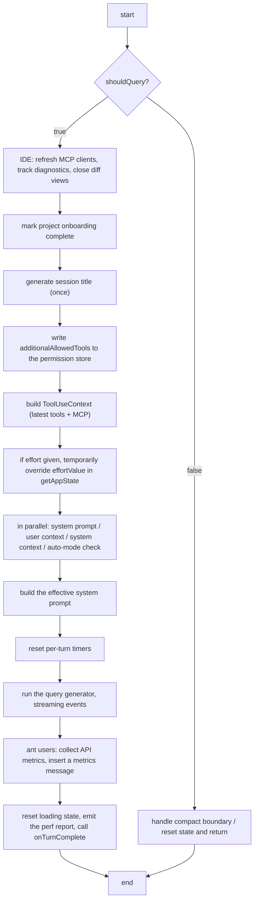

<!-- lang-switcher -->
**English** · [中文](/docs/zh/conversation/multi-turn) · [日本語](/docs/ja/conversation/multi-turn)

{/* Goal of this chapter: trace session orchestration, persistence, cost tracking and model switching end to end */}

## Three ways in, and what each one is

Claude Code is reachable through three surfaces. They answer different questions: the REPL is about *interaction shape*, the SDK is about *how you integrate*, and ACP is about *the wire protocol*.

| | 🖥️ REPL (interaction shape) | 🧩 SDK (integration) | 🌉 ACP (protocol) |
| :--- | :--- | :--- | :--- |
| **What it is** | An interactive conversation environment developers use directly in the terminal | A programmatic library for embedding Claude Code in another application | An open communication standard connecting agents to editors |
| **How you use it** | 1. Run `occ` in a terminal<br />2. A dedicated interface renders (React/Ink)<br />3. Interact through slash commands such as `/help` | 1. Install the SDK in your Node.js/Python project<br />2. Send queries through its API | 1. Start Claude Code through an ACP adapter (`claude-code-acp`)<br />2. The editor talks to it over ACP |
| **Typical use** | Day-to-day coding: ask questions, change code, run tasks as you work | Wiring the core capabilities into automation scripts, CI/CD, or another application's backend | Bringing Claude Code into JetBrains IDEs, Zed, and other third-party editors with their own UI |
| **Characteristics** | **For people.** Interactive and direct.<br />**Complete.** All built-in tools plus MCP.<br />**Handles complex work.** Plans and executes multi-step tasks autonomously. | **For programs.** Scriptable and embeddable.<br />**Lightweight.** Does not require the full Claude Code runtime.<br />**You are in control.** Suited to automation inside your own application. | **Standardized.** One protocol across agents and editors.<br />**Bidirectional.** The agent can request files and run commands through the editor.<br />**Deeply integrated.** Reuses Claude Code's capabilities in full. |

The SDK and ACP surfaces both manage sessions through `QueryEngine`. The REPL takes a different path: `onQueryImpl` in `src/screens/REPL.tsx` calls `query()` directly.

The REPL call chain:

```
user input
  ↓
onSubmit (REPL.tsx)
  ↓
handlePromptSubmit (handlePromptSubmit.ts)
  ↓
executeUserInput (handlePromptSubmit.ts)
  ↓
onQuery (REPL.tsx)
  ↓
onQueryImpl (REPL.tsx)
  ↓
query (query.ts) ← called here
```

`query()` is the agentic loop itself — the `while (true)` that processes conversation turns (`query.ts:460-522`).

`onQueryImpl` is the REPL's controller for talking to the model. It is responsible for:

1. Environment preparation (IDE, diagnostics, permissions)
2. Generating the session title, once
3. Building the dynamic system prompt and user context
4. Running the streaming query and updating the UI live
5. Collecting metrics and cleaning up

## `onQueryImpl` in detail

`onQueryImpl` is an async function wrapped in a React `useCallback`. It handles the **whole query path** from a user message to the model: preprocessing, system prompt construction, tool context preparation, streaming execution, post-processing, and metrics.

### Signature

```typescript
const onQueryImpl = useCallback(
  async (
    messagesIncludingNewMessages: MessageType[],
    newMessages: MessageType[],
    abortController: AbortController,
    shouldQuery: boolean,
    additionalAllowedTools: string[],
    mainLoopModelParam: string,
    effort?: EffortValue,
  ) => { … },
  [ …dependencies ]
)
```

| Parameter | Meaning |
| --- | --- |
| `messagesIncludingNewMessages` | The full message list including the new ones, used to build the model input |
| `newMessages` | Just what was added this turn (the user's text, attachments) |
| `abortController` | Cancels the in-flight query |
| `shouldQuery` | Whether to actually call the model. `false` skips it — an invalid slash command, a manual compact |
| `additionalAllowedTools` | Extra tools permitted for this turn, usually from a Skill's frontmatter |
| `mainLoopModelParam` | The main model for this turn |
| `effort` | Optional override of the global effort value, controlling reasoning depth |

### Execution flow



### IDE integration and diagnostics (only when `shouldQuery = true`)

```typescript
const freshClients = mergeClients(initialMcpClients, store.getState().mcp.clients);
diagnosticTracker.handleQueryStart(freshClients);
const ideClient = getConnectedIdeClient(freshClients);
if (ideClient) closeOpenDiffs(ideClient);
```

MCP clients are read fresh from the store, because `useManageMCPConnections` may have updated them after the closure captured its values. The diagnostic tracker is notified that a query started, and any open diff views in a connected IDE are closed.

### Session title, generated once

```typescript
if (!titleDisabled && !sessionTitle && !agentTitle && !haikuTitleAttemptedRef.current) {
  const firstUserMessage = newMessages.find(m => m.type === 'user' && !m.isMeta);
  const text = getContentText(firstUserMessage.message.content);
  if (text && !text.startsWith(`<${LOCAL_COMMAND_STDOUT_TAG}>`) … ) {
    haikuTitleAttemptedRef.current = true;
    generateSessionTitle(text, …).then(title => setHaikuTitle(title));
  }
}
```

This runs only when titles are enabled, no title exists yet, and no attempt has been made. It takes the first **non-meta** user message and skips synthetic breadcrumbs such as slash-command output and skill markers. The call is asynchronous; a failure resets the ref so a later turn can retry.

### Writing the permission override to the store

```typescript
store.setState(prev => {
  const cur = prev.toolPermissionContext.alwaysAllowRules.command;
  if (cur === additionalAllowedTools || (cur?.length === …)) return prev;
  return { ...prev, toolPermissionContext: { …, alwaysAllowRules: { …, command: additionalAllowedTools } } };
});
```

`additionalAllowedTools` becomes `toolPermissionContext.alwaysAllowRules.command`, bounding the tool set for this turn (a Skill's own tools, for instance). A shallow comparison avoids pointless state updates. This sits **before** the `shouldQuery` branch, so it runs even when no model call happens — forked commands need the permission information regardless.

### The `shouldQuery = false` branch

```typescript
if (!shouldQuery) {
  if (newMessages.some(isCompactBoundaryMessage)) {
    setConversationId(randomUUID());
    if (feature('PROACTIVE') || feature('KAIROS')) proactiveModule?.setContextBlocked(false);
  }
  resetLoadingState();
  setAbortController(null);
  return;
}
```

This covers everything that needs no model call — an invalid slash command, a manual `/compact`. If the new messages include a **compact boundary**, a fresh `conversationId` is generated so the UI's message rows remount, and the proactive context block is cleared. Then loading state resets and the abort controller is dropped.

### Preparing the query

**Tool use context.** `getToolUseContext()` reads the current tools and MCP client configuration from the store, so stale closure values cannot hide a newly connected tool or server.

**Effort override, scoped to this turn:**

```typescript
if (effort !== undefined) {
  const previousGetAppState = toolUseContext.getAppState;
  toolUseContext.getAppState = () => ({ ...previousGetAppState(), effortValue: effort });
}
```

The override is deliberately local to this query. Writing it to the global store would let a background agent or a UI component read a value that was only meant for one turn.

**Fetching prompt and context in parallel:**

```typescript
const [, , defaultSystemPrompt, baseUserContext, systemContext] = await Promise.all([
  undefined,
  feature('TRANSCRIPT_CLASSIFIER') ? checkAndDisableAutoModeIfNeeded(…) : undefined,
  getSystemPrompt(freshTools, mainLoopModelParam, additionalWorkingDirectories, freshMcpClients),
  getUserContext(),
  getSystemContext(),
]);
```

Four independent pieces of work run concurrently: the auto-mode circuit breaker (which may disable fast mode), the system prompt, the user context (workspace, environment), and the system context (OS, terminal).

**Enriching the user context:**

```typescript
const userContext = {
  ...baseUserContext,
  ...getCoordinatorUserContext(freshMcpClients, getScratchpadDir()),
  ...((feature('PROACTIVE') || feature('KAIROS')) && proactiveModule?.isProactiveActive() && !terminalFocusRef.current
    ? { terminalFocus: 'The terminal is unfocused — the user is not actively watching.' }
    : {}),
};
```

**Building the final system prompt** merges the main-thread agent definition, tool context, any custom prompt, the default prompt, and appended content through `buildEffectiveSystemPrompt()`.

### Running the query

```typescript
resetTurnHookDuration(); resetTurnToolDuration(); resetTurnClassifierDuration();
for await (const event of query({ messages, systemPrompt, userContext, systemContext, canUseTool, toolUseContext, querySource })) {
  onQueryEvent(event);
}
```

Per-turn timers reset, then the `query()` generator runs and each event goes to `onQueryEvent` — which updates the message list, renders tool calls, and so on.

### Post-processing and metrics

For internal users (`USER_TYPE === 'ant'`), API metrics are collected: time to first token (TTFT) and output tokens per second (OTPS) per request. When a turn contained several requests — a tool loop — the median is used. Hook duration, tool duration, classifier duration, total turn time, and config write counts are recorded alongside.

Finally, loading state resets, the performance report is emitted if debugging is on, and `onTurnComplete` fires with the full message list.

## One turn versus one session

- **One turn** is a single complete run of `query()`: assemble context → call the API → handle tool calls → loop until done.
- **One session** is what `QueryEngine` manages: dozens of `submitMessage()` calls spanning hours.

`QueryEngine` (`src/QueryEngine.ts`) is the session orchestrator sitting above the loop, and it tracks considerably more than a message list:

```
QueryEngine internal state (src/QueryEngine.ts constructor)
├── mutableMessages: Message[]             ← full history, accumulated across turns
├── readFileState: FileStateCache          ← cached file contents, avoids re-reading
├── totalUsage: NonNullableUsage           ← cumulative tokens (input/output/cache)
├── permissionDenials: SDKPermissionDenial[]
├── discoveredSkillNames: Set<string>      ← skills discovered this turn
├── loadedNestedMemoryPaths: Set<string>   ← loaded nested memory paths (dedupe)
├── hasHandledOrphanedPermission: boolean
└── abortController: AbortController       ← session-level interruption
```

## `submitMessage()`

Each user message goes through `submitMessage()`, which runs the full turn initialization:

```typescript
// src/QueryEngine.ts — simplified
async *submitMessage(
  prompt: string | ContentBlockParam[],
  options?: { uuid?: string; isMeta?: boolean },
): AsyncGenerator<SDKMessage> {
  // 1. Clear per-turn tracking
  this.discoveredSkillNames.clear()

  // 2. Resolve the model — the user may have switched it mid-session
  const mainLoopModel = this.config.userSpecifiedModel
    ? parseUserSpecifiedModel(this.config.userSpecifiedModel)
    : getMainLoopModel()

  // 3. Rebuild the system prompt for this turn
  const { defaultSystemPrompt, userContext, systemContext } =
    await fetchSystemPromptParts({ tools, mainLoopModel, mcpClients })

  // 4. Wrap permission checks so every denial is recorded
  const wrappedCanUseTool = async (tool, input, ...) => {
    const result = await canUseTool(tool, input, ...)
    if (result.behavior !== 'allow') {
      this.permissionDenials.push({
        type: 'permission_denial',
        tool_name: sdkCompatToolName(tool.name),
        tool_use_id: toolUseID,
        tool_input: input,
      })
    }
    return result
  }

  // 5. Run the agentic loop
  yield* query({
    systemPrompt, messages: this.mutableMessages,
    tools, model: mainLoopModel, ...
  })
}
```

`submitMessage()` is an `async *Generator`: it yields `SDKMessage` values as they occur, so the caller can show progress live rather than waiting for the turn to finish.

## Persistence: the JSONL transcript

Every conversation event is appended to a transcript file (`src/utils/sessionStorage.ts`).

### Where it lives

```
~/.occ/projects/<sanitized-cwd>/<session-uuid>.jsonl
```

`getProjectDir(originalCwd)` builds the path, with `sanitizePath()` turning the project directory into a safe directory name (not a hash), so every session for one project lands in the same subdirectory. Each record is one line of JSON, which is what allows appends without a read-modify-write of the whole file. Reads are capped at 50 MB (`MAX_TRANSCRIPT_READ_BYTES`) so a huge session cannot exhaust memory.

### The writer

The private `Project` class manages transcript writes. `writeQueues` groups pending writes by file and `drainWriteQueue()` flushes them in batches, so concurrent appends cannot overwrite one another:

```
Async queued path:
  recordTranscript(sessionId, entry)
    ↓
  project.enqueueWrite(filePath, entry)    ← enqueued into writeQueues
    ↓
  scheduleDrain()                          ← timer (FLUSH_INTERVAL_MS)
    ↓
  drainWriteQueue()                        ← batched by MAX_CHUNK_BYTES
    ↓
  appendToFile(path, batchContent)
    ↓
  if remote persistence is configured:
    persistToRemote(sessionId, entry)
      ├── CCR v2: internalEventWriter('transcript', entry)
      └── v1 ingress: sessionIngress.appendSessionLog(…)

Synchronous direct path (metadata rewrites and similar):
  appendEntryToFile(fullPath, entry)       ← appendFileSync
    ↓
  on failure: mkdir + retry
```

### Resuming a session

`--resume` (handled in `src/main.tsx`) restores a session:

```
1. Interpret the argument:
   ├── UUID          → getTranscriptPathForSession(uuid)
   ├── .jsonl path   → used directly
   └── boolean       → picker over recent sessions

2. loadTranscriptFromFile(path)
   ├── parse JSONL line by line
   ├── keep message records
   └── rebuild the Message[] array

3. Restore surrounding state:
   ├── restoreCostStateForSession(sessionId)  ← cumulative cost
   ├── restore agentSetting (the chosen agent type)
   └── with --rewind-files, restore file snapshots as of a given message

4. new QueryEngine({ initialMessages: restoredMessages })
   └── continue from the restored history
```

## Cost tracking: from usage to dollars

Cost flows through three stages.

**Recording.** Every `message_delta` carries `usage` — `input_tokens`, `output_tokens`, `cache_creation_input_tokens`, `cache_read_input_tokens`. `accumulateUsage()` adds the delta to the session total.

**Accumulating** in `src/cost-tracker.ts`:

```typescript
type StoredCostState = {
  totalCostUSD: number                       // cumulative dollars
  totalAPIDuration: number                   // total API time, retries included
  totalAPIDurationWithoutRetries: number     // pure inference time
  totalToolDuration: number                  // total tool execution time
  totalLinesAdded: number
  totalLinesRemoved: number
  lastDuration: number | undefined
  modelUsage: { [modelName: string]: ModelUsage } | undefined
}
```

`addToTotalSessionCost()` prices each API call against the model's rates and adds it to `totalCostUSD`. The per-model `ModelUsage` breakdown is what makes accounting correct when the model changes mid-session.

**Persisting** across restarts:

```typescript
saveCurrentSessionCosts(sessionId)
  → projectConfig.lastCost = totalCostUSD
  → projectConfig.lastSessionId = sessionId
  → projectConfig.lastModelUsage = modelUsage
```

**Budget limits.** `QueryEngineConfig.maxBudgetUsd` is a hard session ceiling. Separately, the REPL raises a cost dialog once cumulative spend passes $5 — a soft reminder rather than a block, and only when `hasConsoleBillingAccess()` is true.

## Switching models mid-session

Changing models does not lose history, because `mutableMessages` is decoupled from model selection:

```
/model sonnet → QueryEngine.setModel('claude-sonnet-4-20250514')
  ↓  sets this.config.userSpecifiedModel
on the next submitMessage():
  ↓
parseUserSpecifiedModel(this.config.userSpecifiedModel)
  → new model configuration
  ↓
fetchSystemPromptParts({ mainLoopModel: newModel })
  → system prompt rebuilt for the new model's capabilities
  ↓
query({ model: newModel, messages: this.mutableMessages })
  → continues with the full history on the new model
```

`contextWindowTokens` and `maxOutputTokens` are recalculated for the new model's specification — moving from Sonnet to Opus, for instance, may take the context window from 200K to 1M.
