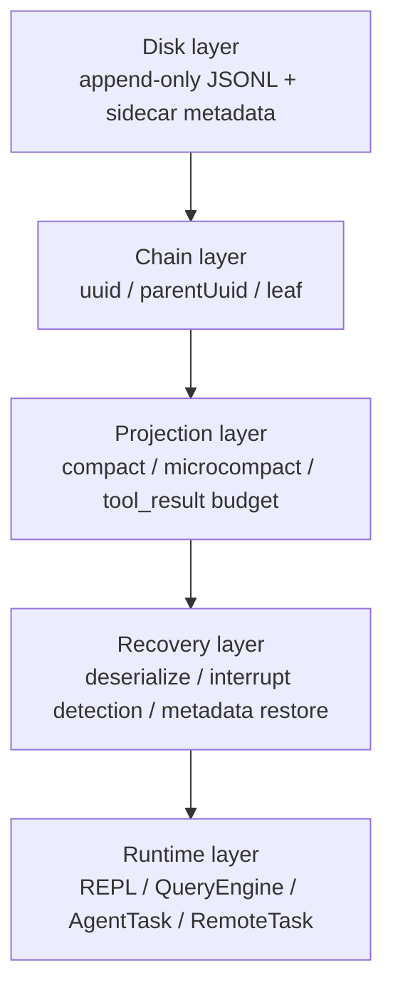
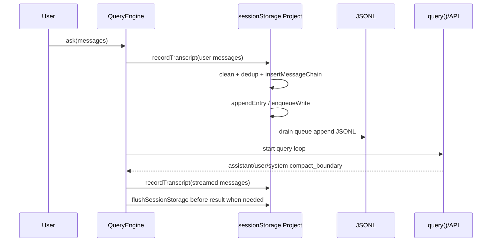
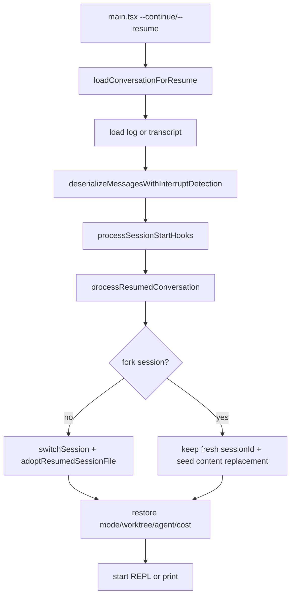
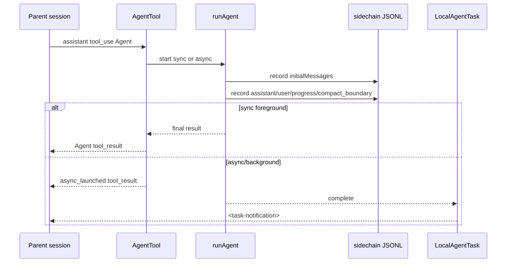
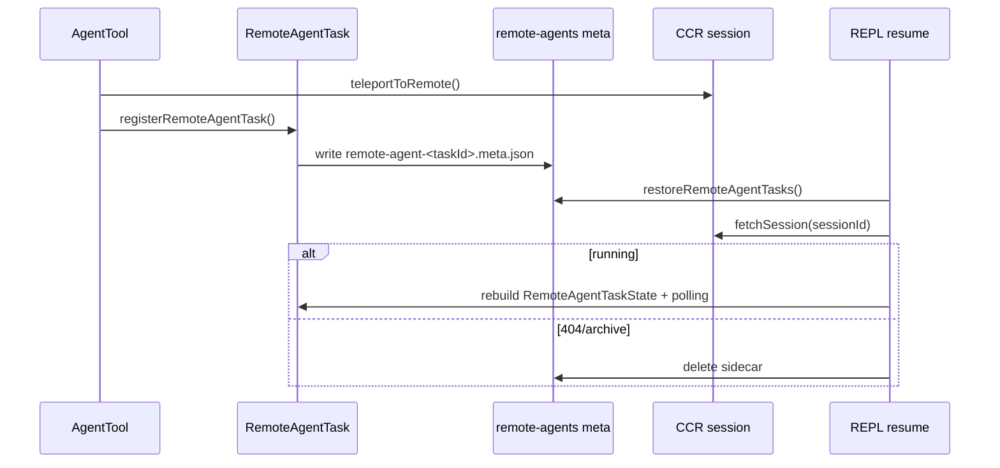

<!-- lang-switcher -->
**English** · [中文](/docs/zh/internals/session-transcript-persistence) · [日本語](/docs/ja/internals/session-transcript-persistence)

# JSONL transcript session persistence and recovery

This document explains Claude Code's JSONL-transcript mechanisms for session persistence, recovery, error recovery, context compaction, branching, subagents, fork agents, and remote agents.

It is a mechanism guide rather than a file-by-file set of source notes. It establishes a mental model first, then examines data structures, lifecycle, exceptional paths, and source entrypoints.

## How to read this guide

| If you want to understand | Read these sections first |
|---|---|
| Why resume restores the correct position | `Overview`, `Reading and chain reconstruction`, and `Recovery entrypoints` |
| Why history remains after compact but is no longer visible to the model | `Context views` and `Compaction and projection` |
| Why a subagent does not contaminate the main session | `Storage topology` and `Subagents and fork agents` |
| How `/branch` (alias `/fork`), `--fork-session`, and an AgentTool fork differ | `Comparing branches and forks` |
| How recovery works after a crash, limit error, or cancellation | `Error-recovery matrix` |

## Overview

Claude Code's local-session core is append-only JSONL. Each line contains an `Entry`, but recovery does not replay the entire file in file order. Instead, it:

1. Places transcript messages in a `uuid -> message` map.
2. Places metadata entries in their respective maps or arrays.
3. Selects the newest leaf.
4. Walks backward from that leaf through `parentUuid` to obtain the current effective chain.
5. Applies projections for compact, preserved segments, content replacements, and related mechanisms.
6. Restores in-memory state including sessionId, worktree, mode, agent setting, and task state.

Core invariants:

| Invariant | Meaning |
|---|---|
| JSONL remains append-only wherever possible | Compact, branch, and sidechain operations prefer appending new entries over editing old history directly. |
| `uuid/parentUuid` determines the timeline | File order represents write order only; recovery follows the chain. |
| Metadata does not participate in the main chain | Titles, tags, worktrees, and content replacements merge by sessionId, messageId, or agentId. |
| Compact does not delete history | It appends a boundary, and the model view starts after the final boundary. |
| A subagent is a sidechain | The subagent's complete conversation resides in a separate JSONL file; the parent session sees only the Agent tool's result or notification. |
| A remote agent is not a sidechain | A remote agent stores only sidecar identity locally; execution state comes from CCR. |

### System layers



### Storage topology

```text
~/.occ/projects/<project-key>/
  <sessionId>.jsonl
  <sessionId>/
    subagents/
      agent-<agentId>.jsonl
      agent-<agentId>.meta.json
      <subdir>/
        agent-<agentId>.jsonl
        agent-<agentId>.meta.json
    remote-agents/
      remote-agent-<taskId>.meta.json
```

| File | Creation function | Purpose |
|---|---|---|
| `<sessionId>.jsonl` | `getTranscriptPath()` | Main-session transcript. |
| `subagents/agent-<agentId>.jsonl` | `getAgentTranscriptPath(agentId)` | Local subagent or fork-agent sidechain. |
| `subagents/agent-<agentId>.meta.json` | `getAgentMetadataPath(agentId)` | agentType, worktreePath, and description. |
| `remote-agents/remote-agent-<taskId>.meta.json` | `getRemoteAgentMetadataPath(taskId)` | Remote CCR session identity used to resume polling. |

## Core source map

| Mechanism | Primary file |
|---|---|
| Entry types | `src/types/logs.ts` |
| Paths, writing, reading, and chain reconstruction | `src/utils/sessionStorage.ts` |
| Streaming reads of large files | `src/utils/sessionStoragePortable.ts` |
| CLI resume loading and interrupt detection | `src/utils/conversationRecovery.ts` |
| Session switching and state restoration | `src/utils/sessionRestore.ts` |
| Transcript writing for SDK/headless queries | `src/QueryEngine.ts` |
| API query loop, compact, and error recovery | `src/query.ts` |
| Compact implementation | `src/services/compact/*` |
| `/branch` | `src/commands/branch/branch.ts` |
| `/fork` (alias of `/branch`) | `src/commands/branch/index.ts` |
| AgentTool and subagents | `packages/builtin-tools/src/tools/AgentTool/*` |
| Generic forked side query | `src/utils/forkedAgent.ts` |
| Remote-agent task | `src/tasks/RemoteAgentTask/RemoteAgentTask.tsx` |

## Data model

`Entry` is defined in `src/types/logs.ts` and can be divided into three broad categories.

| Category | Typical type | Participates in the `parentUuid` chain | Key | Recovery purpose |
|---|---|---:|---|---|
| transcript message | `user`, `assistant`, `attachment`, `system` | Yes | `uuid` | Reconstruct the conversation chain, model context, and UI scrollback. |
| session metadata | `custom-title`, `tag`, `mode`, `worktree-state`, `pr-link`, `agent-setting` | No | `sessionId` | Restore title, tags, mode, worktree, PR, and agent settings. |
| message metadata | `file-history-snapshot`, `attribution-snapshot`, `summary` | No | `messageId` or `leafUuid` | Restore file history, attribution, and summaries. |
| replacement metadata | `content-replacement` | No | `sessionId` + optional `agentId` | Restore replacement decisions for large tool_result content. |
| queue/task metadata | `queue-operation`, `task-summary`, `speculation-accept` | No | Type-specific fields | Restore queues, task summaries, and speculation-acceptance statistics. |

### TranscriptMessage fields

`TranscriptMessage` is the type that participates in the chain:

| Field | Meaning |
|---|---|
| `uuid` | Current message ID. |
| `parentUuid` | Parent node in the chain; recovery follows this field backward. |
| `logicalParentUuid` | Logical parent retained when a compact boundary or similar operation breaks the chain. |
| `sessionId` | Owning main session. |
| `cwd` | Working directory when the message was written. |
| `timestamp` | Write time. |
| `version` | CLI version. |
| `gitBranch` | Git branch at write time. |
| `isSidechain` | Whether this is a subagent sidechain. |
| `agentId` | Agent that owns the sidechain. |
| `teamName/agentName/agentColor` | Swarm or teammate display metadata. |

### JSONL examples

Main-session messages:

```jsonl
{"type":"user","uuid":"u1","parentUuid":null,"sessionId":"s1","isSidechain":false,"cwd":"D:\\vibe\\claude-code","message":{"role":"user","content":"Fix the tests"}}
{"type":"assistant","uuid":"a1","parentUuid":"u1","sessionId":"s1","isSidechain":false,"message":{"role":"assistant","content":[{"type":"text","text":"I'll investigate."}]}}
```

Sidechain message:

```jsonl
{"type":"user","uuid":"u2","parentUuid":null,"sessionId":"s1","isSidechain":true,"agentId":"ag1","message":{"role":"user","content":"Analyze the compact path"}}
```

Agent `content-replacement`:

```jsonl
{"type":"content-replacement","sessionId":"s1","agentId":"ag1","replacements":[{"messageUuid":"u2","toolUseId":"toolu_...","blockIndex":0,"kind":"persisted"}]}
```

Compact boundary:

```jsonl
{"type":"system","subtype":"compact_boundary","uuid":"b1","parentUuid":"a9","logicalParentUuid":"a9","sessionId":"s1","compactMetadata":{"trigger":"auto","preTokens":182000,"messagesSummarized":94}}
```

## Write lifecycle

### Overall flow



Key points:

| Design | Rationale |
|---|---|
| Write user input to the transcript before sending it to the API | If the process crashes before the API call, resume can still recover the user's prompt. |
| Most assistant-stream writes are fire-and-forget | They do not block token streaming. |
| Flush before the result when necessary | Prevents an SDK or desktop client from losing the tail by terminating the process immediately after receiving a result. |
| `progress` does not participate in the chain | High-frequency progress ticks must not create branches or inflate the transcript. |

### Main-session writes

Entry point: `recordTranscript(messages, teamInfo?, startingParentUuidHint?, allMessages?)`.

Flow:

1. `cleanMessagesForLogging()` filters UI-only messages and other messages that should not persist.
2. `getSessionMessages(sessionId)` reads the UUID set already present in the current session.
3. New messages are passed to `insertMessageChain()`.
4. `insertMessageChain()` fills in `parentUuid/sessionId/cwd/timestamp/version/gitBranch/isSidechain`.
5. `appendEntry()` places the entry in the per-file queue.

Deduplication does not simply discard every duplicate. When a prefix contains messages that have already been written, the writer advances `startingParentUuid` so that subsequent new messages attach to the correct parent.

### Write queue, materialization, and flush

`Project` maintains a per-file queue:

| Mechanism | Detail |
|---|---|
| `writeQueues` | A `Map<filePath, entry[]>` that groups writes by file. |
| drain timer | 100ms by default; approximately 10ms for CCR or remote-persistence scenarios. |
| queue limit | When one queue exceeds 1000 entries, the oldest queued entry is discarded and resolved to prevent unbounded memory growth. |
| chunk limit | Each JSONL append chunk is approximately 100MB at most. |
| `flushSessionStorage()` | Cancels the timer and waits for the active drain and all tracked writes. |

`sessionFile` starts as `null`. At that point, metadata such as title, tag, mode, and worktree remains in memory or in `pendingEntries`. The first `user` or `assistant` message causes `materializeSessionFile()` to create the session file and then:

1. Write the cached metadata.
2. Replay pending entries.
3. Append all subsequent entries normally.

This design prevents opening the CLI without sending a message from creating a metadata-only session that pollutes the `/resume` list.

### Sidechain writes

A subagent uses `recordSidechainTranscript(messages, agentId, startingParentUuid?)`.

It still uses `insertMessageChain()` internally, but writes different fields:

```ts
isSidechain: true
agentId: agentId
```

When `appendEntry()` receives a transcript message with `isSidechain && agentId`, it routes the entry to:

```text
<project>/<sessionId>/subagents/agent-<agentId>.jsonl
```

A `content-replacement` carrying an `agentId` is likewise routed to that agent's sidechain JSONL rather than the main-session JSONL.

One important exception applies: sidechain writes do not use the main-session UUID set for deduplication. A fork agent reuses UUIDs from parent-session messages to inherit context. Deduplicating against the main session would remove that inherited context from the sidechain, leaving only the child prompt when the agent resumes.

## Reading and chain reconstruction

### From JSONL to the effective chain

```mermaid
flowchart TD
  A[loadTranscriptFile(file)] --> B[readTranscriptForLoad<br/>read large files in chunks]
  B --> C[parse JSONL Entry]
  C --> D[messages Map uuid->TranscriptMessage]
  C --> E[metadata maps/arrays]
  D --> F[progress bridge / preserved relink]
  F --> G[select leaf]
  G --> H[buildConversationChain]
  H --> I[recoverOrphanedParallelToolResults]
  I --> J[LogOption or agent transcript]
```

`loadTranscriptFile(filePath, opts?)` produces:

| Output | Purpose |
|---|---|
| `messages` | `uuid -> TranscriptMessage`. |
| `leafUuids` | Candidate leaves. |
| title/tag/mode/worktree/PR maps | Session metadata. |
| `fileHistorySnapshots` / `attributionSnapshots` | File-state recovery. |
| `contentReplacements` | Main-thread replacement records. |
| `agentContentReplacements` | `agentId -> replacement records`. |

### Leaves and parent chains

`buildConversationChain(messages, leaf)`:

1. Starts at the leaf.
2. Reads `parentUuid`.
3. Finds the parent message and continues walking backward.
4. Detects parent cycles to prevent an infinite loop.
5. Reverses the result into transcript order.
6. Restores DAG branches created by parallel tool_use operations.

A simplified example:

```text
u1 <- a1 <- u2 <- a2
                 ^
               leaf

recovery chain: a2 -> u2 -> a1 -> u1
forward chain: u1, a1, u2, a2
```

File order is not the effective chain. Branches, rewinds, and streaming fallbacks can leave dead branches in the JSONL file; recovery selects only the timeline containing the current leaf.

### Metadata merge rules

| Metadata | Merge method | Detail |
|---|---|---|
| `custom-title`, `tag`, `mode`, `worktree-state`, `pr-link`, `agent-setting` | Keyed by sessionId, usually last-wins | Restores the latest session state. |
| `file-history-snapshot`, `attribution-snapshot` | Keyed by messageId or stored as an array | Restores file history and attribution. |
| `content-replacement` | Appended to an array | Preserves replacement decisions from multiple rounds. |
| `agentContentReplacements` | Keyed by agentId and appended to an array | Reconstructs sidechain replacement state during agent resume. |

### Large-file read optimizations

A transcript can grow to hundreds of megabytes or even gigabytes. The read path applies several safeguards.

| Optimization | Location | Purpose |
|---|---|---|
| Chunked reads | `readTranscriptForLoad()` | Avoid exhausting memory by reading the file all at once. |
| Skip large metadata at the file-descriptor layer | `readTranscriptForLoad()` | Prevent large entries such as `attribution-snapshot` from entering the buffer. |
| Skip the pre-compact prefix | `readTranscriptForLoad()` | After a non-preserved compact boundary, retain only the boundary and later content. |
| Scan pre-boundary metadata | `scanPreBoundaryMetadata()` | Preserve display metadata such as title, tag, mode, worktree, and PR even when pre-compact content is skipped. |
| Byte-level dead-branch pruning | `walkChainBeforeParse()` | Before JSON.parse, assemble only the active chain and metadata, skipping dead fork or rewind branches. |
| Lite-read limit | `MAX_TRANSCRIPT_READ_BYTES` | Callers that read a raw transcript directly must avoid files larger than approximately 50MB. |

`walkChainBeforeParse()` concatenates buffers only when it expects to discard at least half of the original buffer, preventing the optimization itself from imposing unnecessary cost.

### Preserved segments

A compact boundary can include `compactMetadata.preservedSegment`. During recovery, `applyPreservedSegmentRelinks()`:

1. Validates that the `tailUuid -> headUuid` chain is complete.
2. Attaches the preserved segment's head after the compact anchor.
3. Attaches the anchor's other children to the preserved tail.
4. Deletes old messages before the final boundary that do not belong to the preserved segment.
5. Zeros usage for preserved assistant messages so that recovery does not trigger autocompact immediately.

Diagram:

```text
before compact: old... -> anchor -> head -> ... -> tail -> next
after compact: boundary/summary -> head -> ... -> tail -> next
```

### Repairing legacy chains

| Problem | Repair |
|---|---|
| Legacy `progress` entries participated in the parent chain | `progressBridge` redirects a parent that points to progress back to progress's real parent. |
| Parent cycle | `buildConversationChain()` detects the cycle, records it, and returns a partial chain. |
| Parallel tool_use creates a DAG | `recoverOrphanedParallelToolResults()` restores siblings by matching the assistant `message.id` and tool_result parent relationships. |
| Orphaned tail from streaming fallback | A tombstone triggers `removeTranscriptMessage(uuid)` to delete the failed attempt. |

## Recovery entrypoints

### Entrypoint matrix

| Entrypoint | Load source | Reuse original sessionId | Adopt original JSONL | Characteristics |
|---|---|---:|---:|---|
| `--continue` | Most recent session in the current directory | Yes | Yes | Skips background or daemon non-interactive sessions that are still live. |
| `--resume <uuid>` | Specified session | Yes | Yes | Also accepts a custom title, search term, or picker selection. |
| `--resume <jsonl>` | Specified JSONL file | Yes | Yes | Supported by the internal Ant and print paths. |
| `--fork-session` + resume | Messages from an old session | No | No | Retains a new sessionId and uses the old messages as initial content for the new session. |
| `--resume-session-at <message.id>` | Print/headless resume | Depends on resume | Depends on resume | Truncates at the specified assistant message. |
| REPL `/resume` | Picker or log option | Reuse or fork | Adopt or do not adopt | Runs SessionEnd and SessionStart hooks and switches UI state. |

### CLI resume flow



Core functions:

| Function | Responsibility |
|---|---|
| `loadConversationForResume()` | Uniformly loads the latest session, a sessionId, a LogOption, or a JSONL path; supplements the lite log; copies plan and file history; checks consistency; deserializes and detects interrupts; then returns metadata. |
| `processResumedConversation()` | Restores interactive CLI startup; switches or forks the session; restores cost, worktree, mode, agent setting, and attribution. |
| `restoreSessionStateFromLog()` | Restores AppState state, including file history, attribution, and TodoWrite todos. |

### REPL `/resume`

Resume inside the REPL performs additional work to switch from the current session to another session:

1. Clean the target log's messages.
2. Run SessionEnd hooks for the current session.
3. Run SessionStart resume hooks for the target session.
4. Save the current session's cost and restore the target session's cost.
5. Call `switchSession(sessionId, dirname(fullPath))` to switch sessionId and project directory atomically.
6. Call `resetSessionFilePointer()` and restore the metadata cache.
7. For a non-fork resume, exit the previous worktree, restore the target worktree, and call `adoptResumedSessionFile()`.
8. For a fork, do not adopt the original transcript and do not exit the current worktree.
9. Reconstruct content-replacement state.
10. Restore remote and local task state.
11. Replace messages, clear tool JSX, and clear the input field.

### Interrupt-detection matrix

`deserializeMessagesWithInterruptDetection()` first cleans historical messages:

| Cleanup | Purpose |
|---|---|
| Migrate legacy attachments | Maintain compatibility with old transcripts. |
| Delete invalid `permissionMode` values | Prevent an invalid enum from another build from entering runtime state. |
| Filter unresolved tool_use | Prevent API errors caused by unpaired tool_use and tool_result blocks. |
| Filter orphaned thinking-only assistant messages | Remove orphaned thinking blocks left by interrupted streaming. |
| Filter whitespace-only assistant messages | Remove empty assistant messages left by cancellation. |

It then examines the final turn-relevant message:

| Final relevant message | Result | Additional action |
|---|---|---|
| assistant | `none` | stop_reason is often null in streaming persistence, so it cannot indicate whether the turn finished. |
| ordinary user | `interrupted_prompt` | Insert the `NO_RESPONSE_REQUESTED` sentinel to preserve API validity. |
| meta user or compact-summary user | `none` | Do not treat an internal control message as a new user request. |
| tool_result user | Usually `interrupted_turn` | Exception: terminal tool_result from Brief, SendUserMessage, or SendUserFile counts as complete. |
| attachment | `interrupted_turn` | Append a meta user message: `Continue from where you left off.` |
| system/progress/API-error assistant | Skip | Do not use it to decide whether the turn completed. |

`interrupted_turn` is normalized to `interrupted_prompt`, so upper layers handle only one state indicating that execution must continue.

## Error-recovery matrix

| Scenario | Recovery strategy | Transcript effect |
|---|---|---|
| Process crashes before the API call | `QueryEngine.ask()` has already written the user prompt. | Resume sees an ordinary user message and returns `interrupted_prompt`. |
| Streaming fallback creates an orphan assistant | Yield a tombstone; the REPL removes the UI message and calls `removeTranscriptMessage(uuid)`. | Prefer modifying only the final 64KB of JSONL; when the target in a large file is not in the tail, skip the slow rewrite. |
| prompt-too-long / media-too-large | Withhold the error during streaming, then attempt reactive compact; expose the error only if compaction fails. | On success, write a boundary and summary and retry; write an API-error message only on failure. |
| max_output_tokens | First increase the max-output override; if that still fails, inject an internal recovery prompt to continue; expose the error only after exhausting retries. | Whether the internal retry prompt becomes an ordinary transcript entry depends on whether it is yielded to the outer layer. |
| Auto compact disabled at the blocking limit | Yield a prompt-too-long-style API error directly. | Preserve room for the user to run `/compact` manually. |
| Abort during streaming or tool execution | Fill in missing tool_result blocks and yield a user interruption message when necessary. | When `reason === interrupt`, omit the interruption message because the subsequent queued user message already supplies context. |
| Stop hook blocks | Add the hook blocking error to state and retry. | A reactive-compact guard prevents an infinite hook/error/compact loop. |
| Compact boundary points to a tail not yet persisted | Before writing the boundary, QueryEngine forces the messages preceding the preserved tail to be written. | Prevent recovery from seeing a boundary that references a nonexistent UUID. |
| Incomplete tail in a subagent transcript | `resumeAgentBackground()` again filters unresolved tool_use, orphaned thinking, and blank assistant messages. | Prevent invalid API requests after the agent resumes. |

## Context views

The system maintains four views of the same messages. They must not be conflated:

| View | Contents | Consumer |
|---|---|---|
| Raw transcript | Every JSONL entry, including old history, dead branches, metadata, and sidechains. | Disk persistence and auditing. |
| UI scrollback | Messages currently displayed by the REPL, potentially including pre-compact history and collapsed UI groups. | Terminal UI. |
| Active query view | Messages after `getMessagesAfterCompactBoundary()`. | Context management in `query.ts`. |
| API wire view | Output of `normalizeMessagesForAPI()`, after filtering system boundaries, repairing tool pairing, and inserting cache edits. | Anthropic, OpenAI, Gemini, and other API clients. |

The active context for each query is produced in this order:

1. `getMessagesAfterCompactBoundary(messages)`: take the active slice after the most recent compact boundary.
2. Delete raw `toolUseResult` payloads from old messages, retaining only the `message.content` required by the API.
3. `applyToolResultBudget()`: replace oversized tool_result content with a preview or stub and write a `content-replacement` entry.
4. `microcompactMessages()`: apply time-based microcompact, then cached microcompact.
5. `autoCompactIfNeeded()`: apply proactive compact, preferring session-memory compact.
6. Predictive autocompact: estimate growth for the current turn before the API request and compact early when necessary.
7. After an actual API limit error: apply reactive compact.

## Compaction and projection

### Compact-type comparison

| Type | Trigger | Summary source | Calls compact API | Preserves tail segment | Failure strategy |
|---|---|---|---:|---:|---|
| manual compact | `/compact` | Compact-summary API or session memory | Depends on path | Depends on full/partial/SM | Show the failure or fall back to traditional compact. |
| auto compact | Token threshold | Session memory first, then summary API | Depends on path | Depends on path | Circuit-break after consecutive failures; stop automatic compaction after 3 failures by default. |
| predictive compact | Estimated growth before API request | Same as auto compact | Depends on path | Depends on path | Continue the original request on failure or defer to later error recovery. |
| reactive compact | Actual API 413 or media error | `compactConversation()` | Yes | In the current wrapper, depends on the compact implementation | `hasAttemptedReactiveCompact` prevents a loop. |
| session memory compact | Attempted before manual/auto compact | Session-memory file | No | Yes | If the post-compact context still exceeds the threshold, abandon it and fall back to traditional compact. |
| microcompact | Small time-based or cached compaction | Local cleanup or an API cache edit | Not necessarily | Not applicable | Usually does not change the primary JSONL history. |

### Compact result shape

Traditional compact generates:

1. A `compact_boundary` system message.
2. A compact-summary user message.
3. Post-compact attachments, such as current files, plan mode, skills, MCP/tool-schema deltas, and hook results.

Simplified before and after:

```text
Raw/UI:
  u1, a1, u2, a2, ... u99, a99,
  system:compact_boundary,
  user:compact summary,
  attachment:current files,
  u100

Active query view:
  system:compact_boundary,
  user:compact summary,
  attachment:current files,
  u100

API wire view:
  user:compact summary,
  attachment/content,
  u100
```

The boundary itself is a system message and is eventually removed by API normalization. Its primary value lies in local projection, recovery, and statistics.

### Boundary metadata

`createCompactBoundaryMessage()` writes:

| Field | Meaning |
|---|---|
| `compactMetadata.trigger` | `manual` or `auto`. |
| `compactMetadata.preTokens` | Token count before compact. |
| `compactMetadata.userContext` | Additional instructions supplied by the user for manual compact. |
| `compactMetadata.messagesSummarized` | Number of summarized messages. |
| `logicalParentUuid` | Final message before compact, retained for logical tracing. |

Later paths also add:

| Field | Source | Purpose |
|---|---|---|
| `preCompactDiscoveredTools` | traditional/SM compact | Restore visibility of deferred tool schemas. |
| `preservedSegment.{headUuid,anchorUuid,tailUuid}` | partial/SM compact | During recovery, attach the preserved tail after the boundary. |

### Tool-result budget and content replacement

A large tool_result does not necessarily enter later context in full. `applyToolResultBudget()` aggregates a budget at the API-level user-message granularity and, when necessary, persists large blocks and replaces them with a smaller preview or stub.

Key points:

| Point | Detail |
|---|---|
| Replacement decisions are written to JSONL | `recordContentReplacement()` writes a `content-replacement` entry. |
| Main thread and agent are separate | Without `agentId`, write to the main JSONL; with `agentId`, write to the sidechain JSONL. |
| Resume reconstructs replacement state | Prevents the same large result from returning to full content after recovery, which would sharply increase token use or invalidate the prompt cache. |
| `--fork-session` seeds records | Copy replacement decisions into the new session when forking. |

### Session-memory compact

`sessionMemoryCompact.ts` implements an experimental path attempted before traditional summary compact. Its flow is:

1. Wait for session-memory extraction to complete.
2. Read the session-memory file.
3. If `lastSummarizedMessageId` is present, retain a safe tail after it; otherwise treat a resumed session as already having a memory summary.
4. Adjust the cut point to avoid separating tool_use from tool_result or breaking thinking blocks.
5. Create a standard `compact_boundary` plus summary user message.
6. If the post-compact token count still exceeds the threshold, abandon the result and fall back to traditional compact.

Because the output remains a standard `CompactionResult`, downstream transcript-writing and recovery logic is shared with traditional compact.

### Context-collapse has been removed

The context-collapse (marble origami) stub implementation and persistence interface have been removed from this repository. The `src/services/contextCollapse/` directory, the `recordContextCollapseCommit()` / `recordContextCollapseSnapshot()` write interfaces, and the `marble-origami-commit` / `marble-origami-snapshot` JSONL entry types no longer exist, and the loader no longer collects them.

The context-reduction mechanisms that currently operate are therefore compact, session-memory compact, the tool_result budget, and microcompact.

### Post-compact cleanup

`runPostCompactCleanup(querySource)` always clears:

- Microcompact state.
- System-prompt sections.
- Classifier approvals.
- Speculative Bash checks.
- Beta tracing.
- The session-messages memo cache.
- Compact-cleanup callbacks.
- Under `COMMIT_ATTRIBUTION`, asynchronously sweep the file-content cache.

Only main-thread compact clears:

- The `getUserContext` cache.
- The memory-files cache.

The reason is that a subagent and the main thread run in the same process and share module-level state. If an `agent:*` compact operation cleared the main thread's `getUserContext` or memory cache, it would corrupt parent-session state.

It explicitly does not call `resetSentSkillNames()`, preventing compact from reinjecting the complete skill listing and wasting tokens and prompt-cache capacity.

## Comparing branches and forks

| Entrypoint | Essence | New main session | Subagent | Persistence location | What the parent session sees | Recovery method |
|---|---|---:|---:|---|---|---|
| `/branch` (alias `/fork`) | Copy the current main transcript to a new JSONL file | Yes | No | `<newSessionId>.jsonl` | Switches directly to the new branch session | Ordinary session resume. |
| `--fork-session` | During resume/continue, use old messages as the initial messages of a new session | Yes | No | Materialized when the new session first writes | Continues in the new session immediately at startup | New-session resume. |
| `AgentTool` with `subagent_type` omitted (requires `FORK_SUBAGENT`) | Tool-level fork subagent | No | Yes | `subagents/agent-<id>.jsonl` + `.meta.json` | Synchronous final tool_result or asynchronous notification | `resumeAgentBackground()`. |
| Ordinary asynchronous AgentTool | Background local subagent | No | Yes | `subagents/agent-<id>.jsonl` + `.meta.json` | `async_launched` plus task notification | `resumeAgentBackground()`. |
| Remote AgentTool | CCR remote session | No | Remote | `remote-agents/*.meta.json` | Remote task output or notification | `restoreRemoteAgentTasks()` + CCR. |

### `/branch`

`/branch` creates a new session file; it does not append a branch marker to the original JSONL file.

Flow:

1. Generate a new sessionId.
2. Read the current transcript file.
3. Filter main-session messages, excluding `isSidechain` and non-transcript entries.
4. Copy the messages and rewrite `sessionId`.
5. Rebuild the `parentUuid` chain.
6. Add `forkedFrom: { sessionId, messageUuid }`.
7. Copy the original session's `content-replacement` entries and change them to the new sessionId.
8. Write `<newSessionId>.jsonl`.
9. Construct a `LogOption` and make the REPL resume into the new branch.

### `--fork-session`

`--fork-session` changes only ownership during resume:

| Non-fork resume | fork-session resume |
|---|---|
| Switch to the old sessionId. | Retain the fresh sessionId created at startup. |
| `adoptResumedSessionFile()` adopts the old JSONL file. | Do not adopt the old JSONL file. |
| Continue appending to the old transcript. | Materialize a new transcript on the next write. |
| The original session continues to grow. | The original session is not modified. |

If the old session has `content-replacement` records, those records are first seeded into the new session so that replacement state for large tool_result content is not lost.

## Subagents and fork agents

### Ordinary subagent

An ordinary AgentTool subagent ultimately runs through `runAgent()`:



The parent session usually records only:

- The Agent tool_use.
- The Agent tool_result.
- The asynchronous launch result.
- The task notification.
- Progress when necessary.

The child agent's complete internal tool calls and messages reside in the sidechain JSONL and do not enter the main session's active context.

### Fork agent

A fork agent is a specialized AgentTool subagent. It inherits the parent context, system prompt, tools, model, and thinking configuration so that several child agents share the longest possible byte-identical prompt-cache prefix.

Key inheritance behavior:

| Inherited value | Implementation |
|---|---|
| system prompt | Prefer `toolUseContext.renderedSystemPrompt`; rebuild it only as a fallback. |
| tools | Use the parent's `toolUseContext.options.tools` with `useExactTools: true`. |
| model | `FORK_AGENT.model = "inherit"`. |
| thinking/non-interactive | Inherit through exact tools and options to avoid diverging cache keys. |
| messages | `forkContextMessages = toolUseContext.messages`. |

`buildForkedMessages()` constructs a cache-friendly tail:

```text
parent history...
assistant: [text/thinking/tool_use A/tool_use B/...]
user:
  tool_result for A = "Fork started — processing in background"
  tool_result for B = "Fork started — processing in background"
  directive = "<this fork's task>"
```

Several fork children share the same long prefix and differ only in the final directive.

Restrictions:

| Restriction | Reason |
|---|---|
| Requires the `FORK_SUBAGENT` feature. | Feature gating. |
| Disabled in coordinator mode. | The coordinator already has its own orchestration model. |
| Disabled in non-interactive sessions. | Fork subagents follow an interactive background-task model. |
| A fork child cannot fork recursively. | Prevents unbounded forking; detected through querySource and a boilerplate tag. |
| Resuming a fork agent does not pass `forkContextMessages` again. | The sidechain already contains the parent-context slice; passing it twice would duplicate tool_use IDs. |

### `runForkedAgent()` is not an AgentTool fork

`runForkedAgent()` in `src/utils/forkedAgent.ts` is an internal cache-safe side-query utility used for session memory, prompt suggestions, summaries, and related operations. It reuses the parent's system, user, and system context, tools, and messages and accepts an optional `skipTranscript`, but it does not write AgentTool metadata by default and is not an AgentTool fork with which the user can continue a conversation.

## Agent recovery

The recovery entrypoint for a local agent is `resumeAgentBackground()`.

Flow:

```mermaid
flowchart TD
  A[user continues agent] --> B[getAgentTranscript(agentId)]
  B --> C[load sidechain JSONL + build chain]
  C --> D[readAgentMetadata(agentId)]
  D --> E[filter unresolved tool_use/thinking/blank assistant]
  E --> F[reconstruct content replacement state]
  F --> G{metadata.worktreePath exists?}
  G -- yes --> H[runWithCwdOverride(worktreePath)]
  G -- no --> I[parent cwd]
  H --> J[register async LocalAgentTask]
  I --> J
  J --> K[continue query loop]
```

During recovery:

| State | Source |
|---|---|
| agent transcript | `agent-<agentId>.jsonl`. |
| agent type | `agent-<agentId>.meta.json`. |
| fork/general agent selection | The metadata `agentType`. |
| worktree cwd | Metadata `worktreePath`; fall back to the parent cwd if the directory does not exist. |
| content replacement | Sidechain records plus gap-filling from the parent's live state. |
| task UI | Register the asynchronous task again. |

## Remote-agent recovery

A remote CCR agent does not continue execution from a local sidechain.



Differences:

| Local subagent | Remote agent |
|---|---|
| Has a complete sidechain JSONL file. | Has no local execution transcript. |
| Resume can continue the API conversation. | Resume restores polling only. |
| State comes from JSONL plus `.meta.json`. | State comes from the CCR session plus a local sidecar. |
| The local sidechain remains auditable after completion. | The sidecar is deleted after completion or archival. |

## Common misconceptions

| Misconception | Correct model |
|---|---|
| JSONL order is conversation order | Recovery follows the leaf and `parentUuid`, not a simple sequential replay. |
| Compact deletes old history | Compact appends a boundary; old history remains in the raw transcript. |
| The boundary is sent to the model | The boundary is a local system marker filtered out by API normalization. |
| `/fork` creates a fork subagent | `/fork` is now only an alias of `/branch`, which creates a new main session. Omitting `subagent_type` from AgentTool triggers a fork subagent and requires the default-disabled `FORK_SUBAGENT`. |
| `--fork-session` is equivalent to `/branch` | It does not copy a file; it retains fresh-session ownership during resume. |
| Subagent messages enter the main context | The parent session sees only Agent tool results or notifications; complete internal messages remain in the sidechain. |
| A remote agent has a local sidechain | A remote agent has only local sidecar identity; execution state comes from CCR. |
| Context-collapse already compresses context | The context-collapse implementation has been removed from this repository, so no collapse path currently exists. |

## Source entrypoint index

| Question | Start here |
|---|---|
| Which types belong to the Entry union? | `Entry` in `src/types/logs.ts`. |
| Main-transcript path | `getTranscriptPath()` in `src/utils/sessionStorage.ts`. |
| Subagent-transcript path | `getAgentTranscriptPath(agentId)`. |
| Remote-sidecar path | `getRemoteAgentsDir()` / `getRemoteAgentMetadataPath()`. |
| Main write path | `recordTranscript()`. |
| Sidechain write path | `recordSidechainTranscript()`. |
| Write queue | `Project.enqueueWrite()` / `drainWriteQueue()` / `flush()`. |
| Lazy materialization | `Project.materializeSessionFile()`. |
| Tombstone deletion | `removeTranscriptMessage()` / `Project.removeMessageByUuid()`. |
| Read a transcript | `loadTranscriptFile()`. |
| Read a large file | `readTranscriptForLoad()` in `sessionStoragePortable.ts`. |
| Dead-branch pruning | `walkChainBeforeParse()`. |
| Reconstruct the parent chain | `buildConversationChain()`. |
| Restore parallel tool_result blocks | `recoverOrphanedParallelToolResults()`. |
| Preserved segment | `applyPreservedSegmentRelinks()`. |
| Load CLI resume | `loadConversationForResume()`. |
| Switch resume state | `processResumedConversation()`. |
| Restore AppState | `restoreSessionStateFromLog()`. |
| Detect interrupts | `deserializeMessagesWithInterruptDetection()`. |
| Active context | `getMessagesAfterCompactBoundary()`. |
| Query-context pipeline | `src/query.ts`. |
| Compact boundary | `createCompactBoundaryMessage()`. |
| Auto compact | `autoCompactIfNeeded()` / `shouldAutoCompact()`. |
| Session-memory compact | `src/services/compact/sessionMemoryCompact.ts`. |
| Reactive compact | `src/services/compact/reactiveCompact.ts`. |
| Post-compact cleanup | `runPostCompactCleanup()`. |
| `/branch` (alias `/fork`) | `src/commands/branch/branch.ts` + `src/commands/branch/index.ts`. |
| AgentTool fork | `AgentTool.tsx` + `forkSubagent.ts`. |
| Run an ordinary subagent | `runAgent.ts`. |
| Resume an agent | `resumeAgent.ts`. |
| Restore remote tasks | `restoreRemoteAgentTasks()`. |
