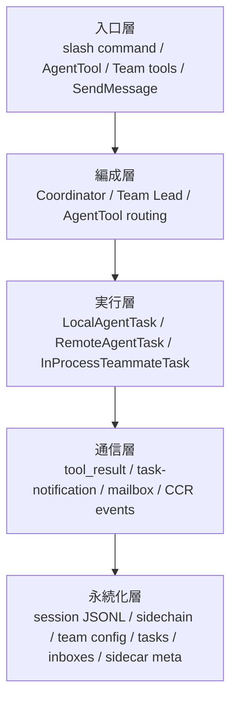
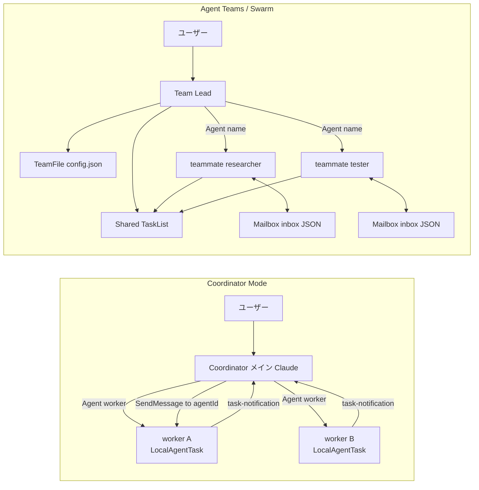
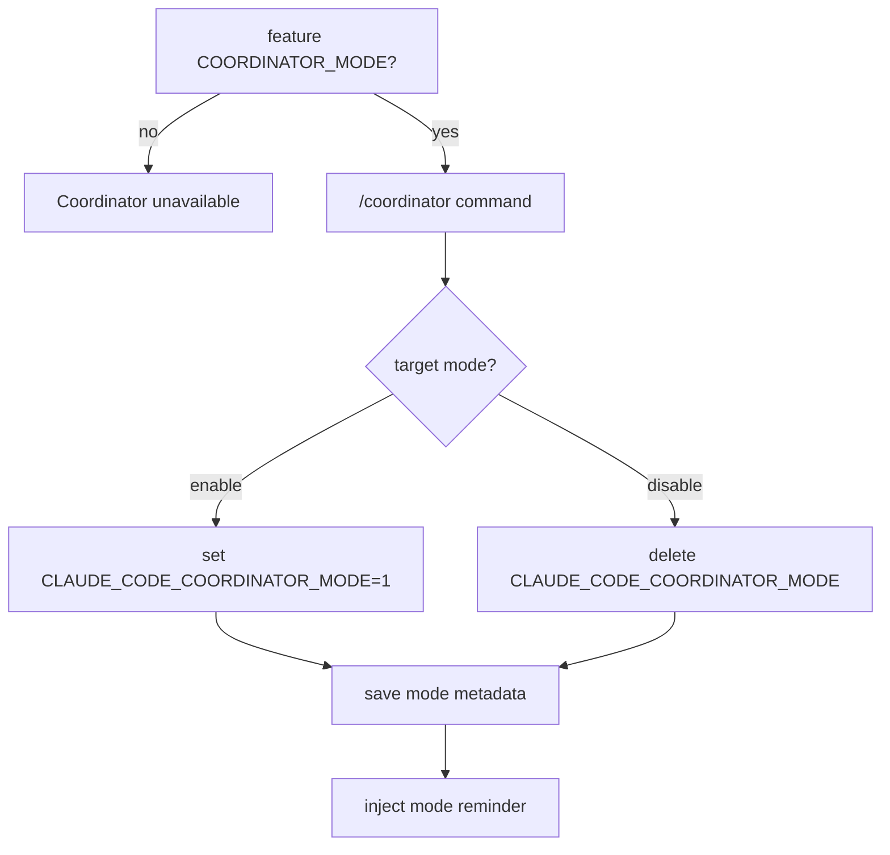
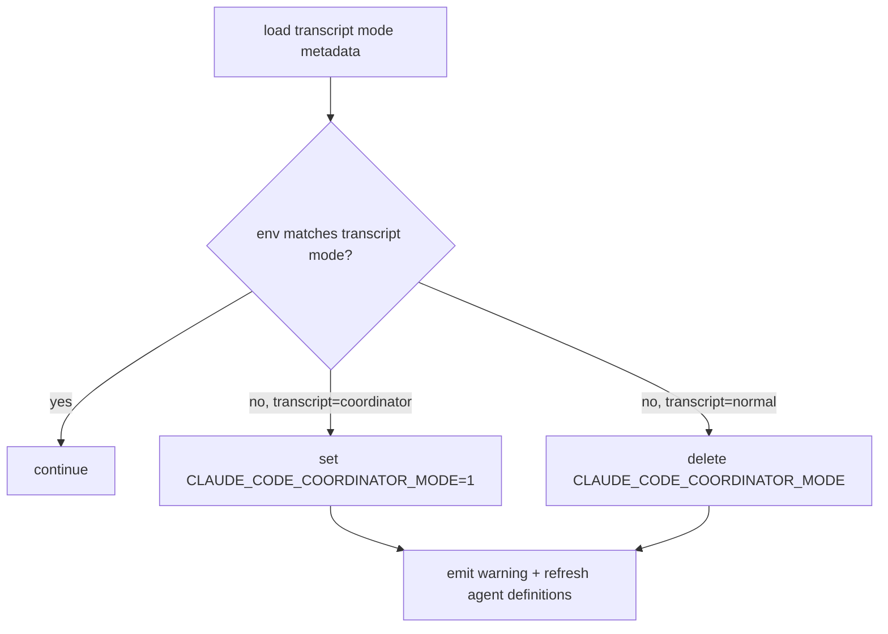
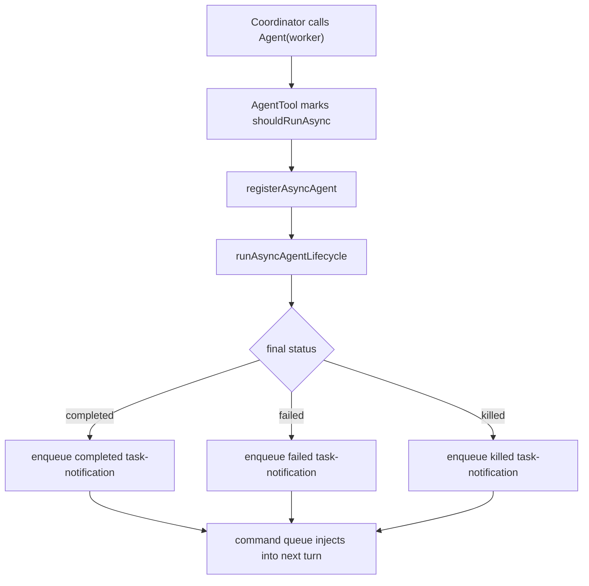
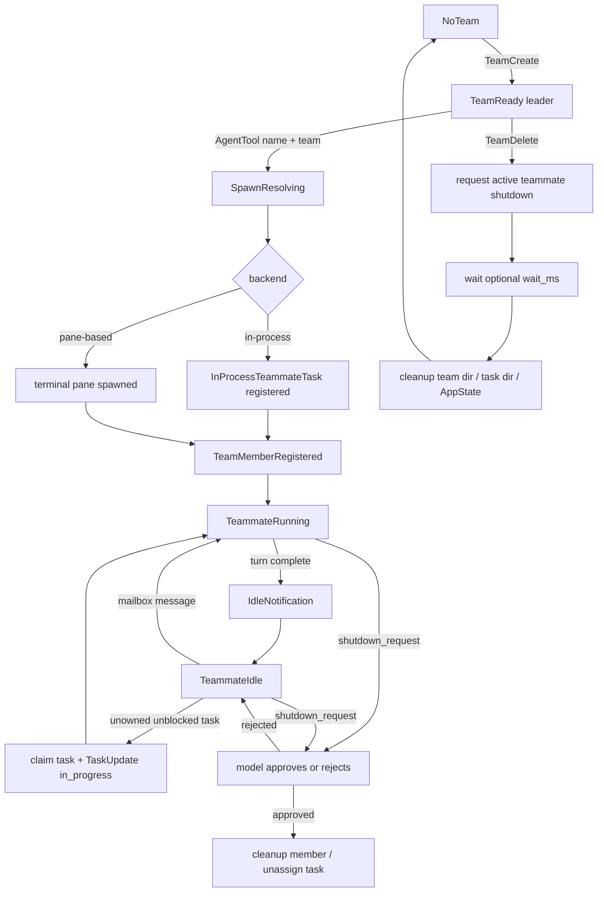
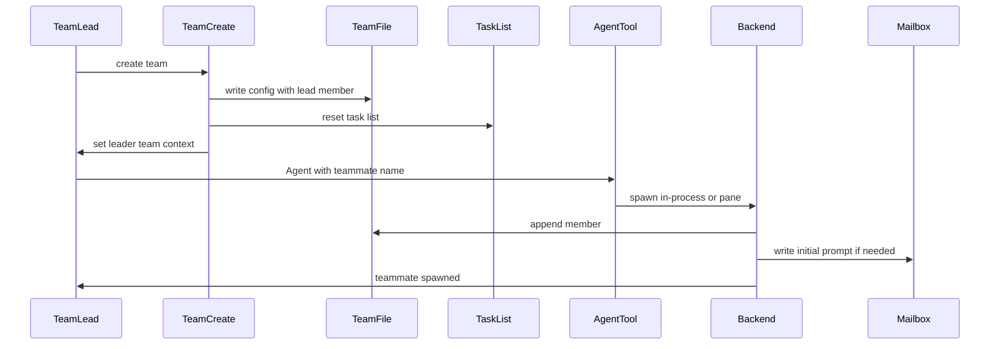
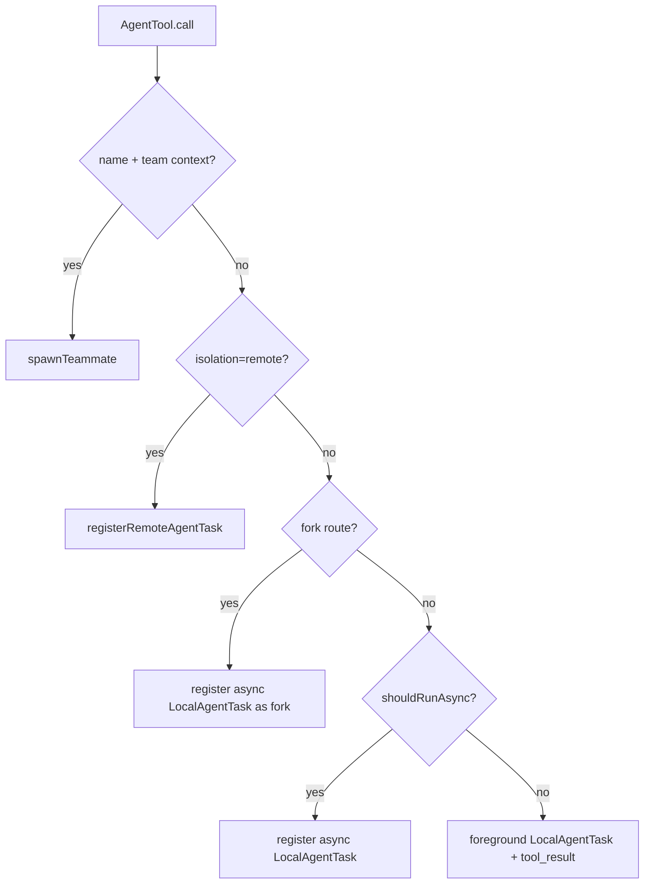
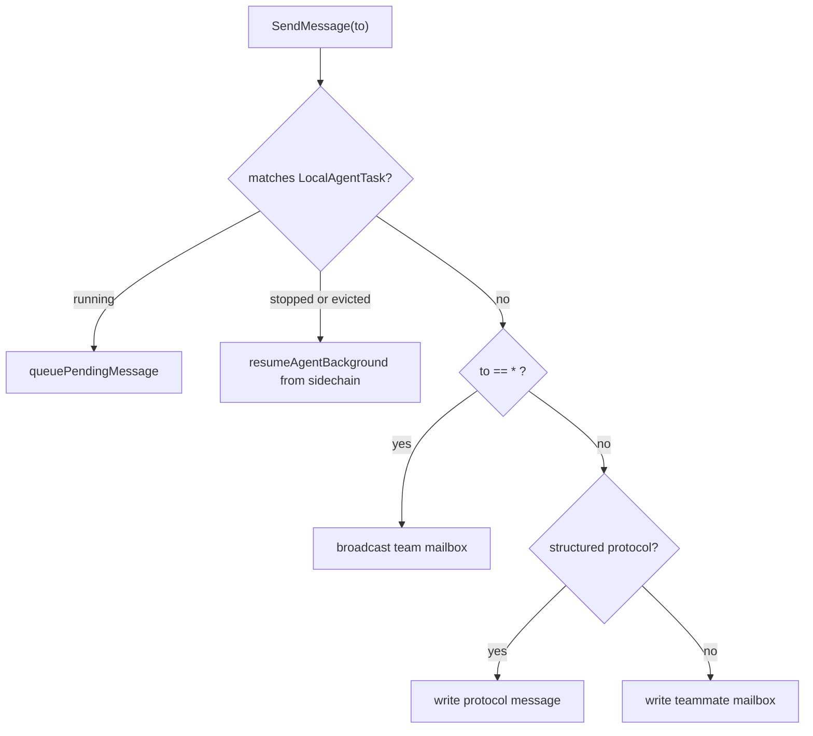
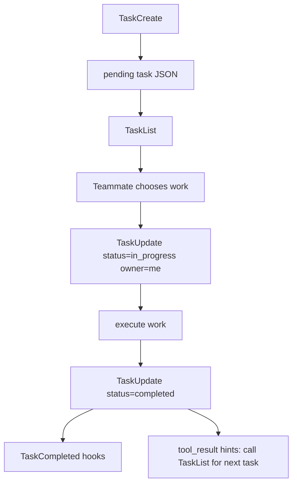

<!-- lang-switcher -->
[English](/docs/en/agent/coordinator-and-swarm) · [中文](/docs/zh/agent/coordinator-and-swarm) · **日本語**

Claude Code には、どれも「マルチエージェント」に見える仕組みが多数あります。`Agent` ツール、fork agent、Coordinator Mode、Agent Teams / Swarm、remote agent、バックグラウンドの runtime task、`TaskCreate` のタスクボードです。これらは基盤の一部を共有していますが、同じ抽象ではありません。

この文書は、仕組みをまたいだ理解のためのものです。タスクが「割り当てられた」、teammate が idle になった、`<task-notification>` がメインスレッドへ戻った、team ディレクトリは残っているのに teammate が動かない、といった場面で、どの仕組みに属するか、状態がどこにあるか、どの通信経路を使うか、何を復元できるかを判断できるようにします。

## 全体のメンタルモデル

最も短いメンタルモデルは次のとおりです。

```text
Agent は人に仕事を任せる。
TaskCreate はボードにタスクカードを貼る。
Runtime Task は実際に動いている人、またはリモートにいる人の影である。
Coordinator は星型のオーケストレーターである。
Swarm はメンバー、メールボックス、タスクボードを持つチームである。
```

まず用語を同じ粒度に揃えます。

| 概念 | 本質 | 入口 | 状態の場所 | 結果の戻り方 |
|---|---|---|---|---|
| 通常の sync subagent | 1 回限りの foreground `Agent` tool call | `Agent({ subagent_type })` | foreground `LocalAgentTask` | 現在の turn の `tool_result` |
| 通常の async subagent | 1 回限りの background agent | `Agent({ subagent_type, async: true })` または自動バックグラウンド化 | `AppState.tasks` + sidechain | `async_launched` + `<task-notification>` |
| fork agent | 親コンテキストと exact tools を継承するバックグラウンド分岐 | `subagent_type` を省略し、fork gate の条件を満たす | `LocalAgentTask` + `.meta.json` | `<task-notification>` |
| coordinator worker | Coordinator が起動する `worker` async subagent | Coordinator が `Agent({ subagent_type: "worker" })` を呼ぶ | `LocalAgentTask` | `<task-notification>` + `SendMessage(to: agentId)` |
| swarm teammate | 長いライフサイクルを持つ team member | `Agent({ name, team_name?, prompt })` | `InProcessTeammateTask` または pane member | name 指定の mailbox。idle 後も続行できる |
| remote agent | リモート実行主体のローカルミラー | `Agent(..., isolation: "remote")` | `RemoteAgentTask` + remote sidecar | CCR events / polling |
| work item task | 共有タスクボードの項目 | `TaskCreate/Update/List/Get` | `~/.occ/tasks/<taskListId>/*.json` | teammate / lead が claim して更新する |
| runtime task | 実行中または過去に実行されたバックグラウンド実行主体 | agent、shell、workflow、remote などの入口 | `AppState.tasks` | UI、spinner、resume、kill |

## システムの階層

マルチエージェントシステムは 5 層に分けて考えられます。各層は 1 つの問いに答えます。

| 層 | 答える問い | 代表的なオブジェクト |
|---|---|---|
| 入口層 | ユーザーまたはモデルはどのツールで動作を起動するか | `/coordinator`、`AgentTool`、`TeamCreate`、`SendMessage`、`TaskUpdate` |
| 編成層 | 誰が分解、割り当て、制御、統合を担当するか | Coordinator、Team Lead、AgentTool routing |
| 実行層 | 誰が実際に実行するか、または実行状態を表すか | `LocalAgentTask`、`InProcessTeammateTask`、`RemoteAgentTask` |
| 通信層 | 結果と制御シグナルはどう戻るか | `tool_result`、`<task-notification>`、mailbox、CCR events |
| 永続化層 | プロセス再起動後も何が見えるか | session JSONL、sidechain、team config、task files、inbox、sidecar meta |



この 5 層は 1 対 1 に対応しません。Coordinator worker は実行層では `LocalAgentTask` で、通信層では `<task-notification>` と `SendMessage(to: agentId)` を使います。Swarm teammate は実行層で `InProcessTeammateTask` の場合があり、通信層では mailbox を使います。remote agent は実行層ではローカルの `RemoteAgentTask` ミラーですが、実際の実行状態は CCR から取得します。

## どの仕組みをいつ使うか

| 場面 | 推奨する仕組み | 理由 |
|---|---|---|
| 1 つの中枢が分解、割り当て、統合、軌道修正を担う必要がある | Coordinator Mode | メインスレッドをオーケストレーターに限定し、直接変更して混乱するのを抑える。 |
| 比較的独立した複数のタスクを、長期的な仲間が継続して担当する | Agent Teams / Swarm | team config、mailbox、shared task list がある。 |
| 1 人の専門家へ調査や変更を任せたいだけ | 通常の subagent | コストが低く、モデル経路が短く、結果が現在の turn またはバックグラウンド通知へ直接戻る。 |
| 現在のコンテキストを複製して並列探索したい | fork agent | 親コンテキストと exact tools を継承し、分岐探索に適する。 |
| リモート環境で作業を実行したい | remote agent | ローカルには `RemoteAgentTask` ミラーだけを保持し、CCR で実行する。 |

よくある誤判断は 2 つあります。

| 誤判断 | より適した選択 |
|---|---|
| 「並列化したいので、必ず Swarm を使う」 | 1 回限りの調査や検証なら、async subagent または Coordinator worker の方が軽い。 |
| 「チームが必要なので、Coordinator で十分」 | メンバーが共有タスクを継続的に claim し、相互にメッセージを送り、team 状態を保持する必要があれば Swarm を使う。 |

## 2 種類のマルチエージェントトポロジー

Coordinator と Swarm はどちらもマルチエージェントですが、制御権と状態モデルがまったく異なります。



| 観点 | Coordinator Mode | Agent Teams / Swarm |
|---|---|---|
| トポロジー | 星型: Coordinator が中央、worker が周辺 | チーム型: Team Lead + named teammates + mailbox + task list |
| メイン Claude の役割 | 編成だけを行い、直接実行しない | 直接実行することも、team lead としてチームを管理することもできる |
| 実行者 | built-in `worker` async subagent | teammate。in-process または pane-based の場合がある |
| 通信方法 | `<task-notification>`。必要に応じて `SendMessage(to: agentId)` | name 指定の mailbox。P2P、broadcast、structured protocol に対応する |
| タスク協調 | `TeamCreate/TaskList` を中心にしない | `TeamFile` + shared task list + mailbox |
| 復元モデル | mode はメイン transcript にあり、worker は local agent sidechain | team/task/inbox ファイルを保持できる。in-process runner は完全には復元できない |

Coordinator Mode は Swarm の特殊な Team Lead ではありません。`AgentTool`、`LocalAgentTask`、`SendMessage` などの基盤は共有しますが、`TeamCreate/TeamDelete/TaskList/TaskUpdate` をチーム協調の中核には使いません。

## Coordinator Mode の 5 段階状態機械

Coordinator Mode の中核設計は、メイン Claude をオーケストレーターへと制限することです。メインスレッドは直接 `Read/Edit/Bash` を行わず、タスクを分解して worker へ割り当て、結果を統合し、必要に応じて worker を停止または続行します。

### 1. 有効化の状態機械



2 層の条件を両方満たしたときだけ Coordinator に入ります。

| 条件 | 役割 |
|---|---|
| `feature("COORDINATOR_MODE")` | ビルド / 実行時の feature gate。 |
| `CLAUDE_CODE_COORDINATOR_MODE=1` | 現在のプロセスを実際に coordinator へ移行する。 |

### 2. 復元の状態機械

Coordinator mode はセッション属性で、メイン session JSONL の `mode` entry に書かれます。

```jsonl
{"type":"mode","sessionId":"...","mode":"coordinator"}
```

resume 時には、現在の環境と transcript 内の mode を揃えます。



これにより、ユーザーが normal 環境から coordinator セッションを復元した場合や、逆に通常のセッションを coordinator として誤って実行した場合の不整合を防ぎます。

### 3. Prompt の状態機械

Coordinator prompt は env だけでは決まりません。対話 REPL 側のおおよその優先順位は次のとおりです。

| 優先順位 | 発生元 | 説明 |
|---|---|---|
| 1 | override system prompt | 最優先。 |
| 2 | coordinator prompt | `isCoordinatorMode()` かつ `mainThreadAgentDefinition` がない場合に使う。 |
| 3 | main-thread agent prompt | `--agent` / settings agent。 |
| 4 | custom/default prompt | 通常のメインスレッド prompt。 |
| 5 | append prompt | 追加型の補足。 |

注意点は `--agent` と Coordinator の併用です。ツールプールは coordinator 向けに絞り込まれているのに system prompt は coordinator 用ではない、という不整合が起こる可能性があります。

Headless も別に確認する必要があります。現在の headless 経路は coordinator のツールフィルタリングを明示的に行い、coordinator user context を注入します。ただし system prompt の組み立て経路は対話 REPL と完全には同じではありません。対話経路と等しいと仮定せず、再確認が必要な境界として扱うべきです。

### 4. ツールフィルタリングの状態機械

Coordinator のメインスレッドと worker ではツールプールが異なります。

| 役割 | ツールプール | 設計目的 |
|---|---|---|
| Coordinator のメインスレッド | `Agent`、`SendMessage`、`TaskStop`、`SyntheticOutput`、PR activity 購読系の MCP ツール | 編成だけを行い、直接実行しない。 |
| worker | `ASYNC_AGENT_ALLOWED_TOOLS`。`TeamCreate`、`TeamDelete`、`SendMessage`、`SyntheticOutput` を除外 | タスクを実行するが、さらにネストした編成はできない。 |
| simple mode worker | `Bash`、`Read`、`Edit` | ツール面を縮小し、単純な実行経路に適する。 |
| MCP ツール | 接続済み server に応じて worker context へ注入 | worker に外部能力を与えつつ、ツールプールで境界を制御する。 |
| scratchpad | gate が有効な場合に scratchpad ディレクトリを提供 | worker 間で一時的な知識を共有できる。 |

対話経路は主に `mergeAndFilterTools()` を通ります。headless 経路はメインの入口で coordinator のツールフィルタリングを直接適用します。worker のツールプールは `AgentTool` が独立して組み立てるため、メインスレッドでフィルタリングされたツールプールを継承しません。

### 5. Worker lifecycle

Coordinator での `Agent(worker)` は強制的に非同期になります。



`<task-notification>` は user-role message ですが、ユーザー入力ではありません。Coordinator prompt は worker の結果シグナルとして扱う必要があります。

```xml
<task-notification>
  <task-id>agent-a1b</task-id>
  <status>completed|failed|killed</status>
  <summary>Agent "Investigate auth bug" completed</summary>
  <result>Found null pointer in src/auth/validate.ts:42...</result>
  <usage>
    <total_tokens>N</total_tokens>
    <tool_uses>N</tool_uses>
    <duration_ms>N</duration_ms>
  </usage>
</task-notification>
```

Coordinator にとって重要な制約は、「転送ではなく統合する」ことです。worker はユーザーと coordinator の完全な会話を見られないため、prompt は自己完結していなければなりません。

```text
Fix the null pointer in src/auth/validate.ts:42.
Session.user can be undefined when the session expires but the token remains cached.
Add a null check before user.id access; if null, return 401 with "Session expired".
Run validate.test.ts and report the commit hash.
```

アンチパターンは次のとおりです。

```text
Based on your findings, fix it.
```

### Coordinator の境界とトラブルシューティング

| 現象 | 考えられる原因 | 対処 |
|---|---|---|
| Coordinator のメインスレッドでファイルを読めない、またはコマンドを実行できない | ツールプールが絞り込まれている。これは想定どおり | `worker` を起動し、ファイル、エラー、受け入れ条件を worker prompt に書く。 |
| `--agent` の後で coordinator の動作が不整合になる | agent prompt の優先順位が coordinator prompt より高い一方、ツールは絞り込まれている可能性がある | 併用を避けるか、現在の system prompt の発生元を確認する。 |
| worker はまだ動いているが方向が違う | runtime task がまだ `running` | `TaskStop` で停止する。`killed` notification が生成される。 |
| worker は完了したが結論が不十分 | 1 回限りの async agent はすでに終了している | fresh worker を推奨する。sidechain を保持する必要がある場合だけ `SendMessage` で続行する。 |
| `SendMessage` が失敗する | agent が見つからない、sidechain transcript がない、message に `summary` がない | agentId/name、sidechain の `.jsonl/.meta.json` を確認する。plain text message には `summary` を付ける。 |
| coordinator に `worker` がない | non-interactive で built-in agents が無効になっている | `CLAUDE_AGENT_SDK_DISABLE_BUILTIN_AGENTS` を確認する。 |

## Swarm の完全な状態機械

Swarm の中核は 1 回の `Agent` 呼び出しではなく、チームです。`TeamCreate` が team を作り、`Agent({ name })` が teammate を加え、`TaskCreate/Update/List/Get` がタスクボードを提供し、`SendMessage` と mailbox が通信と制御を担います。

現在の実装では Agent Teams がデフォルトで有効です。無効にするには `CLAUDE_CODE_EXPERIMENTAL_AGENT_TEAMS_DISABLED` を設定します。

### チームのライフサイクル



重要な不変条件は次のとおりです。

| 不変条件 | 意味 |
|---|---|
| roster はフラット | チームのネストを避けるため、teammate 内からさらに teammate を spawn することは禁止される。 |
| mailbox は name でアドレス指定 | inbox のパスは `teamName + agentName` であり、agentId ではない。 |
| task list は共有ボード | `TaskCreate` は pending task を書くだけで、実行主体を起動しない。 |
| shutdown は強制終了ではない | shutdown request はモデルに渡され、approve 後に graceful shutdown する。 |
| TeamFile はプロセスをまたぐsource of truth | `AppState.teamContext` は leader UI への投影である。 |

### ストレージのトポロジー

Swarm の中核状態は `~/.occ/teams` と `~/.occ/tasks` にあります。

```text
~/.occ/
  teams/
    <team-name>/
      config.json
      inboxes/
        <agent-name>.json
  tasks/
    <team-name>/
      .highwatermark
      1.json
      2.json
      ...
```

| ファイルまたは構造 | 内容 |
|---|---|
| `TeamFile` | `name`、`leadAgentId`、`leadSessionId`、`hiddenPaneIds`、`teamAllowedPaths`、`members[]`。 |
| `TeamFile.members[]` | `agentId`、`name`、`agentType`、`model`、`color`、`backendType`、`isActive`、`mode`、`worktreePath`、`sessionId`。 |
| task JSON | `id`、`subject`、`description`、`activeForm`、`owner`、`status`、`blocks`、`blockedBy`、`metadata`。 |
| mailbox JSON | 通常のメッセージ、プロトコルメッセージ、既読状態、色、要約など。 |

### TeamCreate から teammate までの経路



`TeamCreate` は `config.json` を書くだけではありません。session cleanup の登録、team に対応する task list のリセット、`leaderTeamName` の設定を行い、leader を `AppState.teamContext` へ投影します。

`AgentTool` は `team_name/current teamContext + name` を受け取ると teammate spawn 分岐へ進み、通常の `runAgent()` を通りません。`spawnTeammate()` は team を解決し、name を一意化し、backend を選び、`AppState.teamContext.teammates` を更新してから `TeamFile.members` へ追加します。

### in-process と pane-based の teammate

| 観点 | in-process teammate | pane-based teammate |
|---|---|---|
| 実行場所 | leader と同じプロセス | 独立した terminal pane / CLI プロセス |
| 起動方法 | `InProcessTeammateTask` を登録し、`runInProcessTeammate()` を起動する | tmux / iTerm2 / Windows Terminal の pane を作る |
| メッセージ消費 | runner 自身が約 500ms 間隔で mailbox を poll する | leader / teammate 側の `useInboxPoller()` が約 1s 間隔で poll する |
| 入力経路 | teammate view の入力が `pendingUserMessages` へ入る | 通常の mailbox prompt が teammate プロセスへ入る |
| 処理優先順位 | shutdown > team-lead message > peer message > unowned task claim | poller がメッセージの種類に応じてルーティングし、アイドル時に 1 turn を自動的に開始する |
| UI | spinner tree、footer pills、detail dialog、teammate transcript view | footer TeamStatus、TeamsDialog、pane 状態 |
| 復元 | runner、AbortController、pending queue はメモリ上にあり、プロセス再起動後は完全に復元できない | pane プロセスは残る場合がある。leader 側の backend map は永続化されず、復元は best-effort |
| 削除 | 現在の AppState task / AbortController が必要 | backend 経由で shutdown request を書き、teammate の approve / cleanup を待つ |

## AgentTool の分岐決定木

`AgentTool.call()` は、マルチエージェントの入口で最も分岐が多い場所です。同じ `Agent` ツールでも、引数とコンテキストに応じて異なるランタイムへ進みます。



| ルート | 起動条件 | 結果 |
|---|---|---|
| teammate | `name` があり、`team_name` または現在の `teamContext` が存在する | `spawnTeammate()` を呼び、`teammate_spawned` を返す。 |
| remote | `isolation: "remote"` | `RemoteAgentTask` を登録し、remote sidecar をローカルに保存する。 |
| fork | `subagent_type` を省略し、fork gate / コンテキストが許可する | background local agent を強制し、親コンテキストと exact tools を継承する。 |
| async local | 明示的な async、Coordinator worker、または自動バックグラウンド化の条件を満たす | `async_launched` を返し、完了後に `<task-notification>` を注入する。 |
| sync local | デフォルトの foreground 1 回限り subagent | 現在の tool call が `tool_result` を返す。 |

したがって文書内で「Agent」を単一の概念として扱うことはできません。同じツールの入口以下に少なくとも 5 種類の実行経路があります。

## 通信経路の比較

マルチエージェントの通信経路により、結果が現在の turn に入るか、永続化されるか、resume できるかが決まります。

| 通信経路 | 送信者 | 受信者 | 用途 | 永続化 / 復元 |
|---|---|---|---|---|
| `tool_result` | sync subagent | 現在の assistant turn | 1 回限りの foreground 結果 | メイン transcript に書く。 |
| `<task-notification>` | async local agent / coordinator worker | メインスレッドの次の turn | バックグラウンドの完了、失敗、kill の通知 | `LocalAgentTask` lifecycle と sidechain から生成される。 |
| `SendMessage(to: agentId)` | Coordinator またはユーザー | local agent task | running/stopped worker を続行する | running ならキューへ入れる。stopped なら sidechain resume を試す。 |
| `SendMessage(to: teammateName)` | lead / teammate | teammate mailbox | Swarm の通常通信 | inbox JSON へ書き、name でアドレス指定する。 |
| `SendMessage(to: "*")` | lead / teammate | team members | Swarm broadcast | 複数の inbox へ書く。structured message は broadcast できない。 |
| structured mailbox protocol | lead / teammate / runtime | 特定の teammate または lead | permission、plan、shutdown、mode、task assignment | poller がルーティングできるよう unread を維持し、通常の attachment で消費してはいけない。 |
| CCR events / polling | remote runtime | `RemoteAgentTask` | remote agent の状態と結果 | ローカル sidecar + リモート session 状態。 |

### SendMessage のルーティング



plain text の `SendMessage` には `summary` が必要です。structured message は broadcast できません。teammate の name には接頭辞などを付けず、そのまま指定します。`to` に `@` が含まれると `validateInput` が直接拒否します。1 つの session には 1 つの team しかなく、session をまたぐアドレス指定はないためです。

## Mailbox プロトコル表

Mailbox のパスは次のとおりです。

```text
~/.occ/teams/<team-name>/inboxes/<agent-name>.json
```

lock、atomic rename、サイズ上限、圧縮戦略を備えています。

| 制限 | 値 |
|---|---|
| 1 件の text | 64KB |
| mailbox ファイル | 4MB |
| retained bytes | 2MB |
| 通常の message の保持 | 最大 1000 件 |
| read message の保持 | 最大 200 件 |
| unread protocol message の保持 | 最大 2000 件 |

プロトコルメッセージは単なる「チャット」ではありません。

| メッセージの種類 | 代表的な送信者 | 代表的な受信者 | 消費者 | 通常の LLM context に入れるべきか |
|---|---|---|---|---|
| plain text | lead / teammate | teammate / lead | mailbox attachment または prompt handler | はい |
| broadcast | lead / teammate | team members | mailbox attachment または prompt handler | はい |
| `task_assignment` | `TaskUpdate` | new owner | teammate poller / runner | 通常はタスクの起動として扱い、通常の雑談として扱うべきではない |
| `permission_request/response` | teammate / lead | lead / teammate | `useInboxPoller` + permission UI queue | いいえ |
| `sandbox_permission_request/response` | teammate / sandbox host | lead / teammate | permission sync | いいえ |
| `plan_approval_request/response` | teammate / lead | lead / teammate | plan approval path | いいえ |
| `shutdown_request/approved/rejected` | lead / teammate | teammate / lead | backend / runner / poller | いいえ |
| `mode_set_request` | lead | teammate | permission mode sync | いいえ |
| `team_permission_update` | lead | team members | permission sync | いいえ |
| idle notification | teammate runner | lead | UI / lead poller | 通常は入れない |

重要な境界があります。mailbox attachment が消費するのは非構造化メッセージだけです。構造化されたプロトコルメッセージは unread のまま保持し、`useInboxPoller` または in-process runner がルーティングする必要があります。そうしなければ permission、plan、shutdown が通常のコンテキストとして消費される可能性があります。

## Task は Runtime Task ではない

`TaskCreate` の task と `LocalAgentTask` の task は別のモデルです。

| 名前 | ソースコード上の型 | ストレージ | 状態 | 消費者 |
|---|---|---|---|---|
| work item task | `src/utils/tasks.ts` の `Task` | `~/.occ/tasks/<taskListId>/<id>.json` | `pending/in_progress/completed` | Task tools、TaskList UI、teammate の claim |
| runtime task | `TaskStateBase` のサブタイプ | `AppState.tasks`。一部は sidecar/output を持つ | `running/completed/failed/killed` など | UI、spinner、background selector、kill/resume |

共有タスクのライフサイクルは次のとおりです。



Swarm では `TaskUpdate` に拡張動作があります。

| 動作 | 説明 |
|---|---|
| teammate が `in_progress` を設定し、owner が空 | owner を現在の teammate name に自動設定する。 |
| owner の変更 | new owner の mailbox へ `task_assignment` を書く。 |
| status -> `completed` | TaskCompleted hooks を実行する。 |
| teammate がタスクを完了 | tool result に「直ちに `TaskList` で次の項目を探す」というヒントを追加する。 |
| メインスレッドが 3 件以上のタスクを完了し、verification がない | feature gate 配下で verification nudge を追加する。 |

runtime task の種類は次のとおりです。

| 種類 | 実行場所 | 代表的な場面 |
|---|---|---|
| `LocalAgentTask` | ローカルサブエージェント | 通常のバックグラウンド agent、fork、coordinator worker。 |
| `InProcessTeammateTask` | 同一プロセスの runner | in-process teammate。 |
| `RemoteAgentTask` | CCR remote session | remote agent。 |
| `LocalShellTask` | ローカル shell | バックグラウンド shell。 |
| `LocalWorkflowTask` | ローカル workflow | workflow の編成。 |
| `DreamTask` | バックグラウンドで無表示 | memory dream。 |
| `MonitorMcpTask` | ローカル監視 | MCP monitor。 |

## 永続化と復元のマトリクス

復元できるかどうかは状態の保存場所によって決まります。最も重要な違いは、状態が見えることと実行を続けられることは同じではない、という点です。

| 仕組み | 永続化 | resume 後に見えるもの | resume 後に続行できるか | 境界 |
|---|---|---|---|---|
| main session | メイン session JSONL | 会話列、metadata、mode | はい。メインセッションとして復元する | compact/branch/leaf の影響を受ける。 |
| coordinator mode | メイン session JSONL の `mode` entry | 現在のセッションモード | はい。`matchSessionMode()` が env を切り替える | prompt/tool の状態は引き続き現在の起動引数に影響される。 |
| coordinator worker | local agent sidechain + `.meta.json` | agent task の識別情報と履歴 | 通常は `resumeAgentBackground()` が可能 | sidechain/meta がない、またはツール定義が変わると失敗する。 |
| ordinary/fork subagent | local agent sidechain + `.meta.json` | agent の履歴 | 復元可能。fork は `agentType:"fork"` に依存する | fork の復元には正しい metadata が必要。 |
| remote agent | `remote-agents/remote-agent-<taskId>.meta.json` + CCR | remote task のミラー | CCR session の状態による | 404/archive では sidecar を削除する。 |
| team config | `~/.occ/teams/<team>/config.json` | team/member roster | teammate runner がまだ生きていることを意味しない | `TeamFile` がsource of truthで、`AppState` は投影。 |
| mailbox | `~/.occ/teams/<team>/inboxes/*.json` | 未読の通常 / プロトコルメッセージ | 配信を続行できる | structured message は poller/runner が正しく消費する必要がある。 |
| shared tasks | `~/.occ/tasks/<team>/*.json` | task list / owner / status | claim と更新を続行できる | owner がすでに非アクティブな teammate を指す場合がある。 |
| in-process teammate runner | leader プロセスのメモリ | runner 内部の状態を完全には確認できない | プロセスをまたいで完全には復元できない | AbortController、pending queue、recent messages はすべてメモリ上にある。 |
| pane-based teammate | 外部 pane + transcript + team file | 見える可能性がある | best-effort | leader 側の backend map は永続化されず、active/kill は pane の状態に依存する。 |

デバッグ時は次の順序で確認できます。

1. ファイルはまだあるか。
2. `AppState` の投影はまだあるか。
3. runtime task はまだ `running` か。
4. 通信チャネルはまだ利用できるか。
5. sidechain / inbox / remote sidecar は復元に十分か。

## ユーザー向け状態の投影方法

UI が表示するのは複数の状態源の投影であり、単一の真実ではありません。

| UI | データ源 | 判断できること | 判断できないこと |
|---|---|---|---|
| TaskListV2 | task files + `teamContext` | work item task、owner、状態 | owner に対応する teammate が必ず生きているか。 |
| TeammateSpinnerTree | running in-process teammates | 現在の leader プロセス内における teammate の活動 | pane-based teammate または過去の teammate の全状態。 |
| TeammateSpinnerLine | `InProcessTeammateTaskState` | idle、approval、stopping、tool/token、recent messages | 完全な transcript。 |
| BackgroundAgentSelector | backgrounded `LocalAgentTask` | 選択可能なローカルのバックグラウンド agent | remote/shell/workflow/in-process teammate。 |
| agent transcript view | `viewingAgentTaskId` | local agent または in-process teammate の可視化された会話 | pane teammate の外部プロセス全体の状態。 |
| TeamsDialog / TeamStatus | `AppState.teamContext` + team file | チームメンバーの表示、管理、kill/shutdown/mode | runner が必ず復元できるか。 |

pane-based team は主に footer の TeamStatus と TeamsDialog から管理します。Enter で表示、`k` で kill、`s` で shutdown、`p` で idle のメンバーを prune、Shift+Tab で permission mode を切り替えます。in-process teammate の transcript view への入力は `pendingUserMessages` に入り、mailbox には書かれません。

## 2 つのエンドツーエンドシナリオ

### 複雑な bug に Coordinator を使う

| 手順 | 起きること | 実行主体 | 通信 | 永続化 |
|---|---|---|---|---|
| 1 | ユーザーが複雑な bug を提示する | メインセッション | user message | main JSONL |
| 2 | Coordinator が調査、実装、検証へ分解する | Coordinator のメインスレッド | `Agent(worker)` | main JSONL + task state |
| 3 | worker が非同期に実行する | `LocalAgentTask` | tool calls | sidechain JSONL |
| 4 | worker が完了する | `LocalAgentTask` | `<task-notification>` | notification queue / main turn |
| 5 | Coordinator が root cause を統合する | メインスレッド | assistant reasoning | main JSONL |
| 6 | 方向修正が必要 | 同じ worker または新しい worker | `SendMessage(to: agentId, summary, message)` または fresh `Agent` | sidechain / new sidechain |
| 7 | ユーザーへまとめる | メインスレッド | assistant message | main JSONL |

このフローでは `TeamCreate` を使わず、shared task list にも依存しません。

### 長期の並列タスクに Swarm を使う

| 手順 | 起きること | 状態源 | 通信 |
|---|---|---|---|
| 1 | `TeamCreate({ team_name })` | `teams/<team>/config.json` + `tasks/<team>` | tool result |
| 2 | `TaskCreate` で複数の work item を作る | task JSON | Task tools |
| 3 | `Agent({ name: "researcher" })` | TeamFile member + backend task/pane | initial prompt |
| 4 | teammate がタスクを claim する | task JSON owner/status | `TaskUpdate` |
| 5 | lead がメッセージを送る | inbox JSON | `SendMessage(to: teammateName)` |
| 6 | teammate が 1 turn を完了する | runner/poller 状態 | idle notification |
| 7 | teammate が次のタスクを claim する | task list | `TaskList` / claim |
| 8 | `TeamDelete({ wait_ms })` | team/task dirs cleanup | shutdown request / response |

このフローでは team、task list、mailbox が中核です。teammate の出力は lead へ自動的には渡りません。`SendMessage` または明示的なプロトコルメッセージが必要です。

## 失敗とトラブルシューティングのマトリクス

| 現象 | 最初に確認するもの | よくある原因 | 対処 |
|---|---|---|---|
| Coordinator worker の結果が戻らない | `AppState.tasks[agentId]`、notification queue、sidechain | worker がまだ running、failed、killed、または notification が次の turn にまだ入っていない | 次の turn を待つ。または sidechain / task status を確認する。 |
| `SendMessage(to: agentId)` が worker を見つけない | agentId/name、sidechain の `.jsonl/.meta.json` | agent が evict された、metadata がない、teammate name を渡した | 正しい raw agentId を使う。必要なら新しい worker を起動する。 |
| `SendMessage(to: teammate)` が失敗する | teamContext、team file、inbox path | teammate name の誤記、現在の session に team がない、`@` を含むアドレスを使った | 現在の team 内で装飾のない teammate name を使う。 |
| plain text の `SendMessage` が検証に失敗する | 引数 | `summary` がない | `summary` を追加する。 |
| structured message が作用しない | inbox の read 状態、poller | 通常の attachment として read にされた、または consumer が動いていない | structured message が unread のままか、poller/runner が生きているか確認する。 |
| タスクが表示されない | `leaderTeamName`、`getTaskListId()`、tasks dir | lead と teammate が異なる task list を参照している | env/teamName/sessionId の優先順位を確認する。 |
| task は claim 済みだが誰も実行しない | task owner、team member active、runner/pane | owner の teammate が非アクティブ、または runner が失われた | owner を再割り当てするか、teammate を再起動する。 |
| TeamDelete がクリーンアップを拒否する | `TeamFile.members[].isActive` | active teammate がまだいる | 先に graceful shutdown するか、確認後に手動でクリーンアップする。 |
| resume 後も team はあるが teammate が動かない | team file、runner/pane 状態 | in-process runner は以前のプロセス内にあり、復元できない | teammate を再度 spawn するか、既存の mailbox/task を使って再編成する。 |
| pane teammate は残っているようだが UI が不正確 | paneId、backendType、backend map | leader 側の `spawnedTeammates` map が永続化されない | TeamFile と pane の実際の状態を基準にし、best-effort で管理する。 |
| permission/plan が止まっている | leader inbox、permission UI queue、protocol response | leader poller が消費していない、または response が書き戻されていない | `useInboxPoller` と対応する inbox を確認する。 |
| remote agent の resume が失敗する | remote sidecar、CCR session | session が 404 / archived | sidecar の削除を受け入れ、remote agent を作り直す。 |

## よくある誤解

| 誤解 | 正しい理解 |
|---|---|
| Coordinator は Swarm の Team Lead である | 違う。Coordinator worker は async subagent であり、teammate ではない。 |
| Swarm には `CLAUDE_CODE_EXPERIMENTAL_AGENT_TEAMS=1` の設定が必須 | 現在の実装ではデフォルトで有効。`CLAUDE_CODE_EXPERIMENTAL_AGENT_TEAMS_DISABLED` で無効にする。 |
| `TaskCreate` は実行中の agent を作る | work item JSON を作るだけ。実行主体は `LocalAgentTask` / `InProcessTeammateTask` など。 |
| teammate が 1 turn を完了すると結果が自動的に lead へ渡る | 常にそうなるわけではない。teammate は `SendMessage` で通信する必要があり、runner は idle notification も送る。 |
| mailbox は agentId でアドレス指定する | Swarm mailbox は teammate name でアドレス指定する。 |
| BackgroundAgentSelector はすべてのバックグラウンドタスクを列挙する | backgrounded `LocalAgentTask` だけを列挙し、remote/shell/workflow/in-process teammate は含まない。 |
| `TeamUpdate` というツールがある | 現在のソースコードに独立した `TeamUpdateTool` はない。チームメンバーの更新は spawn、teamHelpers、dialogs に分散している。 |
| `SyntheticOutput` は Swarm の内部通信ツールである | 主に構造化出力に使うもので、Team 協調の中核ではない。 |
| shutdown request は強制終了である | 違う。モデルが処理する graceful shutdown プロトコルである。 |
| in-process teammate は local agent と同じようにプロセスをまたいで resume できる | できない。runner の実行状態はメモリ上にあり、プロセス再起動後は完全に復元できない。 |

## 関連文書

この文書は仕組みをまたいだ概要です。個別の経路を詳しく調べる場合は、次の専門文書を優先してください。

| 詳しく知りたいこと | 文書 |
|---|---|
| `AgentTool` の引数、sync/async/fork、通知キュー | `docs/agent/sub-agents.mdx` |
| Task V2 のデータモデル、lock、high-water mark、owner、hooks | `docs/tools/task-management.mdx` |
| JSONL transcript、sidechain、compact、resume、remote sidecar | `docs/internals/session-transcript-persistence.md` |
| Coordinator feature の個別説明 | `docs/zh/features/coordinator-mode.md` |
| worktree 分離 | `docs/agent/worktree-isolation.mdx` |

## ソースコード入口の索引

| 問題 | ここから読む |
|---|---|
| coordinator mode の検出、復元、prompt、context | `src/coordinator/coordinatorMode.ts` |
| `/coordinator` コマンド | `src/commands/coordinator.ts` |
| coordinator worker の定義 | `src/coordinator/workerAgent.ts` |
| system prompt の選択 | `src/utils/systemPrompt.ts` |
| coordinator のツールフィルタリング | `src/utils/toolPool.ts` |
| coordinator mode の永続化 | `src/utils/sessionStorage.ts` の `mode` entry / `saveMode()` |
| AgentTool のルーティング | `packages/builtin-tools/src/tools/AgentTool/AgentTool.tsx` |
| subagent query loop | `packages/builtin-tools/src/tools/AgentTool/runAgent.ts` |
| async local agent lifecycle | `packages/builtin-tools/src/tools/AgentTool/agentToolUtils.ts` |
| local agent runtime task | `src/tasks/LocalAgentTask/LocalAgentTask.tsx` |
| remote agent runtime task | `src/tasks/RemoteAgentTask/RemoteAgentTask.tsx` |
| agent resume | `packages/builtin-tools/src/tools/AgentTool/resumeAgent.ts` |
| task stop | `packages/builtin-tools/src/tools/TaskStopTool/TaskStopTool.ts`、`src/tasks/stopTask.ts` |
| team gate | `src/utils/agentSwarmsEnabled.ts` |
| team file helpers | `src/utils/swarm/teamHelpers.ts` |
| TeamCreate | `packages/builtin-tools/src/tools/TeamCreateTool/TeamCreateTool.ts` |
| TeamDelete | `packages/builtin-tools/src/tools/TeamDeleteTool/TeamDeleteTool.ts` |
| spawn teammate | `packages/builtin-tools/src/tools/shared/spawnMultiAgent.ts` |
| in-process teammate spawn | `src/utils/swarm/spawnInProcess.ts` |
| in-process teammate runner | `src/utils/swarm/inProcessRunner.ts` |
| pane backend | `src/utils/swarm/backends/PaneBackendExecutor.ts` |
| teammate AsyncLocalStorage identity | `src/utils/teammateContext.ts` |
| mailbox | `src/utils/teammateMailbox.ts` |
| permission sync | `src/utils/swarm/permissionSync.ts` |
| SendMessage routing | `packages/builtin-tools/src/tools/SendMessageTool/SendMessageTool.ts` |
| shared task list | `src/utils/tasks.ts` |
| Task tools | `packages/builtin-tools/src/tools/TaskCreateTool`、`TaskUpdateTool`、`TaskListTool`、`TaskGetTool` |
| inbox polling | `src/hooks/useInboxPoller.ts` |
| swarm initialization | `src/hooks/useSwarmInitialization.ts` |
| teammate view | `src/state/teammateViewHelpers.ts`、`src/screens/REPL.tsx` |
| teammate spinner | `src/components/Spinner/TeammateSpinnerTree.tsx`、`TeammateSpinnerLine.tsx` |
| team dialog/status | `src/components/teams/TeamsDialog.tsx`、`src/components/teams/TeamStatus.tsx` |
| background local agent selector | `src/hooks/useBackgroundAgentTasks.ts`、`src/components/tasks/BackgroundAgentSelector.tsx` |
