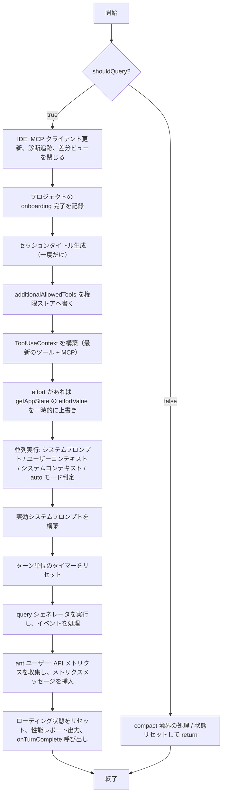

<!-- lang-switcher -->
[English](/docs/en/conversation/multi-turn) · [中文](/docs/zh/conversation/multi-turn) · **日本語**

{/* この章の目的: セッション編成、永続化、コスト追跡、モデル切り替えを通しで追う */}

## 3 つの入口

Claude Code には 3 つの入口があり、それぞれ別の問いに答えます。REPL は**対話の形態**、SDK は**組み込み方**、ACP は**通信プロトコル**の話です。

| | 🖥️ REPL（対話形態） | 🧩 SDK（組み込み方） | 🌉 ACP（プロトコル） |
| :--- | :--- | :--- | :--- |
| **何であるか** | 開発者がターミナルで直接使う対話環境 | 他のアプリへ組み込むためのプログラム呼び出しライブラリ | エージェントとエディタをつなぐ開かれた通信標準 |
| **使い方** | 1. ターミナルで `occ` を実行<br />2. 専用画面が描画される（React/Ink）<br />3. `/help` などのスラッシュコマンドで操作 | 1. 自分の Node.js/Python プロジェクトに SDK を導入<br />2. API 経由でクエリを送る | 1. ACP アダプタ（`claude-code-acp`）で Claude Code を起動<br />2. エディタが ACP で通信する |
| **典型的な用途** | 日常のコーディング中に、その場で質問・修正・実行 | 中核機能を自動化スクリプト、CI/CD、他アプリのバックエンドへ組み込む | JetBrains IDE や Zed など、独自 UI を持つエディタへ機能を取り込む |
| **特徴** | **人間向け。** 対話的で直感的。<br />**機能が完全。** 全内蔵ツールと MCP が使える。<br />**複雑な作業に対応。** 自律的に計画し多段の操作を実行する。 | **プログラム向け。** スクリプト化・組み込みが可能。<br />**軽量。** Claude Code の完全なランタイムを必要としない。<br />**制御はあなた側。** 自前アプリでの自動化に向く。 | **標準化。** エージェントとエディタ間を 1 つのプロトコルで統一。<br />**双方向。** エージェントからエディタへファイル要求やコマンド実行ができる。<br />**深い統合。** Claude Code の機能をそのまま再利用できる。 |

SDK と ACP はどちらも `QueryEngine` でセッションを管理します。REPL だけは経路が異なり、`src/screens/REPL.tsx` の `onQueryImpl` が `query()` を直接呼びます。

REPL の呼び出し連鎖:

```
ユーザー入力
  ↓
onSubmit (REPL.tsx)
  ↓
handlePromptSubmit (handlePromptSubmit.ts)
  ↓
executeUserInput (handlePromptSubmit.ts)
  ↓
onQuery (REPL.tsx)
  ↓
onQueryImpl (REPL.tsx)
  ↓
query (query.ts) ← ここで呼ばれる
```

`query()` がエージェントループそのもので、会話ターンを処理する `while (true)` です（`query.ts:460-522`）。

`onQueryImpl` は REPL 側でモデルとのやり取りを司るコントローラで、次を担当します。

1. 環境の準備（IDE、診断、権限）
2. セッションタイトルの生成（一度だけ）
3. 動的なシステムプロンプトとユーザーコンテキストの構築
4. ストリーミングクエリの実行と UI のリアルタイム更新
5. メトリクスの収集と後片付け

## `onQueryImpl` の詳細

`onQueryImpl` は React の `useCallback` に包まれた非同期関数で、ユーザーメッセージからモデルまでの**全経路**を担います。前処理、システムプロンプト構築、ツールコンテキスト準備、ストリーミング実行、後処理、メトリクス収集。

### シグネチャ

```typescript
const onQueryImpl = useCallback(
  async (
    messagesIncludingNewMessages: MessageType[],
    newMessages: MessageType[],
    abortController: AbortController,
    shouldQuery: boolean,
    additionalAllowedTools: string[],
    mainLoopModelParam: string,
    effort?: EffortValue,
  ) => { … },
  [ …dependencies ]
)
```

| 引数 | 意味 |
| --- | --- |
| `messagesIncludingNewMessages` | 新規分を含む全メッセージ。モデル入力の構築に使う |
| `newMessages` | このターンで追加された分（ユーザーのテキスト、添付） |
| `abortController` | 実行中のクエリを中断する |
| `shouldQuery` | 実際にモデルを呼ぶか。`false` なら呼ばない（無効なスラッシュコマンド、手動 compact など） |
| `additionalAllowedTools` | このターンだけ追加で許可するツール。通常は Skill の frontmatter 由来 |
| `mainLoopModelParam` | このターンの主モデル |
| `effort` | 任意。グローバルな effort 値を上書きし、推論の深さを制御する |

### 実行の流れ



### IDE 連携と診断（`shouldQuery = true` のときのみ）

```typescript
const freshClients = mergeClients(initialMcpClients, store.getState().mcp.clients);
diagnosticTracker.handleQueryStart(freshClients);
const ideClient = getConnectedIdeClient(freshClients);
if (ideClient) closeOpenDiffs(ideClient);
```

MCP クライアントはストアから読み直します。`useManageMCPConnections` がクロージャの捕捉後に更新している可能性があるためです。診断トラッカーにクエリ開始を通知し、接続中の IDE があれば開いている差分ビューを閉じます。

### セッションタイトルは一度だけ生成する

```typescript
if (!titleDisabled && !sessionTitle && !agentTitle && !haikuTitleAttemptedRef.current) {
  const firstUserMessage = newMessages.find(m => m.type === 'user' && !m.isMeta);
  const text = getContentText(firstUserMessage.message.content);
  if (text && !text.startsWith(`<${LOCAL_COMMAND_STDOUT_TAG}>`) … ) {
    haikuTitleAttemptedRef.current = true;
    generateSessionTitle(text, …).then(title => setHaikuTitle(title));
  }
}
```

タイトルが無効化されておらず、まだタイトルが無く、まだ試していない場合だけ走ります。最初の**非 meta** ユーザーメッセージを取り、スラッシュコマンド出力や skill マーカーのような合成物は除外します。呼び出しは非同期で、失敗時は ref をリセットして後のターンで再試行できるようにします。

### 権限の上書きをストアへ書く

```typescript
store.setState(prev => {
  const cur = prev.toolPermissionContext.alwaysAllowRules.command;
  if (cur === additionalAllowedTools || (cur?.length === …)) return prev;
  return { ...prev, toolPermissionContext: { …, alwaysAllowRules: { …, command: additionalAllowedTools } } };
});
```

`additionalAllowedTools` が `toolPermissionContext.alwaysAllowRules.command` になり、このターンで使えるツール集合を限定します（Skill 専用ツールなど）。浅い比較で無駄な状態更新を避けます。この処理は `shouldQuery` の分岐**より前**にあるため、モデルを呼ばない場合も実行されます。fork されたコマンドがこの権限情報を必要とするためです。

### `shouldQuery = false` の分岐

```typescript
if (!shouldQuery) {
  if (newMessages.some(isCompactBoundaryMessage)) {
    setConversationId(randomUUID());
    if (feature('PROACTIVE') || feature('KAIROS')) proactiveModule?.setContextBlocked(false);
  }
  resetLoadingState();
  setAbortController(null);
  return;
}
```

モデル呼び出しが不要な場合（無効なスラッシュコマンド、手動 `/compact` など）を扱います。新しいメッセージに**compact 境界**が含まれていれば、新しい `conversationId` を発行して UI のメッセージ行を再マウントさせ、proactive のコンテキストブロックを解除します。最後にローディング状態をリセットし、abortController を外します。

### クエリの前準備

**ツールコンテキスト。** `getToolUseContext()` はストアから最新のツールと MCP 設定を読み取ります。クロージャに捕捉された古い値のせいで、新しく接続されたツールやサーバーを見落とさないためです。

**effort の一時上書き:**

```typescript
if (effort !== undefined) {
  const previousGetAppState = toolUseContext.getAppState;
  toolUseContext.getAppState = () => ({ ...previousGetAppState(), effortValue: effort });
}
```

上書きはこのクエリ限定です。グローバルストアに書くと、バックグラウンドのエージェントや UI コンポーネントが、1 ターンのためだけの値を読んでしまいます。

**プロンプトとコンテキストの並列取得:**

```typescript
const [, , defaultSystemPrompt, baseUserContext, systemContext] = await Promise.all([
  undefined,
  feature('TRANSCRIPT_CLASSIFIER') ? checkAndDisableAutoModeIfNeeded(…) : undefined,
  getSystemPrompt(freshTools, mainLoopModelParam, additionalWorkingDirectories, freshMcpClients),
  getUserContext(),
  getSystemContext(),
]);
```

独立した 4 つの作業を同時に走らせます。auto モードのサーキットブレーカー（fastMode を無効化しうる）、システムプロンプト、ユーザーコンテキスト（作業ディレクトリ、環境）、システムコンテキスト（OS、ターミナル）。

**ユーザーコンテキストの拡張:**

```typescript
const userContext = {
  ...baseUserContext,
  ...getCoordinatorUserContext(freshMcpClients, getScratchpadDir()),
  ...((feature('PROACTIVE') || feature('KAIROS')) && proactiveModule?.isProactiveActive() && !terminalFocusRef.current
    ? { terminalFocus: 'The terminal is unfocused — the user is not actively watching.' }
    : {}),
};
```

**最終的なシステムプロンプト**は `buildEffectiveSystemPrompt()` が、メインスレッドの agent 定義、ツールコンテキスト、カスタムプロンプト、既定プロンプト、追記内容を統合して作ります。

### クエリの実行

```typescript
resetTurnHookDuration(); resetTurnToolDuration(); resetTurnClassifierDuration();
for await (const event of query({ messages, systemPrompt, userContext, systemContext, canUseTool, toolUseContext, querySource })) {
  onQueryEvent(event);
}
```

ターン単位のタイマーをリセットしてから `query()` ジェネレータを実行し、各イベントを `onQueryEvent` に渡します（メッセージ一覧の更新、ツール呼び出しの描画など）。

### 後処理とメトリクス

社内ユーザー（`USER_TYPE === 'ant'`）の場合、API メトリクスを収集します。リクエストごとの最初のトークンまでの時間（TTFT）と、毎秒の出力トークン数（OTPS）です。1 ターンに複数リクエストが含まれる場合（ツールループ）は中央値を採ります。あわせて hook・ツール・分類器の所要時間、ターン全体の時間、設定書き込み回数も記録します。

最後にローディング状態をリセットし、デバッグ時は性能レポートを出力し、全メッセージを添えて `onTurnComplete` を呼びます。

## 1 ターンと 1 セッション

- **1 ターン**は `query()` の 1 回の完全な実行です。コンテキスト構築 → API 呼び出し → ツール処理 → 終わるまでループ。
- **1 セッション**は `QueryEngine` が管理する単位です。数十回の `submitMessage()` にまたがり、数時間続くこともあります。

`QueryEngine`（`src/QueryEngine.ts`）はループの上に立つセッション編成役で、メッセージ一覧よりずっと多くを保持します。

```
QueryEngine の内部状態（src/QueryEngine.ts のコンストラクタ）
├── mutableMessages: Message[]             ← ターンをまたぐ全履歴
├── readFileState: FileStateCache          ← 読み込み済みファイルのキャッシュ
├── totalUsage: NonNullableUsage           ← 累積トークン（input/output/cache）
├── permissionDenials: SDKPermissionDenial[]
├── discoveredSkillNames: Set<string>      ← このターンで見つかった skill
├── loadedNestedMemoryPaths: Set<string>   ← 読み込み済みの入れ子メモリ（重複防止）
├── hasHandledOrphanedPermission: boolean
└── abortController: AbortController       ← セッション単位の中断
```

## `submitMessage()`

ユーザーのメッセージごとに `submitMessage()` が呼ばれ、ターンの初期化一式を行います。

```typescript
// src/QueryEngine.ts — 簡略化
async *submitMessage(
  prompt: string | ContentBlockParam[],
  options?: { uuid?: string; isMeta?: boolean },
): AsyncGenerator<SDKMessage> {
  // 1. ターン単位の追跡状態をクリア
  this.discoveredSkillNames.clear()

  // 2. モデルを解決する（セッション途中で切り替えられている可能性がある）
  const mainLoopModel = this.config.userSpecifiedModel
    ? parseUserSpecifiedModel(this.config.userSpecifiedModel)
    : getMainLoopModel()

  // 3. このターンのシステムプロンプトを組み直す
  const { defaultSystemPrompt, userContext, systemContext } =
    await fetchSystemPromptParts({ tools, mainLoopModel, mcpClients })

  // 4. 権限チェックを包み、拒否をすべて記録する
  const wrappedCanUseTool = async (tool, input, ...) => {
    const result = await canUseTool(tool, input, ...)
    if (result.behavior !== 'allow') {
      this.permissionDenials.push({
        type: 'permission_denial',
        tool_name: sdkCompatToolName(tool.name),
        tool_use_id: toolUseID,
        tool_input: input,
      })
    }
    return result
  }

  // 5. エージェントループを実行する
  yield* query({
    systemPrompt, messages: this.mutableMessages,
    tools, model: mainLoopModel, ...
  })
}
```

`submitMessage()` は `async *Generator` です。`SDKMessage` を発生順に yield するため、呼び出し側はターンの完了を待たずに進捗を表示できます。

## 永続化: JSONL transcript

会話のイベントはすべて transcript ファイルへ追記されます（`src/utils/sessionStorage.ts`）。

### 保存先

```
~/.occ/projects/<sanitized-cwd>/<session-uuid>.jsonl
```

パスは `getProjectDir(originalCwd)` が組み立て、`sanitizePath()` がプロジェクトディレクトリを安全なディレクトリ名（ハッシュではない）に変換します。同一プロジェクトのセッションは同じサブディレクトリに集まります。各レコードは 1 行の JSON で、これがファイル全体の read-modify-write なしに追記できる理由です。読み込みは 50 MB（`MAX_TRANSCRIPT_READ_BYTES`）で上限を設け、巨大なセッションでメモリを使い切らないようにしています。

### 書き込み側

非公開の `Project` クラスが transcript の書き込みを管理します。`writeQueues` が保留中の書き込みをファイル単位でまとめ、`drainWriteQueue()` がバッチで書き出すため、並行する追記が互いを上書きすることはありません。

```
非同期キュー経路:
  recordTranscript(sessionId, entry)
    ↓
  project.enqueueWrite(filePath, entry)    ← writeQueues へ投入
    ↓
  scheduleDrain()                          ← タイマー（FLUSH_INTERVAL_MS）
    ↓
  drainWriteQueue()                        ← MAX_CHUNK_BYTES で分割
    ↓
  appendToFile(path, batchContent)
    ↓
  リモート永続化が設定されていれば:
    persistToRemote(sessionId, entry)
      ├── CCR v2: internalEventWriter('transcript', entry)
      └── v1 ingress: sessionIngress.appendSessionLog(…)

同期直書き経路（メタデータの書き換えなど）:
  appendEntryToFile(fullPath, entry)       ← appendFileSync
    ↓
  失敗時は mkdir して再試行
```

### セッションの再開

`--resume`（`src/main.tsx` で処理）がセッションを復元します。

```
1. 引数の解釈:
   ├── UUID          → getTranscriptPathForSession(uuid)
   ├── .jsonl パス   → そのまま使う
   └── boolean       → 最近のセッションから選ぶ picker

2. loadTranscriptFromFile(path)
   ├── JSONL を 1 行ずつ解析
   ├── メッセージ種別のレコードを残す
   └── Message[] を再構築

3. 周辺状態の復元:
   ├── restoreCostStateForSession(sessionId)  ← 累積コスト
   ├── agentSetting（選択されていた agent 種別）を復元
   └── --rewind-files があれば、指定メッセージ時点のファイルスナップショットを復元

4. new QueryEngine({ initialMessages: restoredMessages })
   └── 復元した履歴から続ける
```

## コスト追跡: usage から金額へ

コストは 3 段階を通ります。

**記録。** すべての `message_delta` が `usage` を運びます（`input_tokens`、`output_tokens`、`cache_creation_input_tokens`、`cache_read_input_tokens`）。`accumulateUsage()` が差分をセッション合計へ加えます。

**集計**は `src/cost-tracker.ts` で行います。

```typescript
type StoredCostState = {
  totalCostUSD: number                       // 累積の金額
  totalAPIDuration: number                   // API の総時間（リトライ込み）
  totalAPIDurationWithoutRetries: number     // 純粋な推論時間
  totalToolDuration: number                  // ツール実行の総時間
  totalLinesAdded: number
  totalLinesRemoved: number
  lastDuration: number | undefined
  modelUsage: { [modelName: string]: ModelUsage } | undefined
}
```

`addToTotalSessionCost()` が各 API 呼び出しをモデルの単価で計算し、`totalCostUSD` に加算します。モデル別の `ModelUsage` があるため、セッション途中でモデルを変えても会計が正しく保たれます。

**再起動をまたぐ保存:**

```typescript
saveCurrentSessionCosts(sessionId)
  → projectConfig.lastCost = totalCostUSD
  → projectConfig.lastSessionId = sessionId
  → projectConfig.lastModelUsage = modelUsage
```

**予算の上限。** `QueryEngineConfig.maxBudgetUsd` はセッション単位の硬い上限です。これとは別に、REPL は累積が $5 を超えるとコスト確認ダイアログを出します。こちらは遮断ではなく注意喚起で、`hasConsoleBillingAccess()` が true のときだけ表示されます。

## セッション途中でのモデル切り替え

`mutableMessages` はモデル選択と切り離されているため、モデルを変えても履歴は失われません。

```
/model sonnet → QueryEngine.setModel('claude-sonnet-4-20250514')
  ↓  this.config.userSpecifiedModel を設定するだけ
次の submitMessage() で:
  ↓
parseUserSpecifiedModel(this.config.userSpecifiedModel)
  → 新しいモデル設定
  ↓
fetchSystemPromptParts({ mainLoopModel: newModel })
  → 新しいモデルの能力に合わせてシステムプロンプトを組み直す
  ↓
query({ model: newModel, messages: this.mutableMessages })
  → 全履歴を保ったまま新しいモデルで継続
```

`contextWindowTokens` と `maxOutputTokens` も新しいモデルの仕様で計算し直されます。たとえば Sonnet から Opus へ移ると、コンテキスト窓が 200K から 1M になることがあります。
