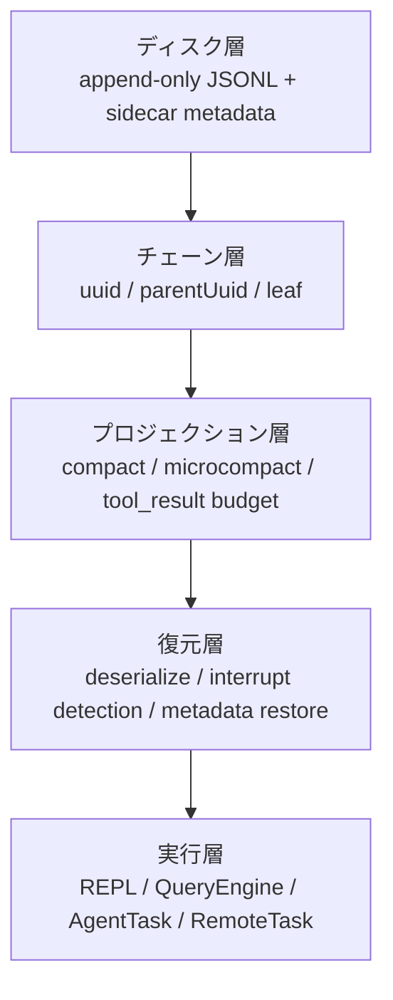
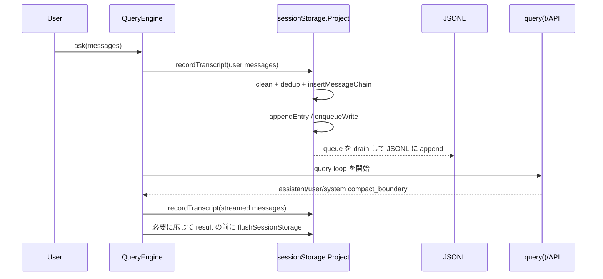
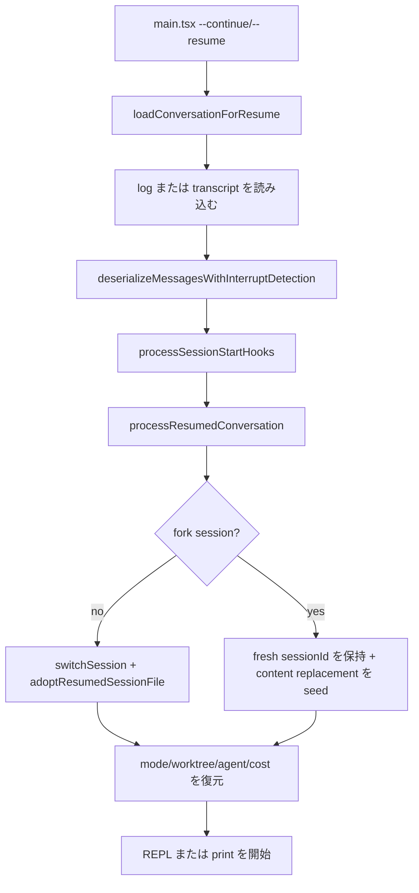
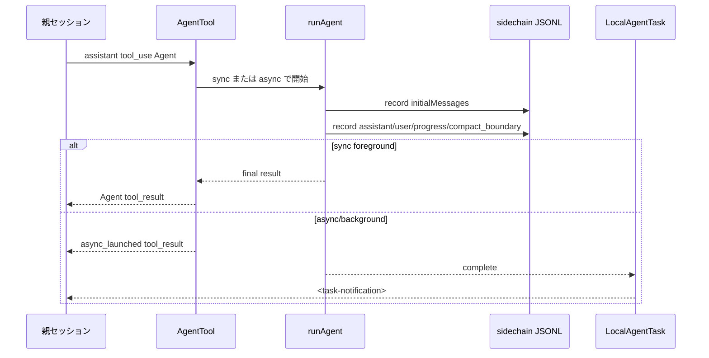
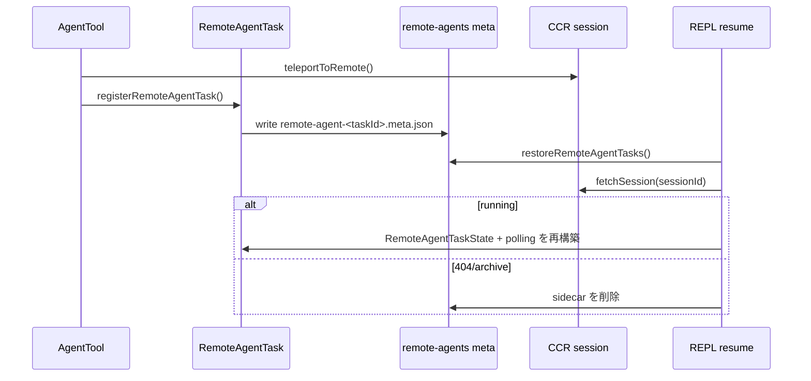

<!-- lang-switcher -->
[English](/docs/en/internals/session-transcript-persistence) · [中文](/docs/zh/internals/session-transcript-persistence) · **日本語**

# JSONL Transcript によるセッションの永続化と復元の仕組み

本稿では、Claude Code の JSONL transcript に基づくセッションの永続化、復元、エラーリカバリ、コンテキスト圧縮、ブランチ、subagent、fork agent、remote agent のロジックを整理します。

ファイルごとにソースコードを列挙するのではなく、仕組みを理解するための手引きとして構成しています。まずメンタルモデルを確立し、その後にデータ構造、ライフサイクル、例外パス、ソースコードの入口を確認します。

## 読み方

| 知りたいこと | 先に読むセクション |
|---|---|
| resume が正しい位置まで復元できる理由 | `概要`、`読み取りとチェーンの再構築`、`復元の入口` |
| compact 後も履歴は残るのにモデルから見えない理由 | `コンテキストビュー`、`Compact とプロジェクション` |
| subagent がメインセッションを汚染しない理由 | `ストレージトポロジ`、`Subagent と Fork Agent` |
| `/branch`（別名 `/fork`）、`--fork-session`、AgentTool fork の違い | `ブランチと Fork の比較` |
| クラッシュ、上限超過、キャンセル後の復元方法 | `エラーリカバリマトリクス` |

## 概要

Claude Code のローカルセッションの中核は append-only JSONL です。各行が 1 つの `Entry` ですが、復元時にファイル全体をファイル順でリプレイするわけではありません。次の手順で復元します。

1. transcript message を `uuid -> message` map に格納する。
2. metadata entry をそれぞれの map または配列に格納する。
3. 最新の leaf を選択する。
4. leaf から `parentUuid` をたどって遡り、現在有効なチェーンを得る。
5. compact、preserved segment、content replacement などのプロジェクションを適用する。
6. sessionId、worktree、mode、agent setting、タスク状態などのメモリ上の状態を復元する。

中核となる不変条件は次のとおりです。

| 不変条件 | 意味 |
|---|---|
| JSONL は可能な限り append-only | compact、branch、sidechain はいずれも新しい entry の追加を優先し、古い履歴を直接変更しない。 |
| `uuid/parentUuid` が世界線を決める | ファイル順は書き込み順を示すだけであり、実際の復元ではチェーンを遡る。 |
| metadata はメインチェーンに参加しない | title、tag、worktree、content replacement などは sessionId/messageId/agentId を使ってマージする。 |
| compact は履歴を削除しない | boundary を追加し、モデルビューは最後の boundary の後から始まる。 |
| subagent は sidechain | 子 agent の完全な会話は独立した JSONL にあり、親セッションには Agent tool の結果 / 通知だけが見える。 |
| remote agent は sidechain ではない | remote agent はローカルに sidecar の ID だけを保存し、実行状態は CCR から取得する。 |

### システムのレイヤー



### ストレージトポロジ

```text
~/.occ/projects/<project-key>/
  <sessionId>.jsonl
  <sessionId>/
    subagents/
      agent-<agentId>.jsonl
      agent-<agentId>.meta.json
      <subdir>/
        agent-<agentId>.jsonl
        agent-<agentId>.meta.json
    remote-agents/
      remote-agent-<taskId>.meta.json
```

| ファイル | 生成関数 | 用途 |
|---|---|---|
| `<sessionId>.jsonl` | `getTranscriptPath()` | メインセッションの transcript。 |
| `subagents/agent-<agentId>.jsonl` | `getAgentTranscriptPath(agentId)` | ローカル subagent / fork agent の sidechain。 |
| `subagents/agent-<agentId>.meta.json` | `getAgentMetadataPath(agentId)` | agentType、worktreePath、description。 |
| `remote-agents/remote-agent-<taskId>.meta.json` | `getRemoteAgentMetadataPath(taskId)` | remote CCR session の ID。polling の復元に使う。 |

## 中核ソースコードマップ

| 仕組み | 主なファイル |
|---|---|
| Entry 型 | `src/types/logs.ts` |
| パス、書き込み、読み取り、チェーンの再構築 | `src/utils/sessionStorage.ts` |
| 大きなファイルのストリーミング読み取り | `src/utils/sessionStoragePortable.ts` |
| CLI resume の読み込みと中断検出 | `src/utils/conversationRecovery.ts` |
| session の切り替えと状態の復元 | `src/utils/sessionRestore.ts` |
| SDK/headless query による transcript の書き込み | `src/QueryEngine.ts` |
| API query loop、compact、エラーリカバリ | `src/query.ts` |
| compact の実装 | `src/services/compact/*` |
| `/branch` | `src/commands/branch/branch.ts` |
| `/fork`（`/branch` の別名） | `src/commands/branch/index.ts` |
| AgentTool と subagent | `packages/builtin-tools/src/tools/AgentTool/*` |
| 汎用 forked side query | `src/utils/forkedAgent.ts` |
| remote agent task | `src/tasks/RemoteAgentTask/RemoteAgentTask.tsx` |

## データモデル

`Entry` は `src/types/logs.ts` で定義され、大きく 3 つのカテゴリに分けられます。

| カテゴリ | 代表的な type | `parentUuid` チェーンへの参加 | key | 復元時の用途 |
|---|---|---:|---|---|
| transcript message | `user`、`assistant`、`attachment`、`system` | はい | `uuid` | 会話チェーン、モデルコンテキスト、UI scrollback を再構築する。 |
| session metadata | `custom-title`、`tag`、`mode`、`worktree-state`、`pr-link`、`agent-setting` | いいえ | `sessionId` | title、tag、mode、worktree、PR、agent setting を復元する。 |
| message metadata | `file-history-snapshot`、`attribution-snapshot`、`summary` | いいえ | `messageId` または `leafUuid` | ファイル履歴、帰属、要約を復元する。 |
| replacement metadata | `content-replacement` | いいえ | `sessionId` + optional `agentId` | 大きな tool_result の置換判断を復元する。 |
| queue/task metadata | `queue-operation`、`task-summary`、`speculation-accept` | いいえ | それぞれのフィールド | queue、タスク要約、投機的処理の採用統計を復元する。 |

### TranscriptMessage のフィールド

実際にチェーンへ参加するのは `TranscriptMessage` です。

| フィールド | 意味 |
|---|---|
| `uuid` | 現在のメッセージ ID。 |
| `parentUuid` | チェーン上の親ノード。復元時にこれをたどって遡る。 |
| `logicalParentUuid` | compact boundary などでチェーンが切れる場合に論理的な親ノードを保持する。 |
| `sessionId` | 所属するメイン session。 |
| `cwd` | 書き込み時の作業ディレクトリ。 |
| `timestamp` | 書き込み時刻。 |
| `version` | CLI のバージョン。 |
| `gitBranch` | 書き込み時の git ブランチ。 |
| `isSidechain` | subagent sidechain かどうか。 |
| `agentId` | sidechain が属する agent。 |
| `teamName/agentName/agentColor` | swarm / teammate の表示用メタデータ。 |

### JSONL の例

メインセッションのメッセージ:

```jsonl
{"type":"user","uuid":"u1","parentUuid":null,"sessionId":"s1","isSidechain":false,"cwd":"D:\\vibe\\claude-code","message":{"role":"user","content":"テストを修正"}}
{"type":"assistant","uuid":"a1","parentUuid":"u1","sessionId":"s1","isSidechain":false,"message":{"role":"assistant","content":[{"type":"text","text":"確認します。"}]}}
```

sidechain のメッセージ:

```jsonl
{"type":"user","uuid":"u2","parentUuid":null,"sessionId":"s1","isSidechain":true,"agentId":"ag1","message":{"role":"user","content":"compact パスを分析"}}
```

agent の `content-replacement`:

```jsonl
{"type":"content-replacement","sessionId":"s1","agentId":"ag1","replacements":[{"messageUuid":"u2","toolUseId":"toolu_...","blockIndex":0,"kind":"persisted"}]}
```

compact boundary:

```jsonl
{"type":"system","subtype":"compact_boundary","uuid":"b1","parentUuid":"a9","logicalParentUuid":"a9","sessionId":"s1","compactMetadata":{"trigger":"auto","preTokens":182000,"messagesSummarized":94}}
```

## 書き込みライフサイクル

### 全体フロー



要点は次のとおりです。

| 設計 | 理由 |
|---|---|
| ユーザー入力を transcript に書いてから API に渡す | API 呼び出し前にプロセスがクラッシュしても、resume でユーザーの prompt を確認できる。 |
| assistant streaming の書き込みは主に fire-and-forget | token streaming をブロックしない。 |
| result の前に必要に応じて flush | SDK / デスクトップクライアントが result の受信直後にプロセスを終了し、末尾が失われるのを防ぐ。 |
| `progress` はチェーンに参加しない | 高頻度の progress tick で分岐が生まれたり、transcript が肥大化したりするべきではない。 |

### メインセッションへの書き込み

入口は `recordTranscript(messages, teamInfo?, startingParentUuidHint?, allMessages?)` です。

処理の流れ:

1. `cleanMessagesForLogging()` が UI-only または永続化すべきでないメッセージを除外する。
2. `getSessionMessages(sessionId)` が現在の session に存在する UUID set を読み取る。
3. まだ書き込まれていないメッセージに対して `insertMessageChain()` を呼ぶ。
4. `insertMessageChain()` が `parentUuid/sessionId/cwd/timestamp/version/gitBranch/isSidechain` を補完する。
5. `appendEntry()` が per-file queue に追加する。

重複排除は、単純にすべての重複を破棄するわけではありません。prefix 内の一部のメッセージがすでに書き込まれている場合、writer は `startingParentUuid` を進め、後続の新しいメッセージが正しい親ノードに接続されるようにします。

### 書き込み queue、materialize、flush

`Project` は内部で per-file queue を管理します。

| 仕組み | 詳細 |
|---|---|
| `writeQueues` | `Map<filePath, entry[]>`。ファイル単位で書き込みを集約する。 |
| drain timer | デフォルトは 100ms。CCR/remote persistence の場合は約 10ms。 |
| queue の上限 | 1 つの queue が 1000 件を超えると、メモリの無制限な増加を防ぐため、最も古い queued entry を破棄して resolve する。 |
| chunk の上限 | 1 回の JSONL append chunk は約 100MB。 |
| `flushSessionStorage()` | timer をキャンセルし、active drain と tracked writes を待つ。 |

`sessionFile` の初期値は `null` です。この状態では title、tag、mode、worktree などの metadata をまずメモリまたは `pendingEntries` に保持します。最初の `user` または `assistant` が現れた時点で、`materializeSessionFile()` が初めて session ファイルを作成し、次の処理を行います。

1. キャッシュされた metadata を書き込む。
2. pending entries をリプレイする。
3. 以後、すべての entry を通常どおり append する。

これにより、「CLI を開いただけで何も話していない」場合に metadata-only session が生成され、`/resume` の一覧を汚染することを防ぎます。

### sidechain への書き込み

subagent は `recordSidechainTranscript(messages, agentId, startingParentUuid?)` を使います。

内部では同じく `insertMessageChain()` を通りますが、書き込むフィールドが異なります。

```ts
isSidechain: true
agentId: agentId
```

`appendEntry()` は `isSidechain && agentId` を持つ transcript message を検出すると、次の場所へルーティングします。

```text
<project>/<sessionId>/subagents/agent-<agentId>.jsonl
```

`content-replacement` に `agentId` がある場合も、メイン session JSONL ではなく、その agent の sidechain JSONL へルーティングします。

重要な例外が 1 つあります。sidechain への書き込みでは、メイン session の UUID set を使って重複排除しません。fork agent は親セッションのメッセージ UUID を再利用してコンテキストを継承します。メイン session を基準に重複排除すると、継承したコンテキストが sidechain から誤って削除され、agent を resume したときに子 prompt しか残らなくなります。

## 読み取りとチェーンの再構築

### JSONL から有効なチェーンへ

```mermaid
flowchart TD
  A[loadTranscriptFile(file)] --> B[readTranscriptForLoad<br/>大きなファイルを chunk 単位で読み取る]
  B --> C[parseJSONL Entry]
  C --> D[messages Map uuid->TranscriptMessage]
  C --> E[metadata maps/arrays]
  D --> F[progress bridge / preserved relink]
  F --> G[leaf を選択]
  G --> H[buildConversationChain]
  H --> I[recoverOrphanedParallelToolResults]
  I --> J[LogOption または agent transcript]
```

`loadTranscriptFile(filePath, opts?)` は次の値を生成します。

| 出力 | 用途 |
|---|---|
| `messages` | `uuid -> TranscriptMessage`。 |
| `leafUuids` | leaf の候補。 |
| title/tag/mode/worktree/PR maps | session metadata。 |
| `fileHistorySnapshots` / `attributionSnapshots` | ファイル状態の復元。 |
| `contentReplacements` | メインスレッドの replacement records。 |
| `agentContentReplacements` | `agentId -> replacement records`。 |

### leaf と parent チェーン

`buildConversationChain(messages, leaf)` は次の処理を行います。

1. leaf から開始する。
2. `parentUuid` を読み取る。
3. 親メッセージを見つけ、さらに遡る。
4. parent cycle を検出し、無限ループを防ぐ。
5. reverse して transcript を正順にする。
6. 並列 tool_use が作る DAG の分岐を補完する。

単純化した例:

```text
u1 <- a1 <- u2 <- a2
                 ^
               leaf

復元チェーン: a2 -> u2 -> a1 -> u1
正順チェーン: u1, a1, u2, a2
```

ファイル順と有効なチェーンは同じではありません。branch、rewind、streaming fallback によって JSONL 内に dead branch が生じることがあります。復元時には、現在の leaf が属する世界線だけを選択します。

### metadata のマージ規則

| metadata | マージ方法 | 説明 |
|---|---|---|
| `custom-title`、`tag`、`mode`、`worktree-state`、`pr-link`、`agent-setting` | sessionId keyed、通常は last-wins | 最新の session 状態を復元する。 |
| `file-history-snapshot`、`attribution-snapshot` | messageId keyed / array | ファイル履歴と帰属を復元する。 |
| `content-replacement` | append array | 複数回の replacement 判断をすべて保持する必要がある。 |
| `agentContentReplacements` | agentId keyed + append array | agent resume 時に sidechain の replacement state を再構築する。 |

### 大きなファイルの読み取り最適化

transcript は数百 MB、場合によっては数 GB まで増える可能性があるため、読み取りパスには複数の防護策があります。

| 最適化 | 場所 | 目的 |
|---|---|---|
| chunk 読み取り | `readTranscriptForLoad()` | 一度に読み込んでメモリを枯渇させない。 |
| fd 層で大きな metadata をスキップ | `readTranscriptForLoad()` | `attribution-snapshot` などの大きな entry を buffer に入れない。 |
| compact prefix をスキップ | `readTranscriptForLoad()` | preserved でない compact boundary が見つかったら、boundary より後の内容だけを保持する。 |
| pre-boundary metadata scan | `scanPreBoundaryMetadata()` | compact より前をスキップしても、title/tag/mode/worktree/PR などの表示情報を保持する。 |
| byte-level で dead branch を枝刈り | `walkChainBeforeParse()` | JSON.parse の前に active chain と metadata だけを連結し、dead fork/rewind branch をスキップする。 |
| lite read の制限 | `MAX_TRANSCRIPT_READ_BYTES` | raw transcript を直接読む呼び出しは、約 50MB を超える場合に回避する。 |

`walkChainBeforeParse()` が concat を行うのは、buffer の半分以上を破棄できると見込まれる場合だけです。最適化自体が追加コストになるのを防ぎます。

### preserved segment

compact boundary は `compactMetadata.preservedSegment` を持つことができます。復元時に `applyPreservedSegmentRelinks()` は次の処理を行います。

1. `tailUuid -> headUuid` チェーンが完全であることを検証する。
2. preserved segment の head を compact anchor の後に接続する。
3. anchor の他の children を preserved tail に接続する。
4. 最後の boundary より前にあり、preserved segment に属さない古いメッセージを削除する。
5. preserved assistant の usage をゼロにし、復元直後に autocompact が再度発生するのを防ぐ。

図示すると次のようになります。

```text
compact 前: old... -> anchor -> head -> ... -> tail -> next
compact 後: boundary/summary -> head -> ... -> tail -> next
```

### 古いチェーンの修復

| 問題 | 修復方法 |
|---|---|
| legacy `progress` が parent チェーンに入っていた | `progressBridge` が progress を指す parent を progress の実際の親ノードへ戻す。 |
| parent cycle | `buildConversationChain()` が cycle を検出し、記録して partial chain を返す。 |
| 並列 tool_use が DAG を形成する | `recoverOrphanedParallelToolResults()` が assistant の `message.id` と tool_result の parent 関係に基づいて sibling を補完する。 |
| streaming fallback で末尾が孤立する | tombstone が `removeTranscriptMessage(uuid)` をトリガーし、失敗した attempt を削除する。 |

## 復元の入口

### 入口マトリクス

| 入口 | 読み込み元 | 元の sessionId を再利用するか | 元の JSONL を adopt するか | 特徴 |
|---|---|---:|---:|---|
| `--continue` | 現在のディレクトリで最新の session | はい | はい | 引き続き live である bg/daemon の非 interactive session をスキップする。 |
| `--resume <uuid>` | 指定した session | はい | はい | custom title / 検索語 / picker にも対応する。 |
| `--resume <jsonl>` | 指定した JSONL ファイル | はい | はい | Ant 社内 / print path でサポートする。 |
| `--fork-session` + resume | 古い session messages | いいえ | いいえ | 新しい sessionId を保持し、古いメッセージを新しい session の初期内容として使う。 |
| `--resume-session-at <message.id>` | print/headless resume | resume による | resume による | 指定した assistant message の位置で切り詰める。 |
| REPL `/resume` | picker / log option | 通常または fork | 通常または fork | SessionEnd/SessionStart hooks を実行し、UI state を切り替える。 |

### CLI resume のフロー



中核となる関数:

| 関数 | 責務 |
|---|---|
| `loadConversationForResume()` | 最新 session、sessionId、LogOption、JSONL path を一元的に読み込む。lite log の補完、plan/file history のコピー、consistency check、デシリアライズ、中断検出を行い、metadata を返す。 |
| `processResumedConversation()` | CLI interactive の起動状態を復元する。session を切り替えるか fork し、cost、worktree、mode、agent setting、attribution を復元する。 |
| `restoreSessionStateFromLog()` | AppState 側の状態を復元する。file history、attribution、TodoWrite todos が対象。 |

### REPL `/resume`

REPL 内の resume では、CLI の起動パスに加えて、「現在の session から別の session へ切り替える」処理が必要です。

1. 対象の log messages をクリーンアップする。
2. 現在の session で SessionEnd hooks を実行する。
3. 対象の session で SessionStart resume hooks を実行する。
4. 現在の session cost を保存し、対象の session cost を復元する。
5. `switchSession(sessionId, dirname(fullPath))` で sessionId + project dir をアトミックに切り替える。
6. `resetSessionFilePointer()` を実行し、metadata cache を復元する。
7. fork でない場合は前の worktree を終了し、対象の worktree を復元して、`adoptResumedSessionFile()` を実行する。
8. fork の場合は元の transcript を引き継がず、現在の worktree を終了しない。
9. content replacement state を再構築する。
10. remote/local task の状態を復元する。
11. messages を置き換え、tool JSX と入力欄をクリアする。

### 中断検出マトリクス

`deserializeMessagesWithInterruptDetection()` は、最初に履歴メッセージをクリーンアップします。

| クリーンアップ | 目的 |
|---|---|
| legacy attachment の移行 | 古い transcript との互換性を維持する。 |
| 不正な `permissionMode` を削除 | ビルド間で無効な enum が実行時状態に入るのを防ぐ。 |
| unresolved tool_use を除外 | tool_use/tool_result の不整合で API エラーになるのを防ぐ。 |
| orphaned thinking-only assistant を除外 | streaming の中断で孤立した thinking block が残るのを防ぐ。 |
| whitespace-only assistant を除外 | キャンセル時に空白だけの assistant が残るのを防ぐ。 |

次に、最後の turn-relevant message を調べます。

| 最後の有効なメッセージ | 結果 | 追加処理 |
|---|---|---|
| assistant | `none` | streaming の永続化では stop_reason が null のことが多いため、これを使って未完了かどうかを判断できない。 |
| 通常の user | `interrupted_prompt` | API-valid を維持するため、`NO_RESPONSE_REQUESTED` sentinel を挿入する。 |
| meta user / compact summary user | `none` | 内部制御メッセージをユーザーの新しいリクエストとして扱わない。 |
| tool_result user | 通常は `interrupted_turn` | 例外として、Brief/SendUserMessage/SendUserFile の terminal tool_result は完了とみなす。 |
| attachment | `interrupted_turn` | meta user として `Continue from where you left off.` を追加する。 |
| system/progress/API error assistant | スキップ | turn の完了判定には使わない。 |

`interrupted_turn` は一律に `interrupted_prompt` へ変換されるため、上位層は「続行が必要」という 1 種類の状態だけを処理します。

## エラーリカバリマトリクス

| シナリオ | 処理戦略 | transcript への影響 |
|---|---|---|
| API 呼び出し前にプロセスがクラッシュ | ユーザーの prompt は `QueryEngine.ask()` によって先に書き込まれている。 | resume では通常の user が見つかり、`interrupted_prompt` をトリガーする。 |
| streaming fallback が孤立した assistant を生成 | tombstone を yield し、REPL が UI message を削除して `removeTranscriptMessage(uuid)` を呼び出す。 | JSONL の末尾 64KB だけを優先的に変更する。大きなファイルで対象が末尾にない場合、低速な rewrite はスキップする。 |
| prompt-too-long / media-too-large | streaming フェーズではまず withheld にし、reactive compact を試す。失敗した場合のみエラーを公開する。 | compact に成功すると boundary/summary を書き込んで再試行し、失敗した場合のみ API error message を書き込む。 |
| max_output_tokens | まず max output override を引き上げる。それでも失敗する場合は内部 recovery prompt を注入して続行し、試行回数を使い切った場合のみエラーを公開する。 | 内部 retry prompt が通常の transcript になるかどうかは、外側まで yield されるかによる。 |
| auto compact が無効だが blocking limit に到達 | prompt-too-long 形式の API error を直接 yield する。 | ユーザーが手動で `/compact` する余地を残す。 |
| streaming/tools の実行中に abort | 不足している tool_result を補完し、必要に応じて user interruption message を yield する。 | `reason === interrupt` の場合は、後続の queued user message がすでにコンテキストを提供するため、interruption message をスキップする。 |
| stop hook がブロック | hook blocking error を state に追加して再試行する。 | hook/error/compact の無限ループを防ぐ reactive compact guard がある。 |
| compact boundary が未書き込みの tail を参照 | QueryEngine は boundary を書き込む前に、preserved tail より前のメッセージを強制的に補完して書き込む。 | 復元時に boundary が存在しない UUID を参照するのを防ぐ。 |
| subagent transcript の末尾が不完全 | `resumeAgentBackground()` が unresolved tool_use、orphan thinking、空白の assistant を再度除外する。 | agent の復元後に API リクエストが不正になるのを防ぐ。 |

## コンテキストビュー

同じメッセージにはシステム内で 4 つのビューがあります。混同しないでください。

| ビュー | 内容 | 使用者 |
|---|---|---|
| Raw transcript | JSONL 内のすべての entry。古い履歴、dead branch、metadata、sidechain を含む。 | ディスクへの永続化と監査。 |
| UI scrollback | REPL に現在表示されるメッセージ。compact より前の履歴や collapsed UI group を保持することがある。 | ターミナル UI。 |
| Active query view | `getMessagesAfterCompactBoundary()` より後のメッセージ。 | `query.ts` のコンテキスト管理。 |
| API wire view | `normalizeMessagesForAPI()` の処理後。system boundary の除外、tool pairing の修復、cache edits の挿入を行う。 | Anthropic/OpenAI/Gemini などの API client。 |

各 query turn の active context は次の順序で処理されます。

1. `getMessagesAfterCompactBoundary(messages)`: 最新の compact boundary より後の active slice を取得する。
2. 古い `toolUseResult` の raw payload を削除し、API に必要な `message.content` だけを保持する。
3. `applyToolResultBudget()`: 大きすぎる tool_result を preview/stub に置き換え、`content-replacement` を書き込む。
4. `microcompactMessages()`: time-based microcompact を実行し、次に cached microcompact を実行する。
5. `autoCompactIfNeeded()`: 能動的に compact し、session memory compact を優先する。
6. predictive autocompact: API 呼び出し前に現在の turn の増加量を見積もり、必要に応じて事前に compact する。
7. API で実際に上限を超えた後: reactive compact を実行する。

## Compact とプロジェクション

### Compact の種類の比較

| 種類 | トリガー | 要約の取得元 | compact API を呼ぶか | 末尾セグメントを保持するか | 失敗時の戦略 |
|---|---|---|---:|---:|---|
| manual compact | `/compact` | compact summary API または session memory | パスによる | full/partial/SM による | 失敗を表示するか、従来の compact にフォールバックする。 |
| auto compact | token のしきい値 | session memory を先に試し、その後 summary API | パスによる | パスによる | 連続失敗用の circuit breaker があり、デフォルトでは 3 回の失敗後に自動 compact を停止する。 |
| predictive compact | API 呼び出し前の増加量の見積もり | auto compact と同じ | パスによる | パスによる | 失敗した場合は元のリクエストを続行するか、後続のエラーリカバリへ進む。 |
| reactive compact | API で実際に 413/media error が発生した後 | `compactConversation()` | はい | 現在の wrapper では compact の実装による | `hasAttemptedReactiveCompact` でループを防ぐ。 |
| session memory compact | manual/auto の前に試行 | session memory ファイル | いいえ | はい | compact 後もまだしきい値を超える場合は破棄し、従来の compact にフォールバックする。 |
| microcompact | time/cached の小規模な圧縮 | 局所的なクリーンアップまたは API cache edit | 場合による | 該当なし | 通常は JSONL のメイン履歴を変更しない。 |

### Compact 結果の形式

従来の compact は次の要素を生成します。

1. `compact_boundary` system message。
2. compact summary user message。
3. compact 後の attachments。たとえば現在のファイル、プランモード、skills、MCP/tool schema delta、hook の結果。

単純化した before/after:

```text
Raw/UI:
  u1, a1, u2, a2, ... u99, a99,
  system:compact_boundary,
  user:compact summary,
  attachment:current files,
  u100

Active query view:
  system:compact_boundary,
  user:compact summary,
  attachment:current files,
  u100

API wire view:
  user:compact summary,
  attachment/content,
  u100
```

boundary 自体は system message であり、最終的に API normalization で除外されます。主な役割は、ローカルでのプロジェクション、復元、統計です。

### Boundary metadata

`createCompactBoundaryMessage()` は次のフィールドを書き込みます。

| フィールド | 意味 |
|---|---|
| `compactMetadata.trigger` | `manual` または `auto`。 |
| `compactMetadata.preTokens` | compact 前の token 数。 |
| `compactMetadata.userContext` | ユーザーが手動で compact するときの追加指示。 |
| `compactMetadata.messagesSummarized` | 要約されたメッセージ数。 |
| `logicalParentUuid` | compact 前の最後のメッセージ。論理的な追跡に使う。 |

後続のパスはさらに次のフィールドを補完します。

| フィールド | 取得元 | 役割 |
|---|---|---|
| `preCompactDiscoveredTools` | traditional/SM compact | deferred tool schema の可視性を復元する。 |
| `preservedSegment.{headUuid,anchorUuid,tailUuid}` | partial/SM compact | 復元時に保持した末尾セグメントを boundary の後へ接続する。 |

### Tool result budget と content replacement

大きな tool_result は、そのまま後続のコンテキストに入るとは限りません。`applyToolResultBudget()` は API-level user message 単位で予算を集約し、必要に応じて大きなブロックを永続化して、より小さな preview/stub に置き換えます。

要点:

| 要点 | 説明 |
|---|---|
| replacement decision は JSONL に保存する | `recordContentReplacement()` が `content-replacement` を書き込む。 |
| メインスレッドと agent を分離する | `agentId` がなければメイン JSONL に書き込み、`agentId` があれば sidechain JSONL に書き込む。 |
| resume で replacement state を再構築する | 復元後に同じ大きな結果が完全な内容へ戻り、token が急増したり prompt cache が一致しなくなったりするのを防ぐ。 |
| `--fork-session` は records を seed する | 新しい session へ fork するときに replacement 判断をコピーする。 |

### Session memory compact

`sessionMemoryCompact.ts` は、従来の summary compact の前に試行する実験的なパスです。処理の流れは次のとおりです。

1. session memory extraction の完了を待つ。
2. session memory ファイルを読み取る。
3. `lastSummarizedMessageId` がある場合は、その後から安全な末尾セグメントを保持する。なければ resumed session にはすでに memory summary があるとみなす。
4. tool_use/tool_result や thinking blocks を分断しないように切断位置を調整する。
5. 標準の `compact_boundary` + summary user message を作成する。
6. compact 後の token count がまだしきい値を超える場合は破棄し、従来の compact にフォールバックする。

生成物は引き続き標準の `CompactionResult` であるため、下流の transcript 書き込みと復元ロジックを従来の compact と共有します。

### Context-collapse は削除済み

context-collapse（marble origami）の stub 実装と永続化インターフェースは、このリポジトリから削除されています。`src/services/contextCollapse/` ディレクトリ、`recordContextCollapseCommit()` / `recordContextCollapseSnapshot()` 書き込みインターフェース、`marble-origami-commit` / `marble-origami-snapshot` という 2 種類の JSONL entry はすべて存在せず、loader も収集しません。

したがって、現在実際に有効なコンテキスト削減手段は compact、session memory compact、tool_result budget、microcompact です。

### Compact 後のクリーンアップ

`runPostCompactCleanup(querySource)` は常に次の要素をクリアします。

- microcompact state。
- system prompt sections。
- classifier approvals。
- speculative bash checks。
- beta tracing。
- session messages memo cache。
- compact cleanup callbacks。
- `COMMIT_ATTRIBUTION` 配下で file-content cache を非同期 sweep。

メインスレッドの compact でのみ、次の要素をクリアします。

- `getUserContext` cache。
- memory files cache。

理由は、subagent とメインスレッドが同じプロセス内にあり、モジュールレベルの状態を共有するためです。`agent:*` compact がメインスレッドの `getUserContext` または memory cache をクリアすると、親セッションの状態が壊れます。

`resetSentSkillNames()` は明示的にクリアしません。compact 後に完全な skill listing が再び注入され、token と prompt cache を浪費するのを防ぐためです。

## ブランチと Fork の比較

| 入口 | 本質 | 新しいメイン session か | subagent か | 永続化する場所 | 親セッションから見えるもの | 復元方法 |
|---|---|---:|---:|---|---|---|
| `/branch`（別名 `/fork`） | 現在のメイン transcript を新しい JSONL としてコピーする | はい | いいえ | `<newSessionId>.jsonl` | 新しいブランチセッションへ直接切り替える | 通常の session resume。 |
| `--fork-session` | resume/continue 時に古いメッセージを新しい session の初期メッセージとして使う | はい | いいえ | 新しい session への初回書き込み時に materialize | 起動直後から新しい session で続行する | 新しい session を resume。 |
| `AgentTool` で `subagent_type` を省略（`FORK_SUBAGENT` が必要） | Tool 層の fork 子 agent | いいえ | はい | `subagents/agent-<id>.jsonl` + `.meta.json` | sync final tool_result または async notification | `resumeAgentBackground()`。 |
| 通常の AgentTool async | バックグラウンドのローカル subagent | いいえ | はい | `subagents/agent-<id>.jsonl` + `.meta.json` | `async_launched` + task notification | `resumeAgentBackground()`。 |
| remote AgentTool | CCR remote session | いいえ | リモート | `remote-agents/*.meta.json` | remote task output/notification | `restoreRemoteAgentTasks()` + CCR。 |

### `/branch`

`/branch` は新しい session ファイルを作成します。元の JSONL に branch marker を追加するわけではありません。

処理の流れ:

1. 新しい sessionId を生成する。
2. 現在の transcript ファイルを読み取る。
3. メインセッションのメッセージを抽出し、`isSidechain` と transcript 以外の entry を除外する。
4. メッセージをコピーし、`sessionId` を書き換える。
5. `parentUuid` を再度チェーン化する。
6. `forkedFrom: { sessionId, messageUuid }` を追加する。
7. 元の session の `content-replacement` entry をコピーし、新しい sessionId に書き換える。
8. `<newSessionId>.jsonl` へ書き込む。
9. `LogOption` を構築し、REPL を新しいブランチへ resume させる。

### `--fork-session`

`--fork-session` が変更するのは、resume の ownership だけです。

| fork でない resume | fork-session resume |
|---|---|
| 古い sessionId に切り替える。 | 起動時の fresh sessionId を保持する。 |
| `adoptResumedSessionFile()` が古い JSONL を引き継ぐ。 | 古い JSONL を引き継がない。 |
| 以後も古い transcript へ append する。 | 以後は新しい transcript として materialize する。 |
| 元の session が増え続ける。 | 元の session には書き込まない。 |

古い session に `content-replacement` がある場合は、最初に records を新しい session へ seed し、大きな tool_result の置換状態が失われるのを防ぎます。

## Subagent と Fork Agent

### 通常の subagent

通常の AgentTool subagent は最終的に `runAgent()` を通ります。



通常、親セッションが記録するのは次の要素だけです。

- Agent tool_use。
- Agent tool_result。
- async launch result。
- task notification。
- 必要な progress。

子 agent 内部の完全なツール呼び出しとメッセージは sidechain JSONL にあり、メインセッションの active context へ混入しません。

### Fork agent

fork agent は AgentTool の特殊な subagent です。親のコンテキスト、system prompt、tools、model、thinking config を継承し、複数の子 agent が可能な限り長い byte-identical prompt cache prefix を共有できるようにします。

主な実装:

| 継承する内容 | 実装 |
|---|---|
| system prompt | `toolUseContext.renderedSystemPrompt` を優先し、なければ fallback として再構築する。 |
| tools | 親の `toolUseContext.options.tools` を使い、`useExactTools: true` を指定する。 |
| model | `FORK_AGENT.model = "inherit"`。 |
| thinking/non-interactive | exact tool/options を通じて継承し、cache key の分岐を防ぐ。 |
| messages | `forkContextMessages = toolUseContext.messages`。 |

`buildForkedMessages()` が cache-friendly な末尾を構築します。

```text
parent history...
assistant: [text/thinking/tool_use A/tool_use B/...]
user:
  tool_result for A = "Fork started — processing in background"
  tool_result for B = "Fork started — processing in background"
  directive = "<this fork's task>"
```

複数の fork child は長い prefix が同一で、最後の directive だけが異なります。

制限:

| 制限 | 理由 |
|---|---|
| `FORK_SUBAGENT` feature が必要。 | 機能ゲーティング。 |
| coordinator mode では無効。 | coordinator には独自のオーケストレーションモデルがある。 |
| non-interactive session では無効。 | fork subagent は対話型のバックグラウンドタスクモデルを前提としている。 |
| fork child による再帰的な fork を禁止。 | 無限 fork を防ぐ。querySource と boilerplate tag で検出する。 |
| fork agent の resume 時には `forkContextMessages` を再度渡さない。 | sidechain が親コンテキストの slice をすでに含むため、再度渡すと tool_use id が重複する。 |

### `runForkedAgent()` は AgentTool fork ではない

`src/utils/forkedAgent.ts` の `runForkedAgent()` は、session memory、prompt suggestion、summary などに使う社内向けの cache-safe side query ツールです。親の system/user/system context、tools、messages を再利用し、`skipTranscript` を任意で指定できます。ただしデフォルトでは AgentTool metadata を書き込まず、ユーザーが会話を継続できる AgentTool fork でもありません。

## Agent の復元

ローカル agent の復元入口は `resumeAgentBackground()` です。

処理の流れ:

```mermaid
flowchart TD
  A[user continues agent] --> B[getAgentTranscript(agentId)]
  B --> C[sidechain JSONL を読み込む + chain を構築]
  C --> D[readAgentMetadata(agentId)]
  D --> E[unresolved tool_use/thinking/blank assistant を除外]
  E --> F[content replacement state を再構築]
  F --> G{metadata.worktreePath exists?}
  G -- yes --> H[runWithCwdOverride(worktreePath)]
  G -- no --> I[parent cwd]
  H --> J[async LocalAgentTask を登録]
  I --> J
  J --> K[query loop を続行]
```

復元時には、次の場所から状態を取得します。

| 状態 | 取得元 |
|---|---|
| agent transcript | `agent-<agentId>.jsonl`。 |
| agent type | `agent-<agentId>.meta.json`。 |
| fork/general agent の選択 | metadata の `agentType`。 |
| worktree cwd | metadata の `worktreePath`。ディレクトリが存在しなければ親の cwd にフォールバックする。 |
| content replacement | sidechain records + parent live state gap-fill。 |
| task UI | async task を再登録する。 |

## Remote Agent の復元

remote CCR agent は、ローカル sidechain を使って実行を続行するわけではありません。



違い:

| ローカル subagent | remote agent |
|---|---|
| 完全な sidechain JSONL がある。 | ローカル実行の transcript はない。 |
| resume で API 会話を続行できる。 | resume は polling だけを復元する。 |
| 状態は JSONL + `.meta.json` から取得する。 | 状態は CCR session + local sidecar から取得する。 |
| 完了後もローカル sidechain を監査できる。 | 完了 / archived 後に sidecar を削除する。 |

## よくある誤解

| 誤解 | 正しい理解 |
|---|---|
| JSONL の順序が会話の順序である | 復元は単純な順序での replay ではなく、leaf + `parentUuid` に基づく。 |
| compact は古い履歴を削除する | compact は boundary を追加する。古い履歴は raw transcript に残る。 |
| boundary はモデルに送られる | boundary はローカルの system marker であり、API normalization で除外される。 |
| `/fork` は fork subagent を作成する | `/fork` は現在、`/branch` の別名（新しいメイン session）にすぎない。fork subagent は AgentTool で `subagent_type` を省略すると起動し、デフォルトで無効な `FORK_SUBAGENT` が必要。 |
| `--fork-session` は `/branch` と同じ | これはファイルをコピーするコマンドではなく、resume 時に fresh session の ownership を保持する仕組みである。 |
| subagent のメッセージはメインコンテキストに入る | 親セッションに見えるのは Agent tool result/notification だけで、完全な内部メッセージは sidechain にある。 |
| remote agent にはローカル sidechain がある | remote には ID を示す sidecar だけがあり、実行状態は CCR から取得する。 |
| context-collapse が実際にコンテキストを圧縮している | context-collapse の実装はこのリポジトリから削除されており、現在 collapse パスは存在しない。 |

## ソースコード入口の索引

| 問題 | 参照先 |
|---|---|
| Entry union に含まれる型 | `src/types/logs.ts` の `Entry`。 |
| メイン transcript のパス | `src/utils/sessionStorage.ts` の `getTranscriptPath()`。 |
| subagent transcript のパス | `getAgentTranscriptPath(agentId)`。 |
| remote sidecar のパス | `getRemoteAgentsDir()` / `getRemoteAgentMetadataPath()`。 |
| メイン書き込み | `recordTranscript()`。 |
| sidechain 書き込み | `recordSidechainTranscript()`。 |
| write queue | `Project.enqueueWrite()` / `drainWriteQueue()` / `flush()`。 |
| lazy materialize | `Project.materializeSessionFile()`。 |
| tombstone の削除 | `removeTranscriptMessage()` / `Project.removeMessageByUuid()`。 |
| transcript の読み取り | `loadTranscriptFile()`。 |
| 大きなファイルの読み取り | `sessionStoragePortable.ts` の `readTranscriptForLoad()`。 |
| dead branch の枝刈り | `walkChainBeforeParse()`。 |
| parent チェーンの再構築 | `buildConversationChain()`。 |
| parallel tool_result の補完 | `recoverOrphanedParallelToolResults()`。 |
| preserved segment | `applyPreservedSegmentRelinks()`。 |
| CLI resume の読み込み | `loadConversationForResume()`。 |
| resume の状態切り替え | `processResumedConversation()`。 |
| AppState の復元 | `restoreSessionStateFromLog()`。 |
| 中断検出 | `deserializeMessagesWithInterruptDetection()`。 |
| active context | `getMessagesAfterCompactBoundary()`。 |
| query context pipeline | `src/query.ts`。 |
| compact boundary | `createCompactBoundaryMessage()`。 |
| auto compact | `autoCompactIfNeeded()` / `shouldAutoCompact()`。 |
| session memory compact | `src/services/compact/sessionMemoryCompact.ts`。 |
| reactive compact | `src/services/compact/reactiveCompact.ts`。 |
| post compact cleanup | `runPostCompactCleanup()`。 |
| `/branch`（別名 `/fork`） | `src/commands/branch/branch.ts` + `src/commands/branch/index.ts`。 |
| AgentTool fork | `AgentTool.tsx` + `forkSubagent.ts`。 |
| 通常の subagent 実行 | `runAgent.ts`。 |
| agent resume | `resumeAgent.ts`。 |
| remote task restore | `restoreRemoteAgentTasks()`。 |
